> /SOCTraining/NetSecMonitoring/DataExfil

# Data Exfiltration Detection – **DNS, FTP, HTTP & ICMP Analysis**

## Objectives
- Understand how adversaries perform **data exfiltration** using common and covert protocols.
- Detect exfiltration attempts through **network traffic analysis** and **log correlation**.
- Practice **SOC-style triage and investigation** using PCAPs and SIEM queries.
- Correlate findings across **Wireshark** and **Splunk** to identify compromised hosts, destinations, and data leakage.

## Activity Structure
This activity was divided into **four practical analysis parts**, each focusing on a different exfiltration technique:

1. **DNS Tunneling Detection**
2. **FTP-based Data Exfiltration**
3. **HTTP-based Data Exfiltration**
4. **ICMP-based Covert Exfiltration**

## Tools Used
- **Wireshark** – packet-level traffic inspection
- **Splunk** – log analysis and correlation
- **Network PCAPs** – simulated exfiltration traffic
- **SOC triage methodology** – indicator-based investigation

## **1. DNS Tunneling Detection**

### Analysis Performed
- Filtered DNS traffic to identify anomalous queries.
- Investigated **long, high-entropy DNS queries** indicating encoded payloads.
- Identified excessive DNS requests to a **single external domain**.
- Correlated findings with **Splunk DNS logs** to confirm tunneling behavior.

### Key Indicators Observed
- Unusually long DNS query names.
- High query volume to one external domain.
- Multiple internal hosts participating.
- Queries with no corresponding responses (NXDOMAIN).

### Outcome
- Confirmed **DNS-based data exfiltration** via tunneling.
- Identified the external exfiltration domain and most active internal host.

## **2. FTP-Based Data Exfiltration**

### Analysis Performed
- Isolated FTP control and data channels using Wireshark.
- Identified cleartext **USER / PASS** credentials.
- Inspected **STOR** commands indicating file uploads.
- Followed TCP streams to inspect transferred files.

### Key Indicators Observed
- Guest and root account usage.
- Upload of sensitive **CSV files** to an external IP.
- Large payload sizes over FTP data channels.
- Suspicious file names and cleartext authentication.

### Outcome
- Confirmed **unauthorized FTP uploads** of sensitive data.
- Identified compromised internal host and exfiltrated file.
- Extracted hidden flag from FTP stream.

## **3. HTTP-Based Data Exfiltration**

### Analysis Performed
- Analyzed HTTP logs in Splunk focusing on **POST requests**.
- Identified domains receiving unusually large uploads.
- Correlated Splunk findings with PCAP traffic.
- Inspected HTTP streams to view exfiltrated content.

### Key Indicators Observed
- Large POST request sizes to external domains.
- Rare or low-reputation destination domains.
- Single internal host responsible for bulk data upload.
- Encoded or structured sensitive content inside HTTP payload.

### Outcome
- Confirmed **HTTP-based data exfiltration**.
- Correlated logs and network traffic successfully.
- Identified compromised host and recovered hidden flag.

## **4. ICMP-Based Covert Exfiltration**

### Analysis Performed
- Filtered ICMP traffic to isolate Echo Requests.
- Identified ICMP packets with **abnormally large payloads**.
- Analyzed payload patterns indicating encoded data transfer.

### Key Indicators Observed
- Persistent ICMP traffic to an external IP.
- Frame lengths significantly larger than normal ping traffic.
- Repeated, structured ICMP payloads.

### Outcome
- Confirmed **ICMP tunneling used for covert exfiltration**.
- Extracted hidden flag from ICMP payload.

## Key Learnings
- Data exfiltration often hides within **legitimate protocols**.
- Detection depends on **behavioral anomalies**, not single alerts.
- DNS, FTP, HTTP, and ICMP all present unique detection challenges.
- **Correlation across network traffic and logs** is critical in SOC investigations.
- Large payloads, unusual destinations, and abnormal frequencies are strong indicators of compromise.

## Screenshots
Relevant **Wireshark views, Splunk queries, and stream analysis screenshots** are available in this directory for reference.

**DNS exfil logged**
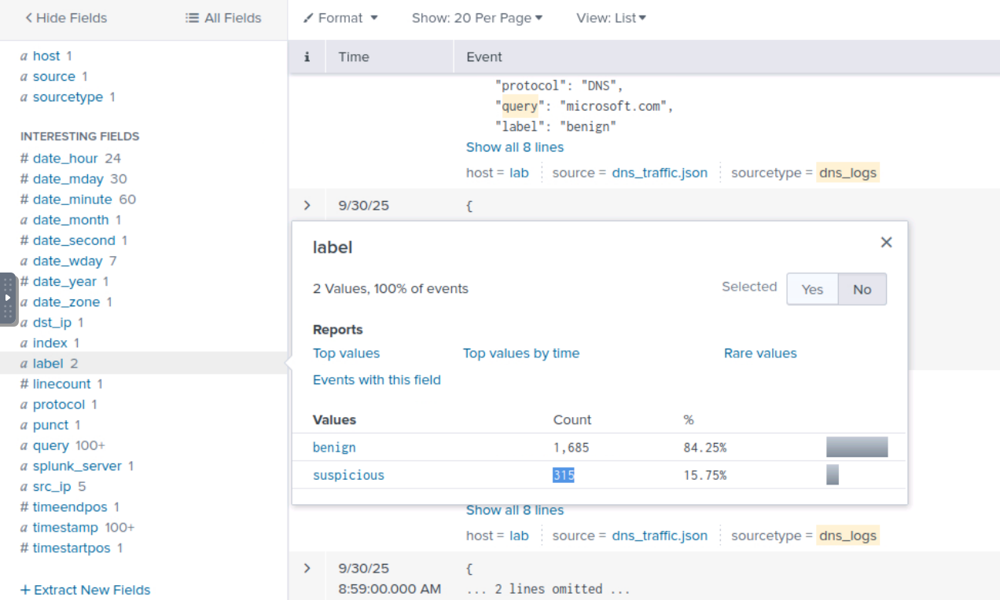

**DNS exfil host victim**
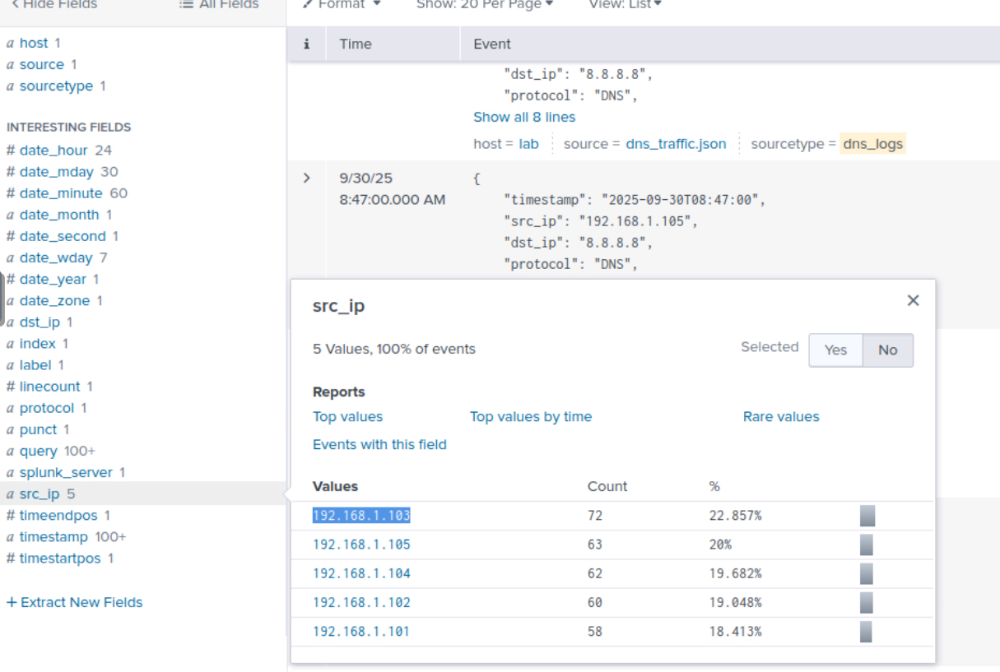

**FTP exfil using guest account**
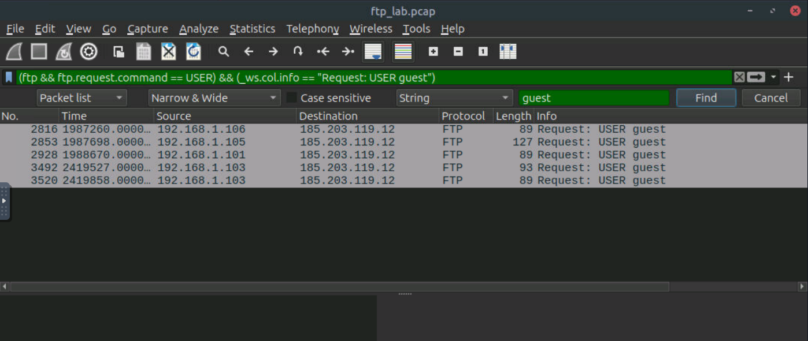

**Exfiltrated file of customer data**
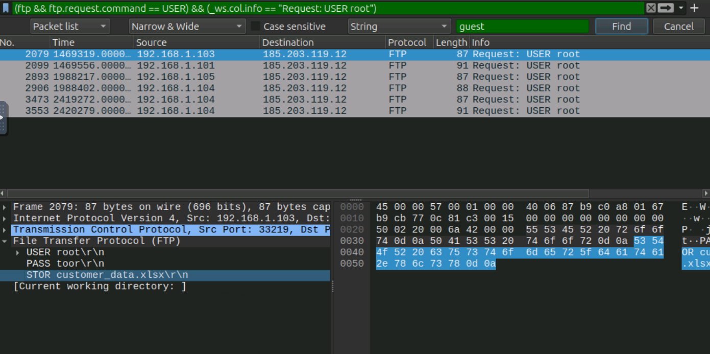

**Stolen credentials from vicitm**
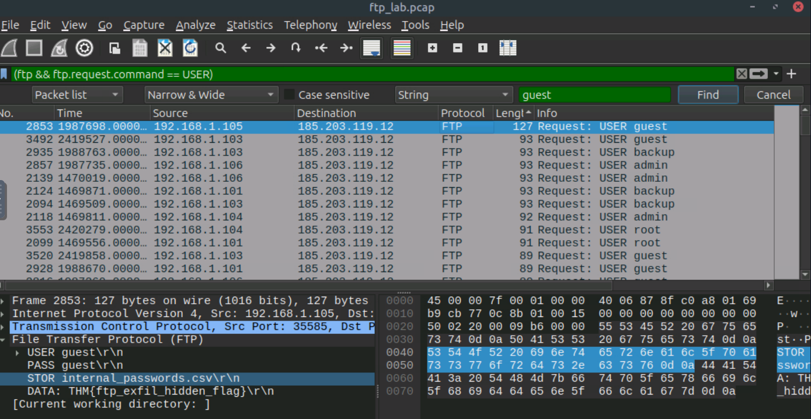

**HTTP exfil victim**
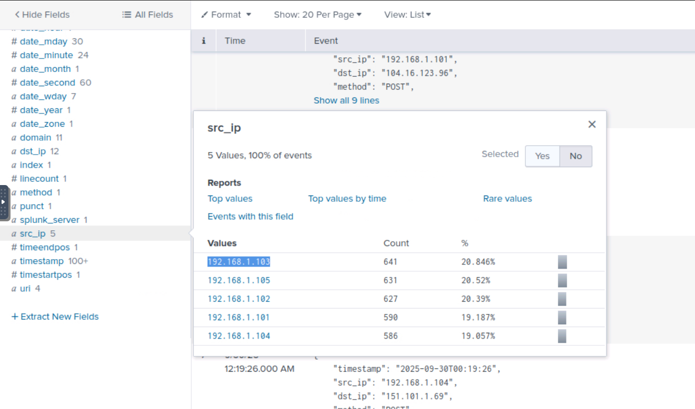

**CTF captured**
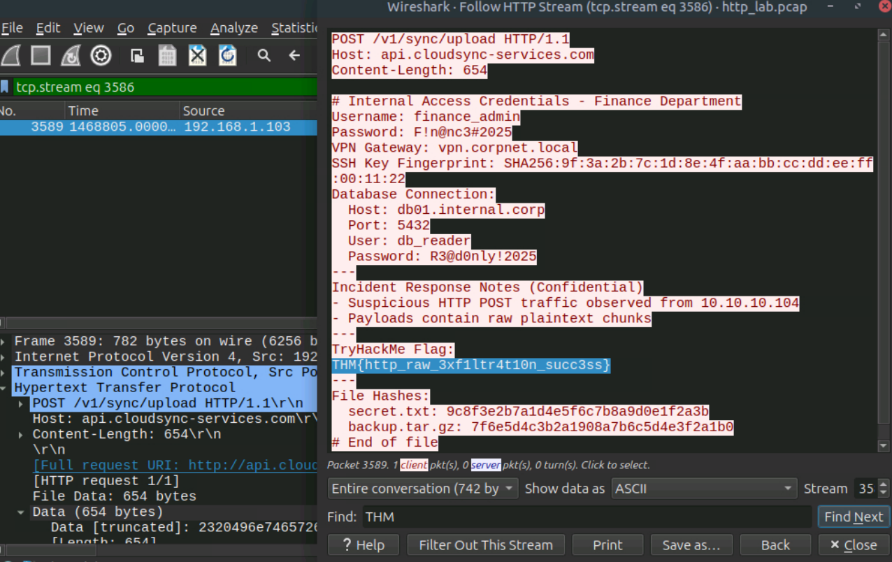

**CTF captured**

**Results**
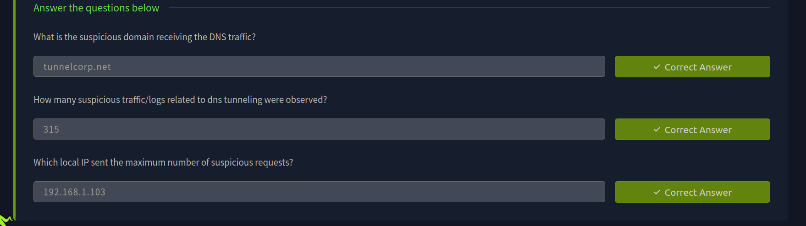

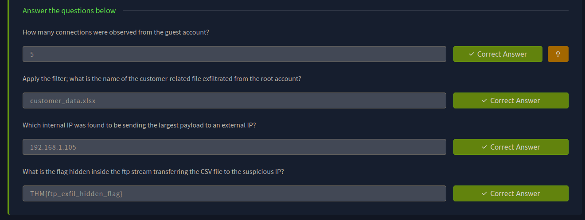

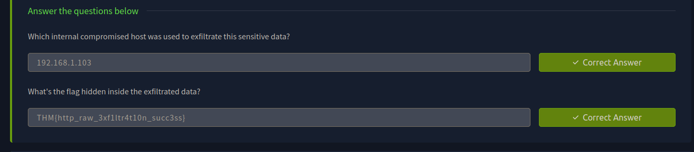

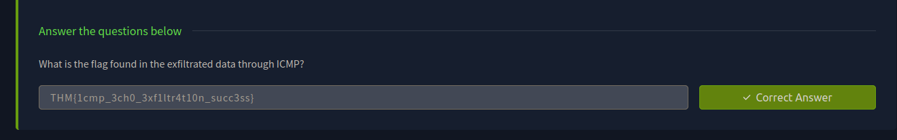