> /SOCTraining/NetSecMonitoring/MITMDetection

# Man-in-the-Middle Attack Detection 

## Objectives
- Identify indicators of **Man-in-the-Middle (MITM)** attacks in network traffic.
- Detect **ARP spoofing**, **DNS spoofing**, and **SSL stripping** techniques.
- Correlate multi-stage MITM activity using packet-level analysis.
- Practice SOC-style investigation and incident validation.

## Tools Used
- Wireshark
- Network PCAP files

## Steps Performed
- **1. ARP Spoofing Analysis**
  - Isolated ARP traffic to review request and reply behavior.
  - Identified unsolicited and gratuitous ARP replies.
  - Detected duplicate IP-to-MAC mappings for the gateway address.
  - Confirmed abnormal ARP response frequency indicating cache poisoning.

**Authentic network gateway MAC address**
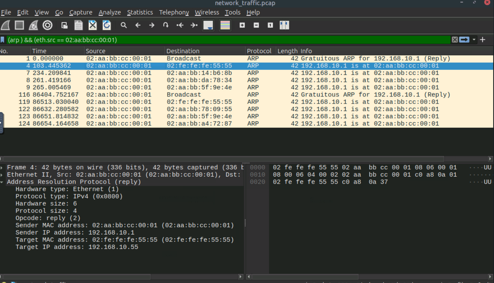

**ARP spoofed attacker's MAC address**
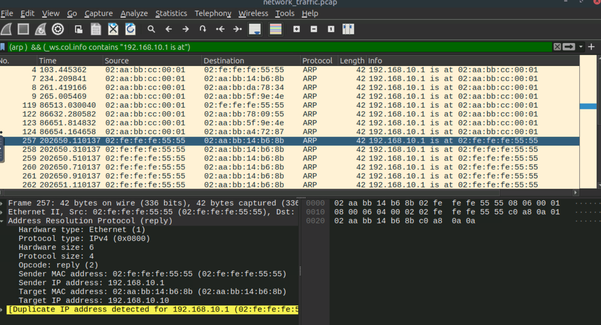

**Gratuitous ARP reply (IOA)**
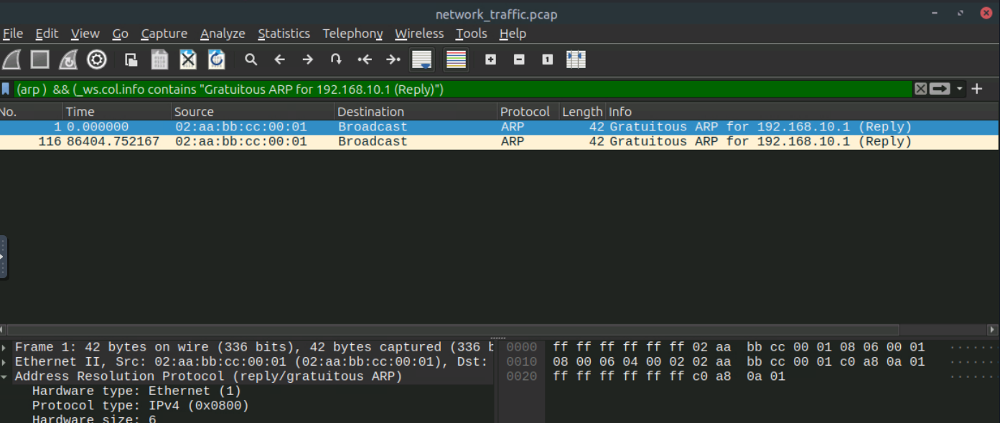
  
**Spoofed traffic by attacker**
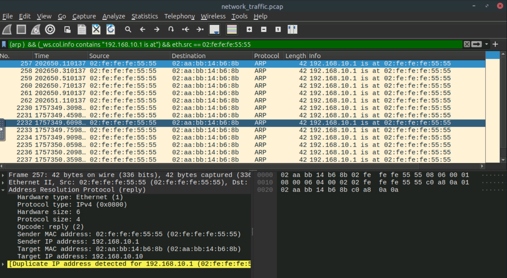
  
  ---

- **2. DNS Spoofing Analysis**
  - Filtered DNS traffic to examine request and response patterns.
  - Compared legitimate DNS responses with responses from unexpected sources.
  - Identified multiple DNS responses for the same query.
  - Detected forged DNS replies redirecting traffic to an attacker-controlled IP.
  - Correlated DNS spoofing activity with prior ARP spoofing behavior.

**Site address in authentic Google's DNS**
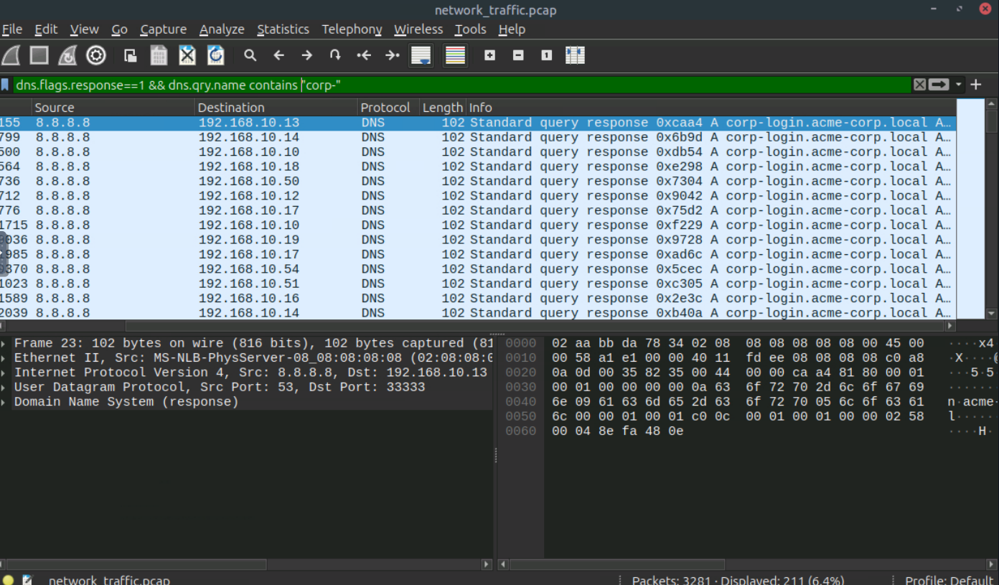

**DNS spoofed by attacker**
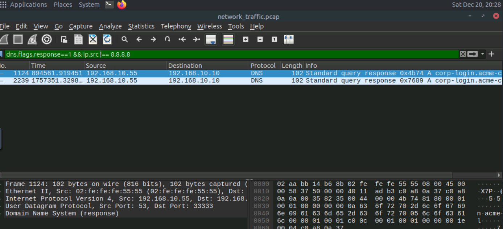

---

- **3. SSL Stripping Detection**
  - Isolated TLS/SSL traffic to confirm legitimate encrypted communication.
  - Verified absence of TLS handshakes after DNS redirection.
  - Identified HTTP traffic where HTTPS was expected.
  - Observed plaintext credential submission due to SSL stripping.

**Plain-text HTTP traffic after SSL strip-off**
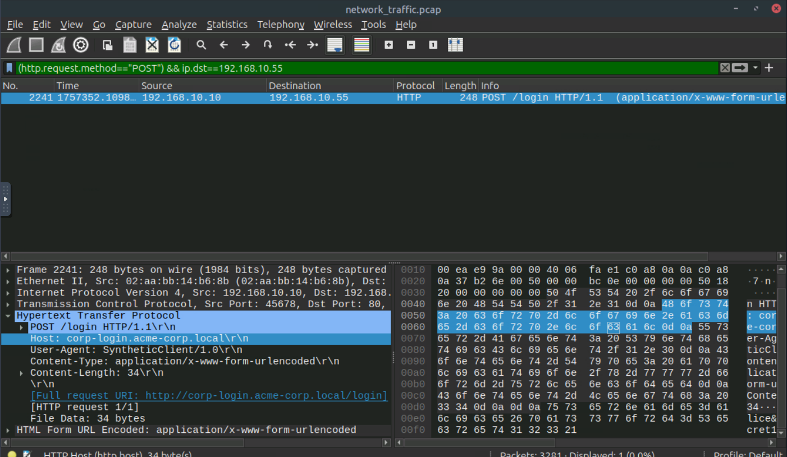

**Credentials laid bare due to SSL/TLS stripping**
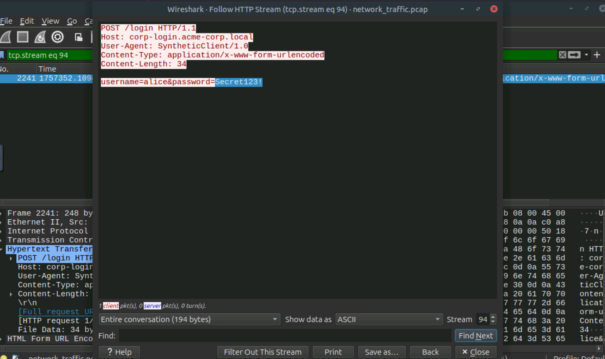

---

## Key Learnings
- Understood how **ARP spoofing** enables initial MITM positioning.
- Learned to detect **DNS spoofing** through duplicate and rogue DNS responses.
- Identified **SSL stripping** by observing TLS downgrade and plaintext traffic.
- Reinforced the importance of correlating multiple protocol indicators.
- Improved skills in packet-level analysis for SOC investigations.

**Results**
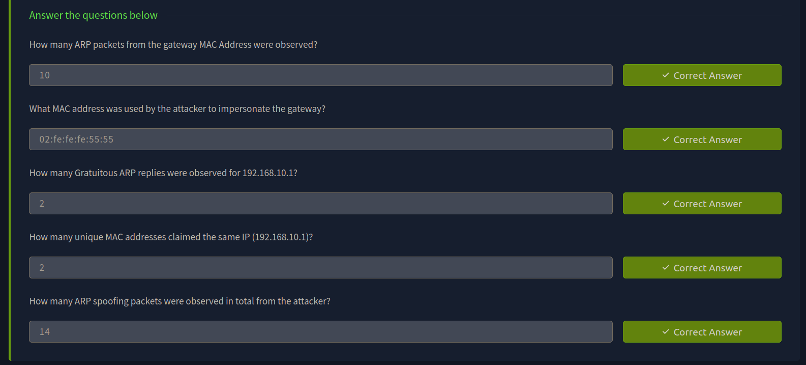

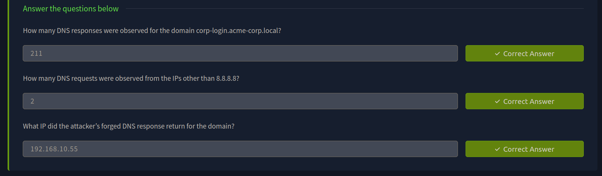

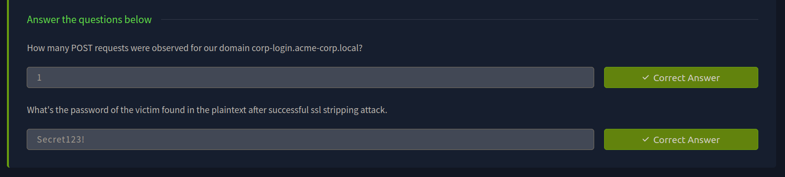