> /SOCTraining/NetworkMiner/NetworkForensics

# Network Forensics Investigation - Network Miner

## Objectives
- Understand the role of NetworkMiner as a Network Forensic Analysis Tool (NFAT).
- Perform passive network traffic analysis using captured PCAP files.
- Identify hosts, sessions, credentials, files, and anomalies from network captures.
- Strengthen network forensics investigation skills.

## Tools Used
- NetworkMiner v1.6 and v2.7

## Steps Performed
- Loaded multiple PCAP files for offline analysis.
- Reviewed host-level information including IP addresses, MAC addresses, operating systems, open ports, and traffic statistics.
- Analyzed session data to understand client-server communications and protocol usage.
- Investigated DNS activity to identify queried domains and responses.
- Extracted credentials such as NTLM hashes, HTTP cookies, and authentication artifacts.
- Reviewed reconstructed files and images extracted from network traffic.
- Inspected parameters and keywords to identify cleartext data and suspicious indicators.
- Examined messages to analyze extracted emails and communication artifacts.
- Reviewed anomaly detections such as spoofing attempts and exploit indicators.

## Key Learnings
- Learned how NetworkMiner provides a fast overview of network traffic for forensic investigations.
- Understood how host, session, DNS, and credential views accelerate initial analysis.
- Gained experience extracting files, images, and authentication artifacts from PCAPs.
- Identified strengths and limitations of NetworkMiner compared to deeper analysis tools.
- Reinforced the importance of combining overview tools with detailed packet analysis workflows.

## Screenshots
Please refer to the attached screenshots in this directory.

**Host Analysis**
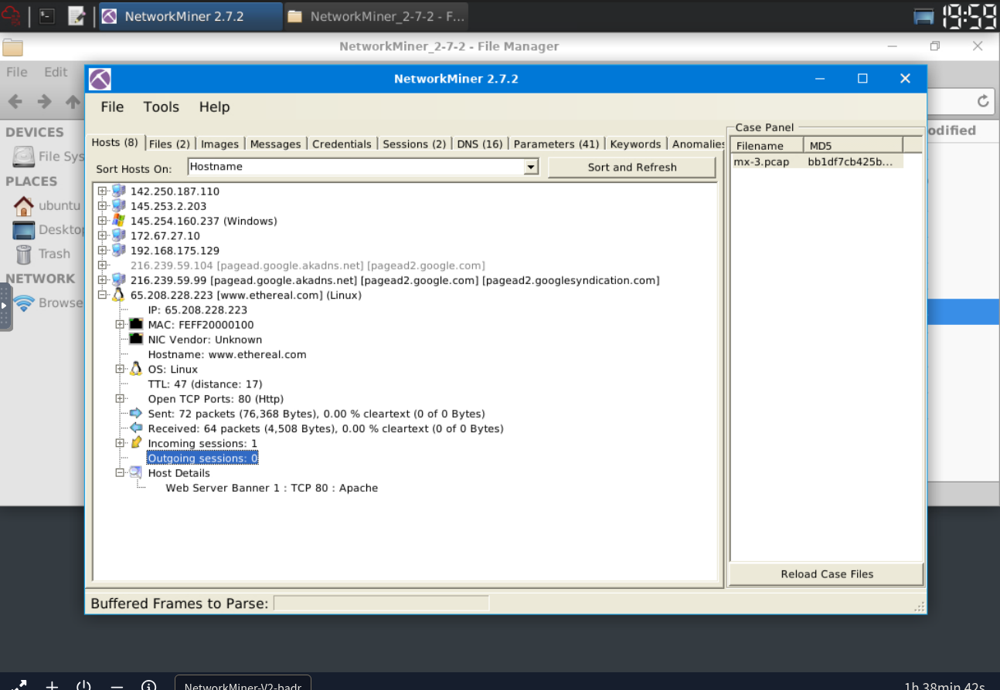

**MAC Address Correlation**
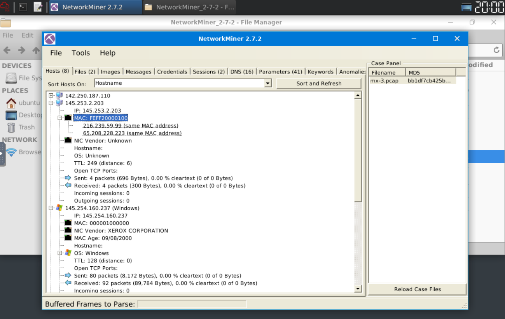

**Credentials Hunt**
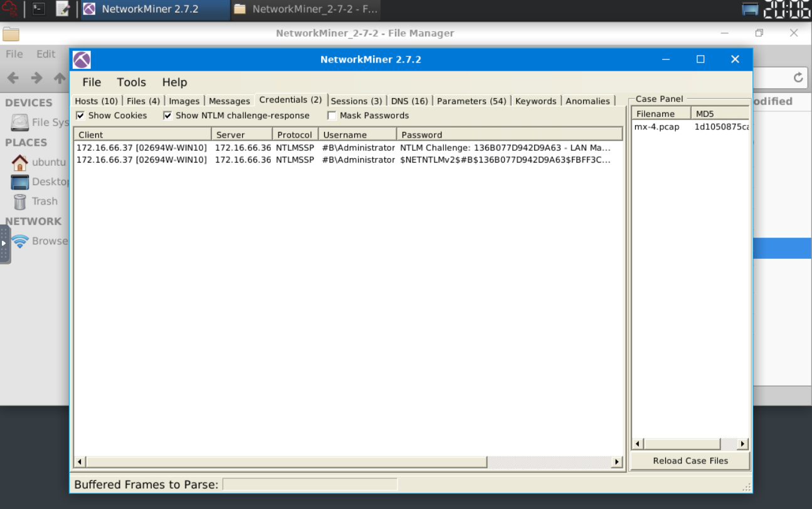

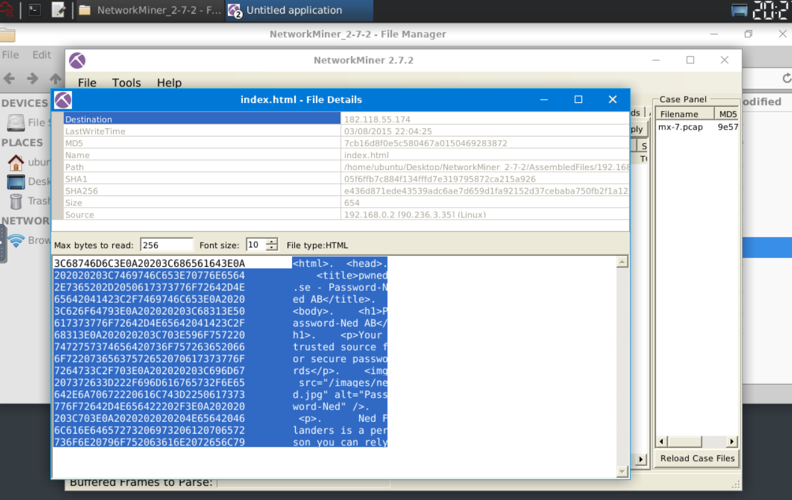

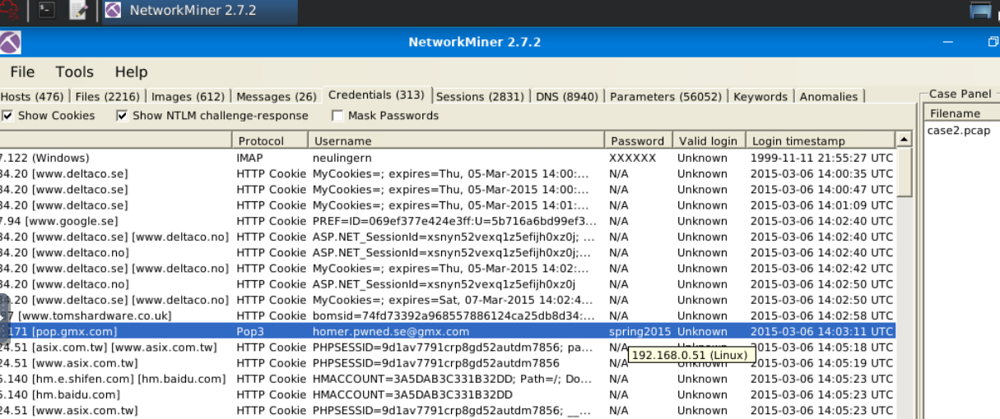

**Files Analysis**
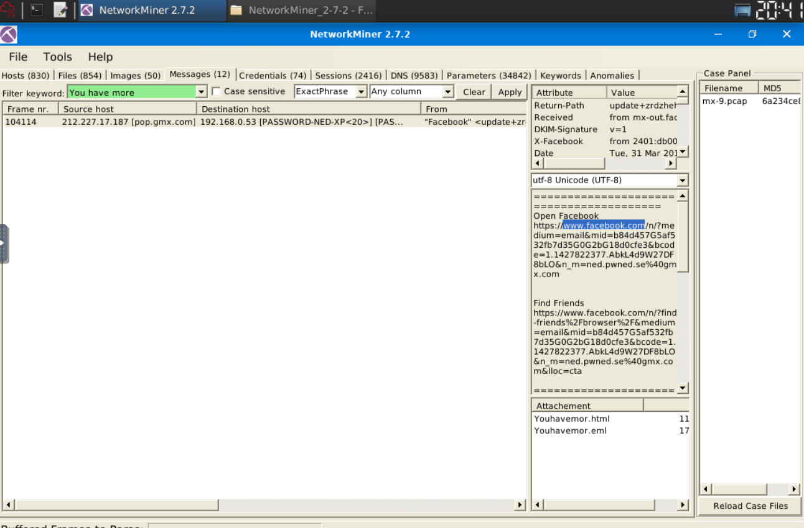

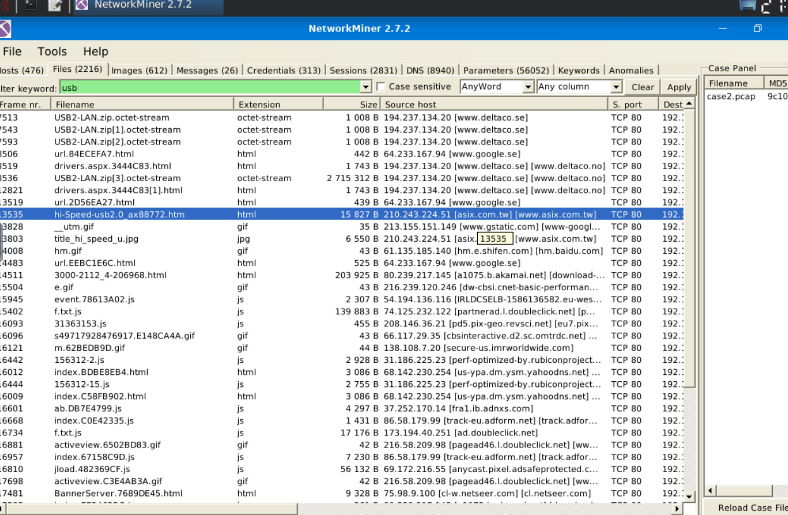

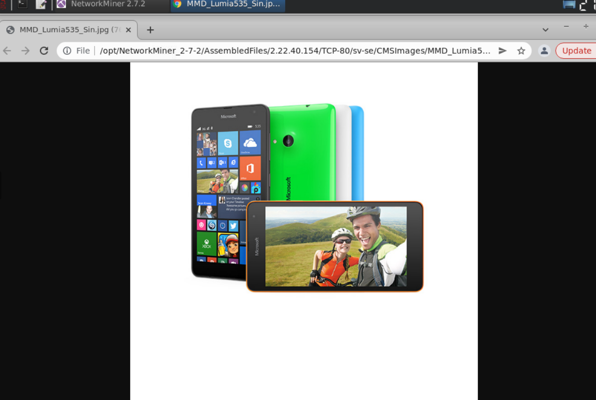

**Fetching Email**
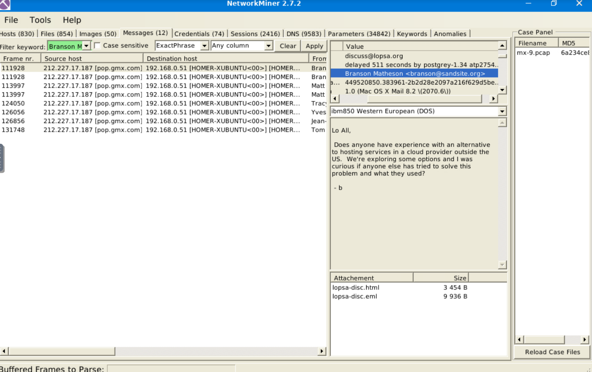

**Client-Server Analysis**

**Frames Analysis**
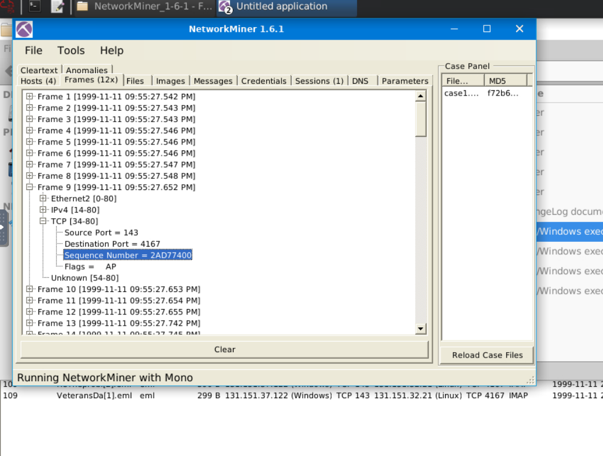

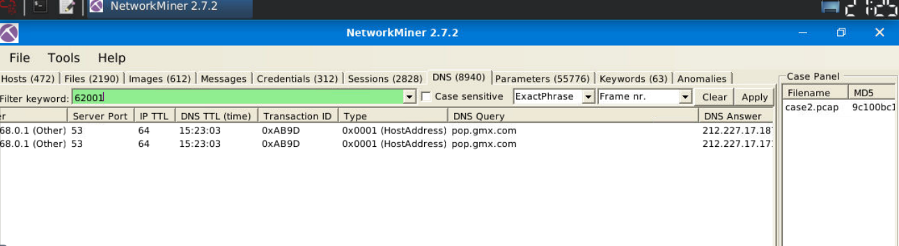

**Results**
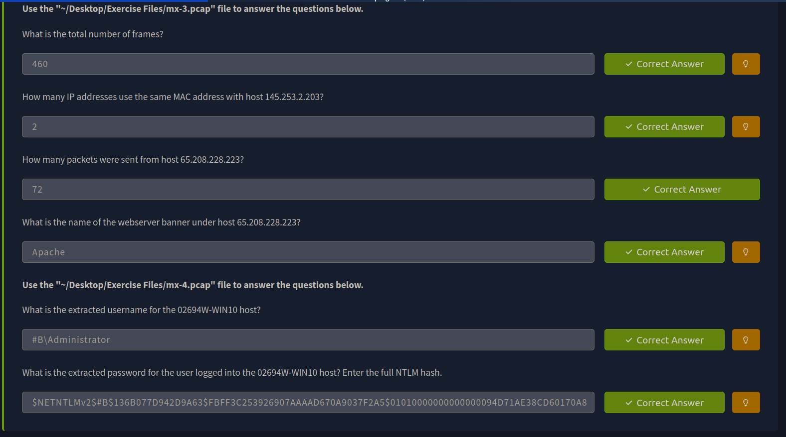

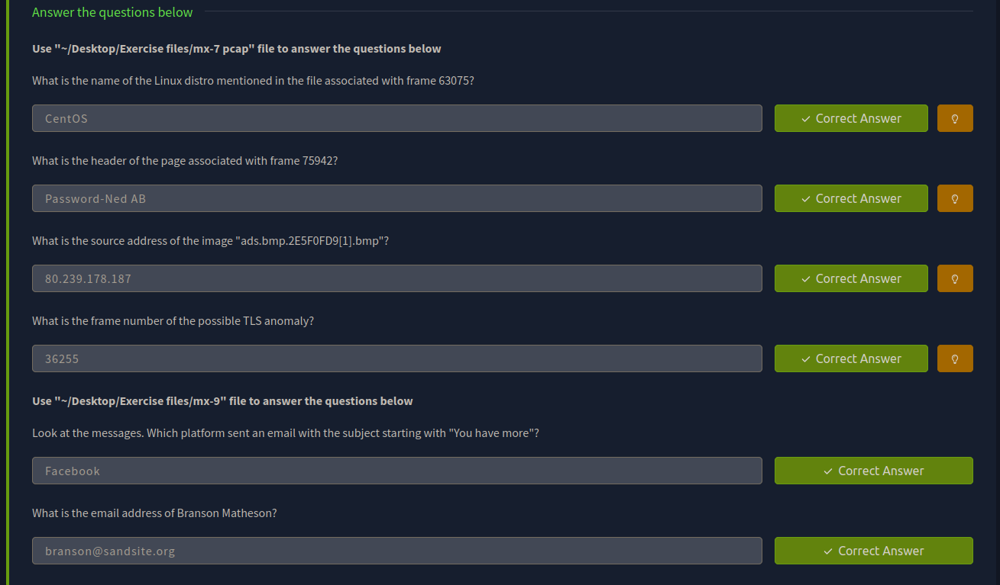

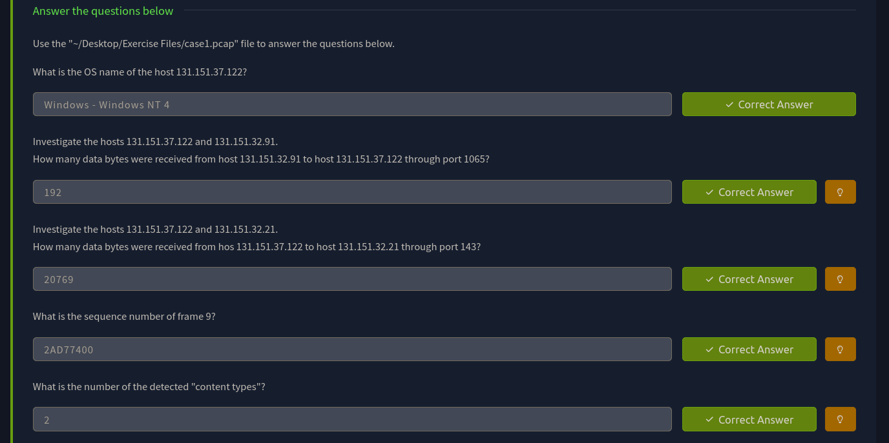

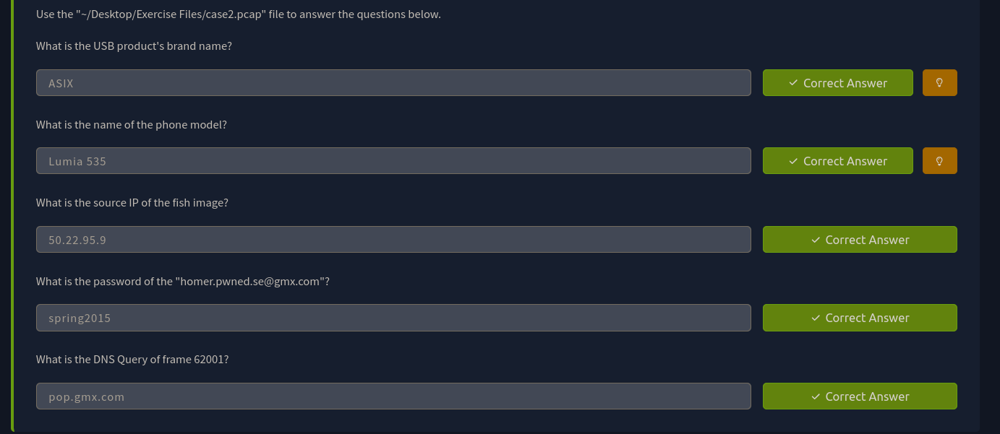