> /SOCTraining/Ramdump&Macros

# Ramdump & Macros Analysis

## Objectives

- Analyse a phishing email delivering a malicious document with an embedded VBA macro.

- Extract and investigate the macro to identify payload download and execution behaviour.

- Perform memory forensics using Volatility to trace the full execution chain and C2 establishment.

- Recover the malicious attachment path, staged payload location, and scheduled task persistence from the memory dump.

- Map the updated TTPs of the Boogeyman threat group across initial access, execution, C2, and persistence.

## Tools & Resources

- **Olevba:** For extracting and analysing VBA macros embedded in the malicious Office document.

- **Volatility:** For memory forensics, including process listing, network connections, file path recovery, and command history extraction from the memory dump.

## Steps Performed

Investigated the attack chain targeting an HR employee via a malicious resume document, covering:

- Phishing email analysis, identifying the sender, victim, and the name and MD5 hash of the malicious attachment.

- Macro extraction using Olevba to recover the stage 2 payload download URL and confirm the process responsible for its execution.

- Full file path and PID of the stage 2 payload process, along with its parent PID, traced via memory analysis.

- URL used to download the binary executed by the stage 2 payload, and the PID and full file path of the process used to establish the C2 connection.

- C2 IP address and port recovered from memory dump network artefacts.

- Full file path of the malicious email attachment as stored on disk, recovered from the memory dump.

- Scheduled task persistence command implanted by the attacker immediately following C2 callback, extracted from memory.

## Key Learnings

The ramdump and VBA macros analysis demonstrates how threat actors iterate on TTPs after initial detection, layering macro-based delivery with multi-stage payload execution and memory-resident persistence. Combining `Olevba` for static macro analysis with `Volatility` for runtime memory forensics bridges the gap between what the document was designed to do and what it actually executed. Process tree reconstruction from memory, alongside network connection artefacts, is what confirms C2 establishment when endpoint logs are absent or incomplete.

## Screenshots

Please refer to the attached screenshots in this directory.

#### Malicious URL hit
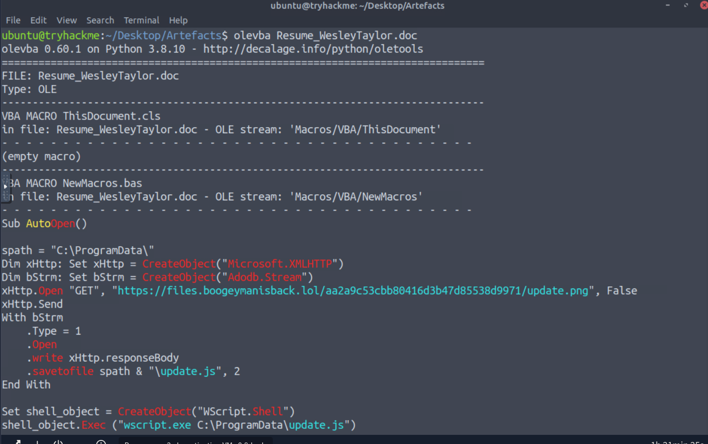

#### Program used for payload
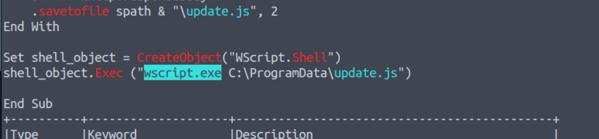

#### Olevba report
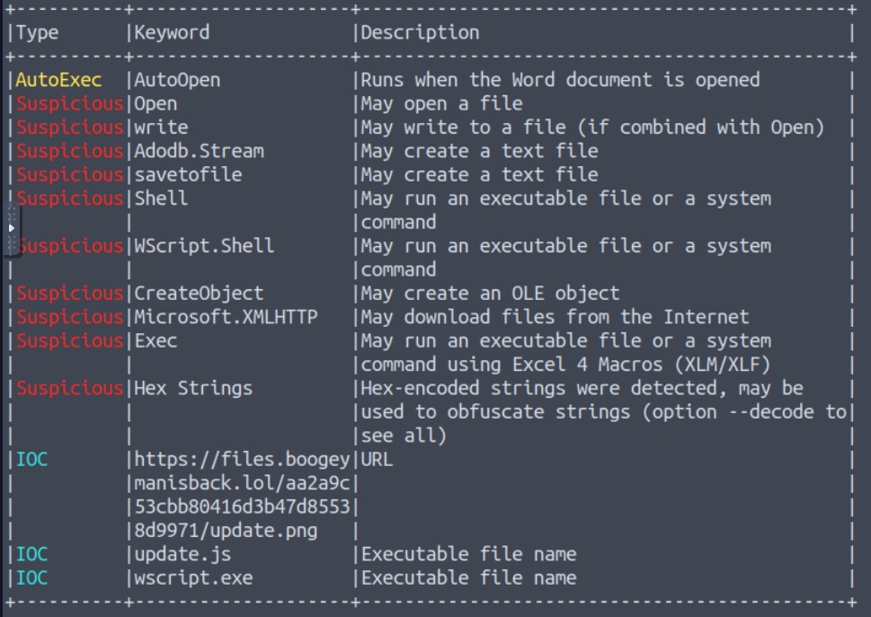

#### PID & PSTree recovery
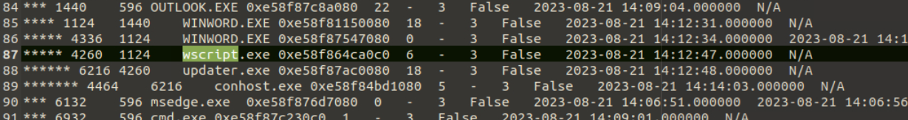

#### Downloaded file
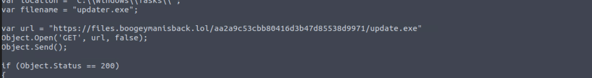

#### Executed command & file path
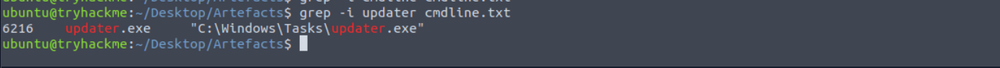

#### Malicious IP
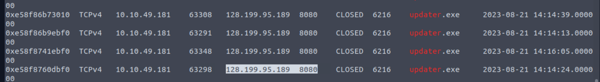

#### Malware document residing in storage
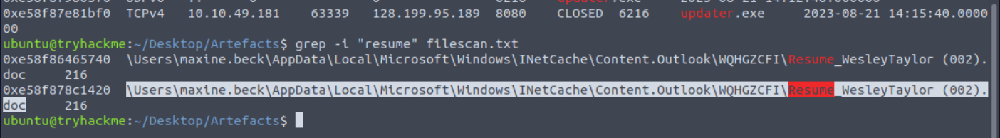

#### Results & Findings
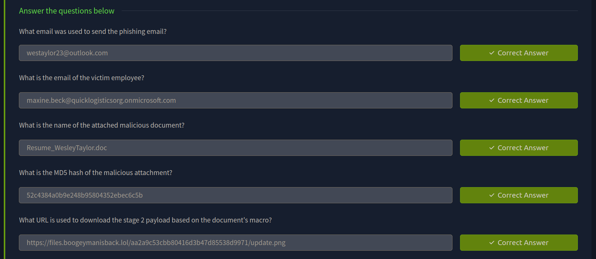
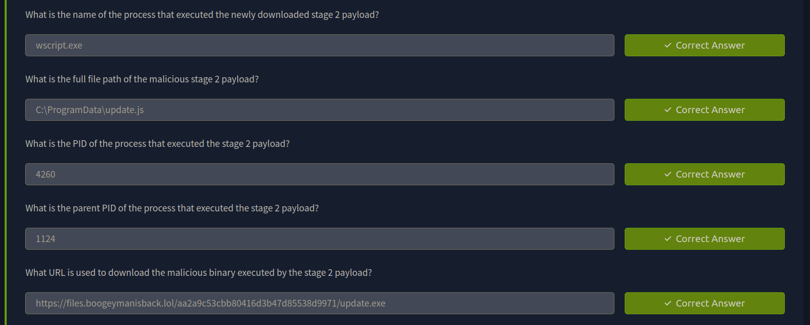
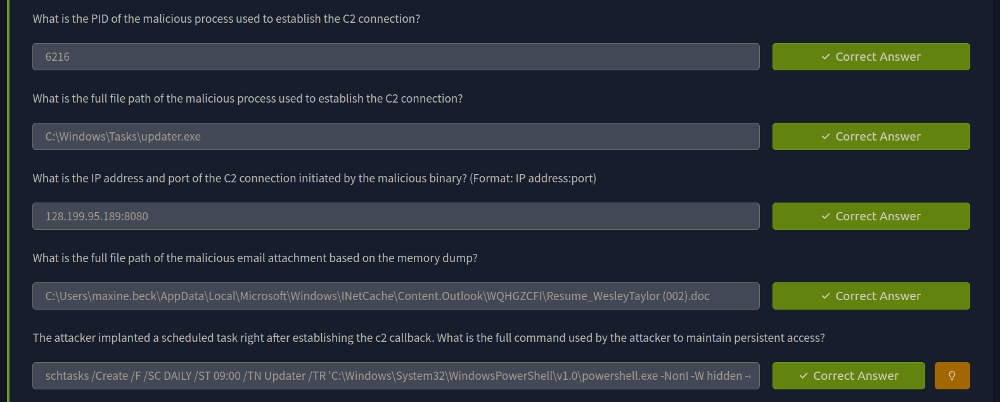

---
> QXV0aG9yOiBodHRwczovL2dpdGh1Yi5jb20vaGFzaC01NDU=