> /SOCTraining/Splunk/Alert Triage

# Alert Triage

## Objectives

- Investigate a Linux brute-force alert, confirm attack success, and identify post-access persistence activity.

- Analyse a suspicious scheduled task on a Windows workstation and trace it back to the compromised user session.

- Investigate a web shell upload and exploitation chain on a vulnerable web server.

- Apply structured L1 triage methodology across three distinct alert scenarios in Splunk.

- Practise classifying alerts as True Positive or False Positive and identifying the appropriate escalation path.

## Tools & Resources

- **Splunk:** Primary SIEM platform for querying and correlating logs across all three investigation scenarios.

- **Linux Secure Logs:** For detecting brute-force attempts, successful logins, privilege escalation, and persistence on Linux hosts.

- **Windows Event Logs:** For investigating scheduled task creation, process activity, and lateral movement on Windows hosts.

- **Web Access Logs:** For identifying brute-force, web shell upload, and post-exploitation activity on the web server.

## Steps Performed

Investigated three escalated alerts across Linux, Windows, and web environments, covering:

- Brute-force activity against a Linux host, identifying the targeted user, attack duration, failed attempt count, and confirming a successful login.

- Post-access activity on the same host, including privilege escalation and a backdoor user account created for persistence.

- Suspicious scheduled task on a Windows workstation, tracing the creating process ID, parent process, and confirming malicious payload delivery via certutil.

- Discovery activity on the Windows host, identifying the enumerated local group and the attacker's source workstation.

- Web-based brute-force using Hydra against a WordPress login page, followed by web shell interaction with b374k, identifying the start time, user agent, and number of web shell requests.

## Key Learnings

Effective L1 investigation starts before opening the SIEM. Alert context, asset type, and user role shape the analysis before a single query runs. Across all three scenarios, the pattern holds: brute-force precedes access, access enables persistence, and persistence enables deeper impact. Correlating events across log sources within the same timeline is what separates a confirmed True Positive from noise, and clear documentation at each step is what makes escalation to L2 actionable.

## Screenshots

Please refer to the attached screenshots in this directory.

#### Total brute-force attempts
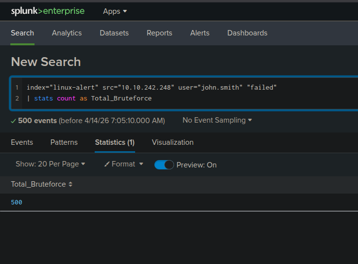

#### Privilege escalation
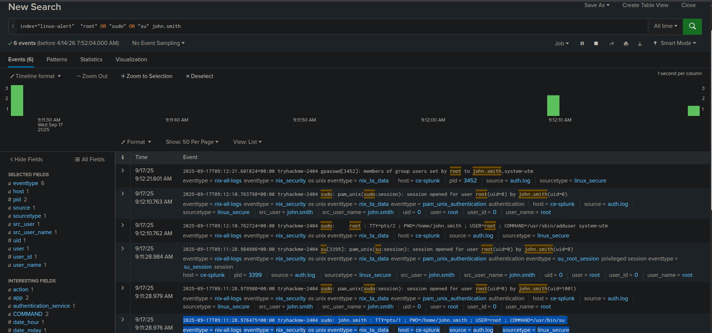

#### New user creation for persistence
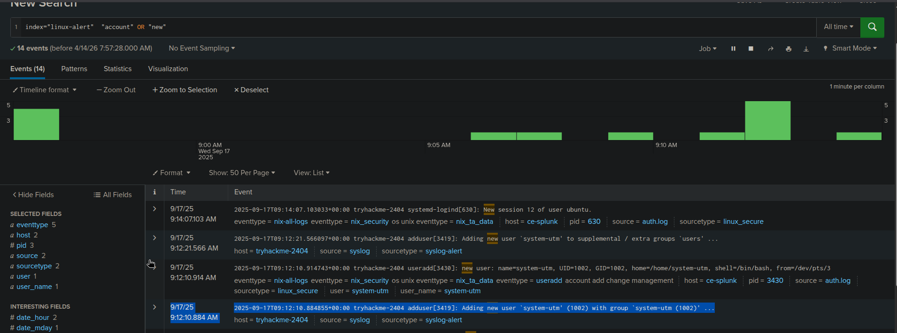

#### Process ID of malware
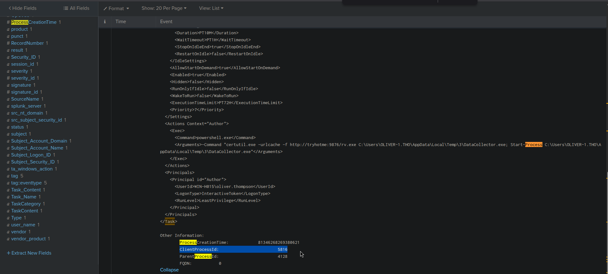

#### Process creating malicious task
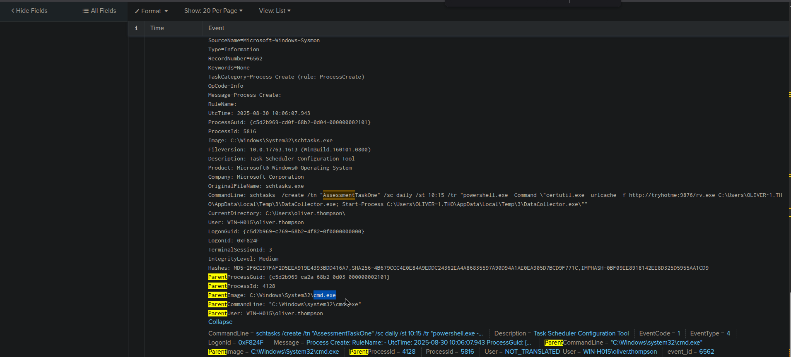

#### Group enumeration for target
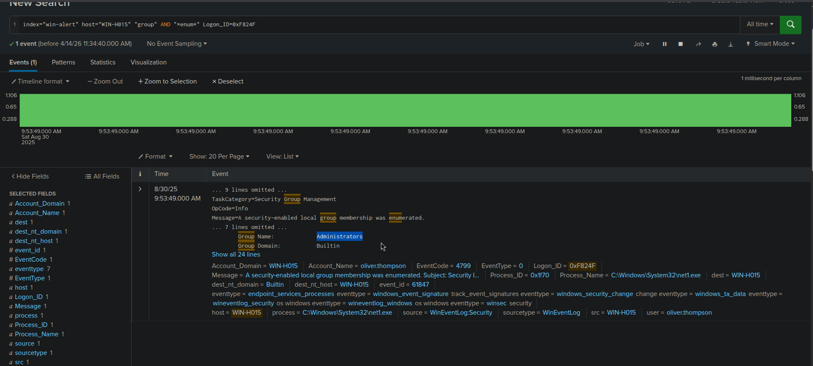

#### Host used for intrusion
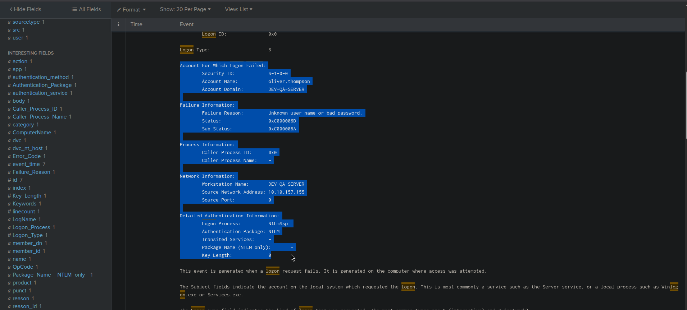

#### Web-shell compromise
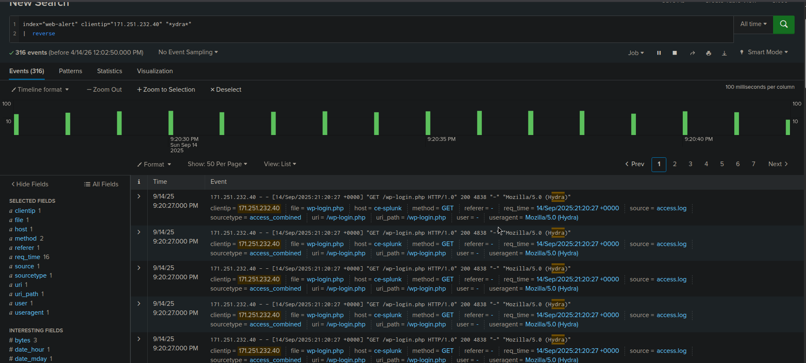

#### Results & Findings
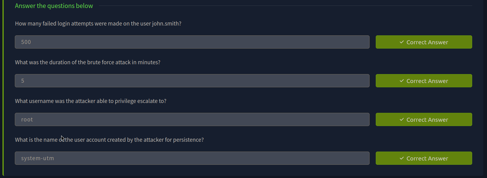

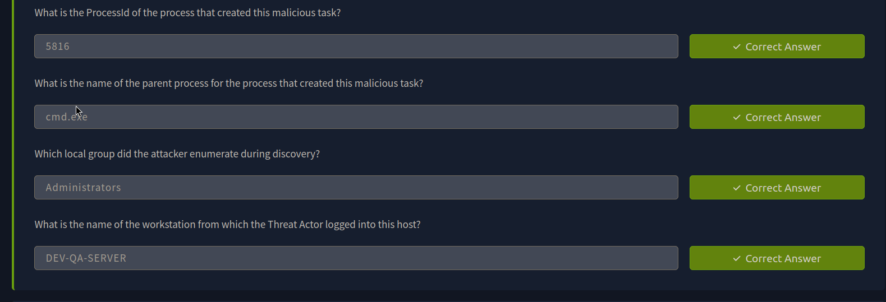

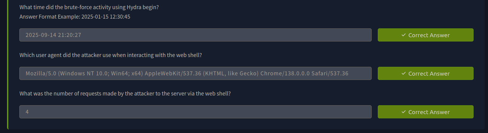

---
> QXV0aG9yOiBodHRwczovL2dpdGh1Yi5jb20vaGFzaC01NDU=