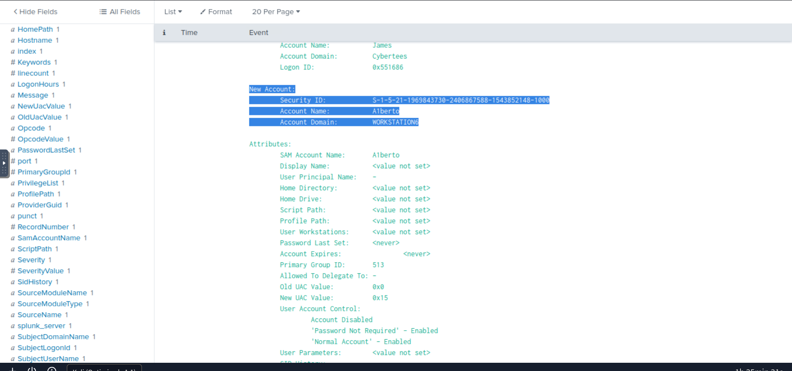
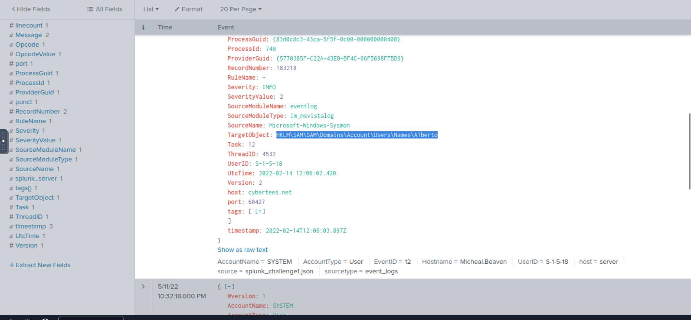
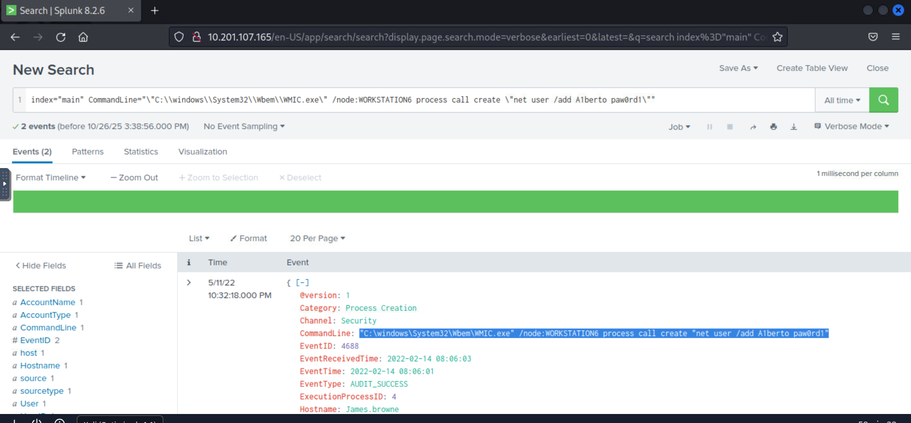
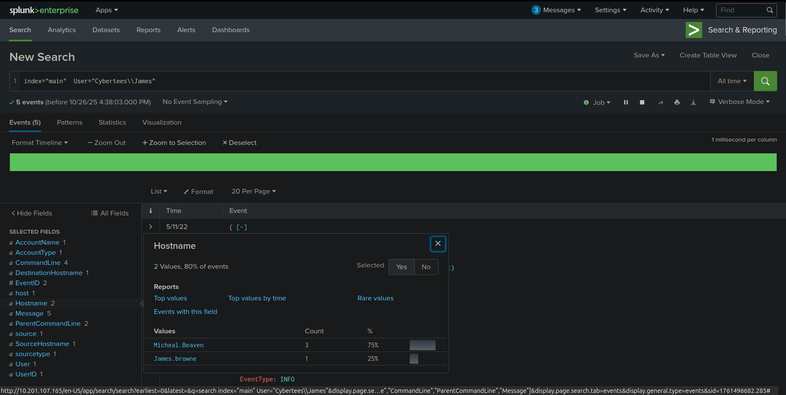
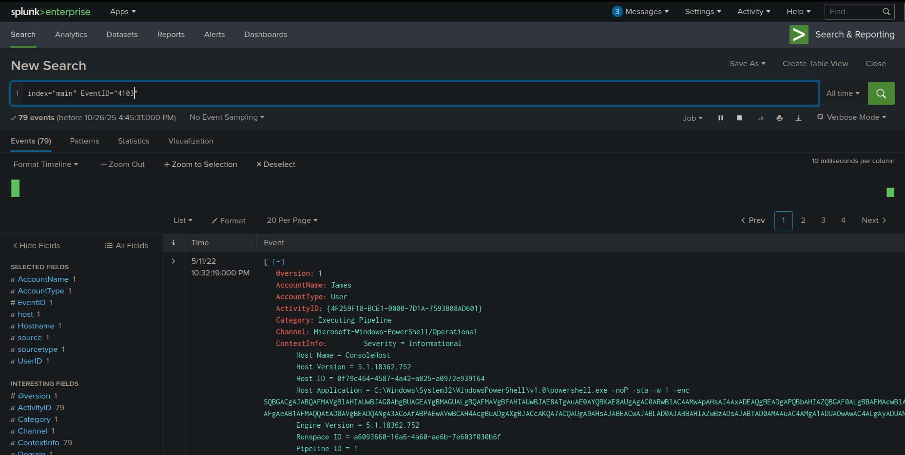
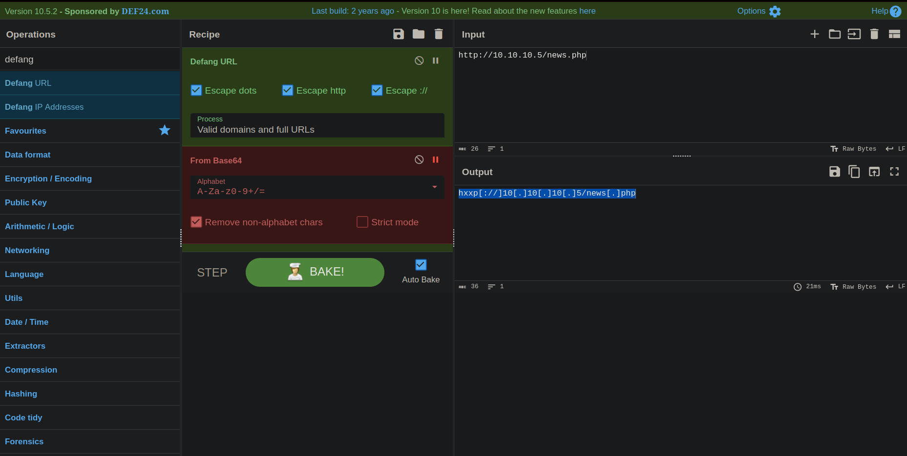
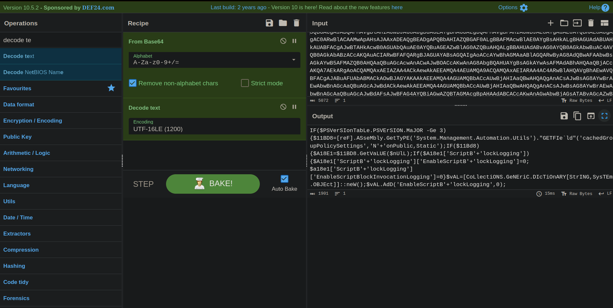
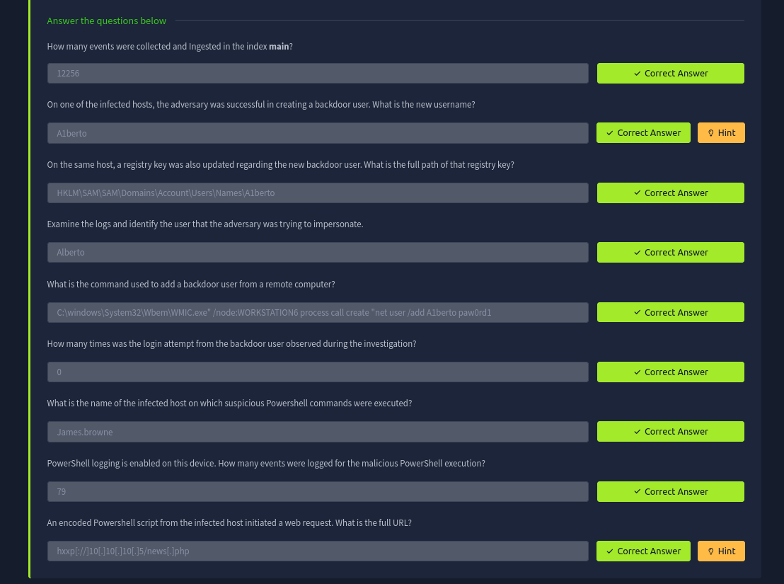

> /SOCTraining/Splunk/Backdoor Investigation

# Splunk: Backdoor Investigation

## Objectives
- Ingest and analyze logs from suspected Windows hosts in Splunk.
- Identify anomalous activities indicative of backdoor creation.
- Examine malicious PowerShell execution and associated artifacts.
- Gain practical experience in log correlation, user tracking, and forensic investigation using Splunk.

## Tools Used
- Splunk Enterprise / Splunk Cloud (Search & Reporting App)
- Search Processing Language (SPL)
- Windows Event Logs from suspected hosts

## Steps Performed
- Pulled event logs from suspected Windows hosts and ingested them into Splunk `main` index.
- Queried the `main` index to count the total events ingested.
- Identified the new backdoor user created by the adversary.
- Tracked registry changes related to the backdoor user and extracted the full registry path.
- Determined the legitimate user that the adversary attempted to impersonate.
- Analyzed commands used to create the backdoor user from a remote host.
- Counted login attempts made by the backdoor user.
- Identified the infected host where suspicious PowerShell commands were executed.
- Checked PowerShell logging and counted the number of events related to malicious execution.
- Traced encoded PowerShell scripts initiating web requests and extracted the full URL accessed.

## Key Learnings
- Learned how to effectively ingest and analyze Windows logs in Splunk.
- Applied SPL filters and search commands to detect anomalous user activity.
- Practiced tracing registry modifications and identifying malicious accounts.
- Strengthened skills in correlating PowerShell logs with adversary behavior.
- Gained experience identifying remote execution techniques and command usage.

## Screenshots
Please refer to the attached screenshots in this directory.

