> /SOCTraining/Splunk/Incident Handling

# Splunk: Incident Handling - Website Defacement

## Objectives
- Understand what constitutes a security incident in an organizational environment.
- Investigate a website defacement incident at Wayne Enterprises using Splunk.
- Map attacker activity into the Cyber Kill Chain phases.
- Learn to leverage OSINT sites to gather threat intelligence.
- Analyze host-centric and network-centric logs to identify malicious activity.
- Gain experience in detection, analysis, and incident response lifecycle.

## Tools Used
- Splunk (SIEM platform)
- Windows Event Logs
- Sysmon
- Fortinet Firewall logs
- IIS Webserver logs
- Suricata IDS alerts
- Network flow logs (HTTP, DNS, ICMP)
- Nessus vulnerability scanner
- OSINT platforms: Robtex, VirusTotal, ThreatMiner, Hybrid-Analysis

## Steps Performed
1. **Reconnaissance Phase**
   - Searched for webserver domain `imreallynotbatman[.]com` in `index=botsv1`.
   - Identified source IPs performing reconnaissance: `40[.]80[.]148[.]42` and `23[.]22[.]63[.]114`.
   - Validated scanning attempts using Suricata alerts and network traffic logs.

2. **Exploitation Phase**
   - Examined inbound traffic to webserver IP `192[.]168[.]250[.]70`.
   - Identified brute-force attempts against Joomla admin login `/joomla/administrator/index[.]php`.
   - Extracted attempted credentials using regex in Splunk.
   - Determined automated attack from Python script and manual attempt from Mozilla browser.

3. **Installation Phase**
   - Investigated uploaded payloads: `3791.exe` and `agent.php`.
   - Confirmed execution of `3791.exe` via Sysmon EventCode=1 and host-centric logs.
   - Retrieved MD5 hash of the executable and verified in VirusTotal for additional threat intelligence.

4. **Command & Control Phase**
   - Identified outbound connections from compromised server to external IPs.
   - Traced the malicious domain `prankglassinebracket[.]jumpingcrab[.]com` as a C2 server.
   - Verified domain resolution and communication patterns in firewall and HTTP logs.

5. **Weaponization Phase**
   - Used OSINT sources (Robtex, VirusTotal, WHOIS) to identify additional domains and IPs associated with the adversary.
   - Collected intelligence on the attacker’s infrastructure and email addresses linked to APT group P01s0n1vy.

6. **Delivery Phase**
   - Investigated malware delivery and secondary attack vectors using ThreatMiner, VirusTotal, and Hybrid-Analysis.
   - Retrieved malware hash `c99131e0169171935c5ac32615ed6261` and analyzed behavior.
   - Correlated network communication, DNS requests, and MITRE ATT&CK mapping from Hybrid-Analysis.

7. **Actions on Objectives Phase**
   - Confirmed website defacement via `poisonivy-is-coming-for-you-batman.jpeg`.
   - Determined SQL injection attempt and rule triggered in Fortinet firewall.
   - Documented attack progression and mapped activities across all Cyber Kill Chain phases.

## Key Learnings
- Ability to detect and analyze security incidents using Splunk.
- Understanding of Cyber Kill Chain framework and mapping attacker actions.
- Effective use of regex, searches, and table formatting in Splunk for log analysis.
- Correlation of host-centric and network-centric logs for threat identification.
- Leveraging OSINT to gather threat intelligence and identify attacker infrastructure.
- Steps to contain, mitigate, and document incidents for future prevention.

## Screenshots
Please refer to the screenshots for more details

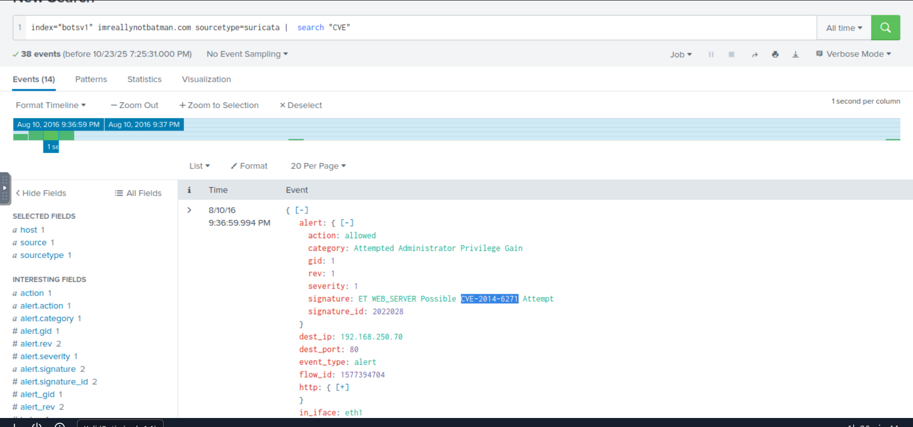

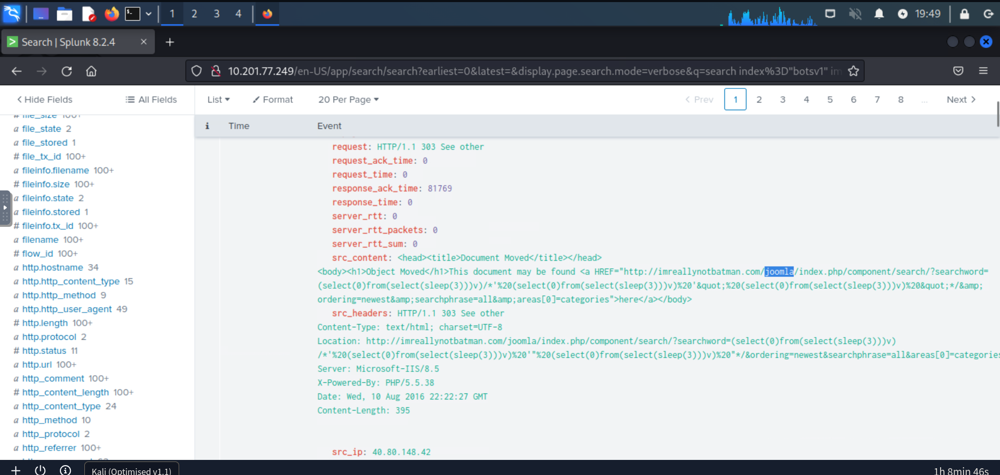

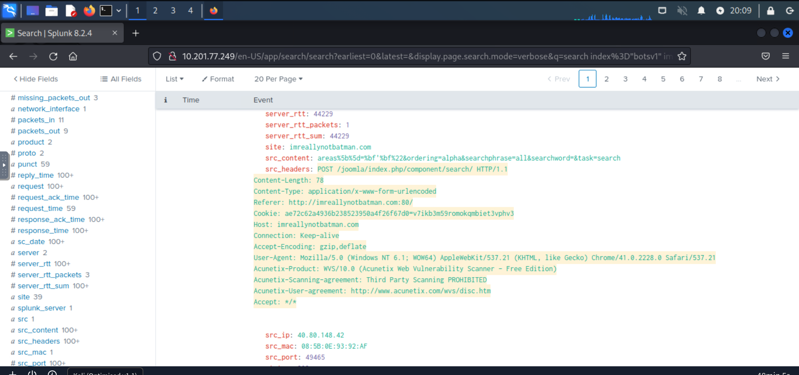

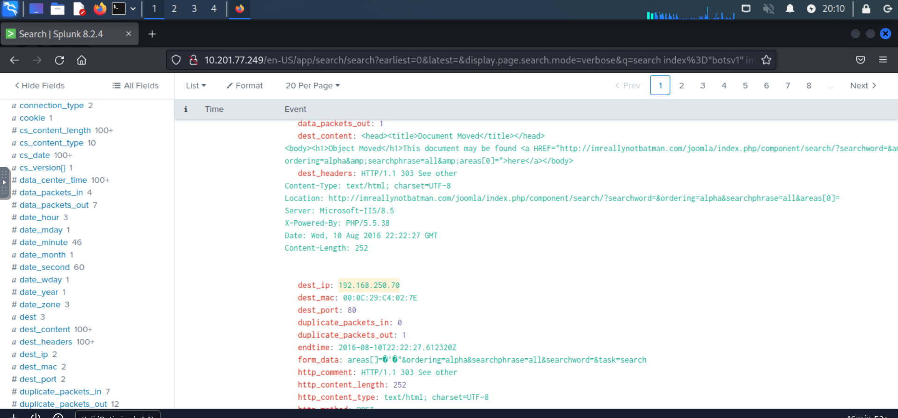

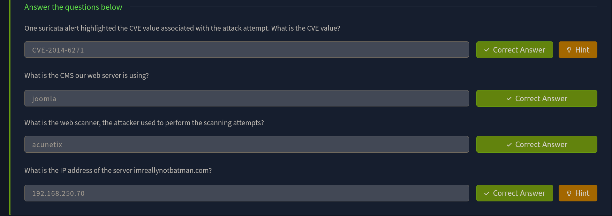

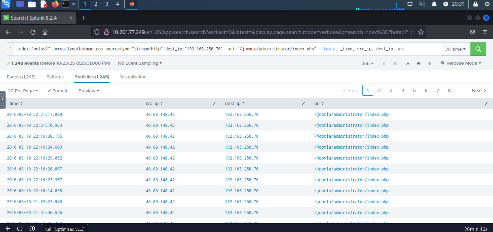

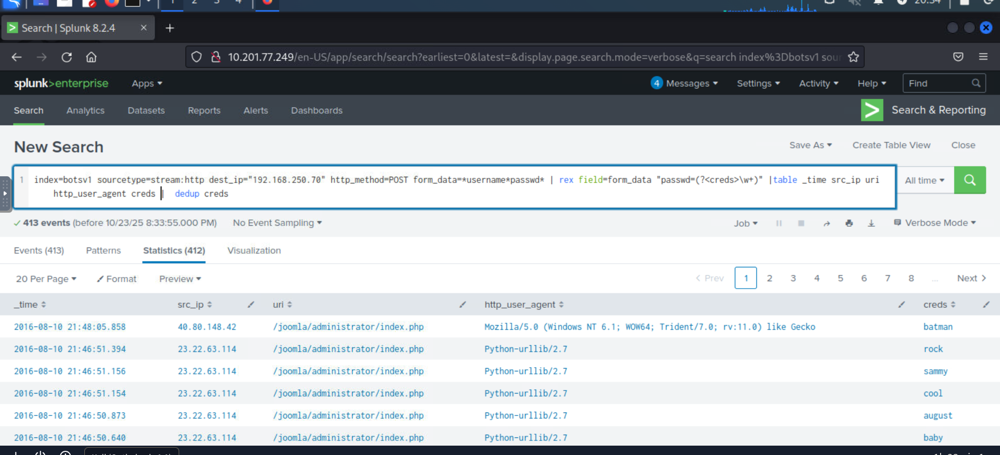

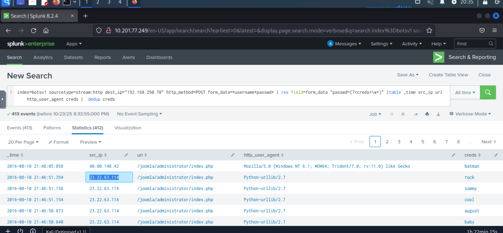

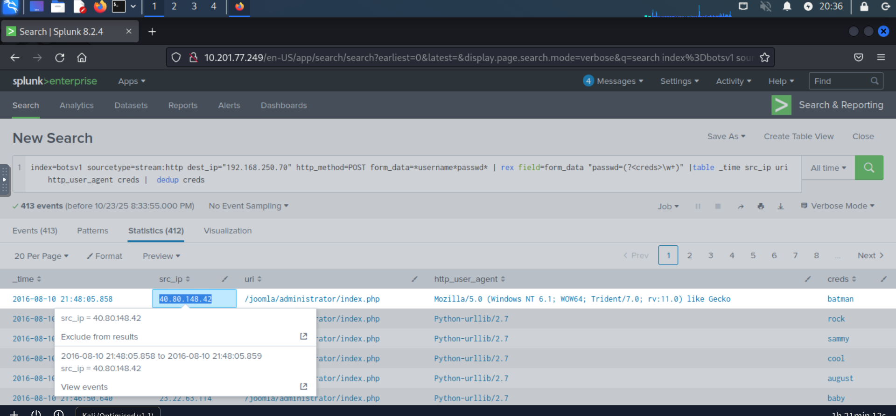

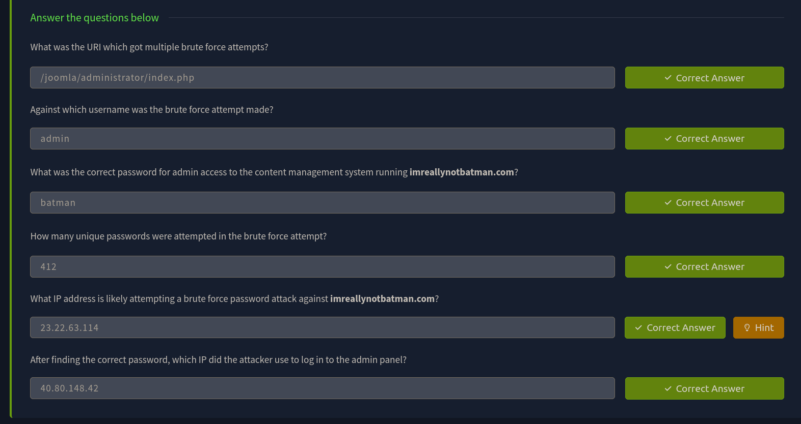

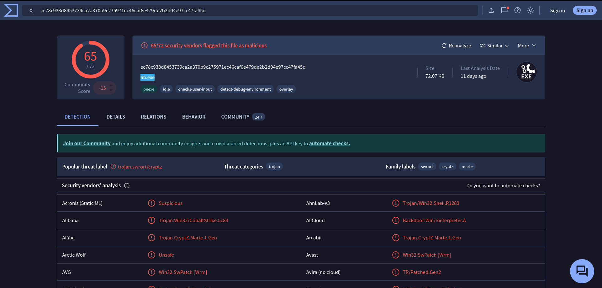

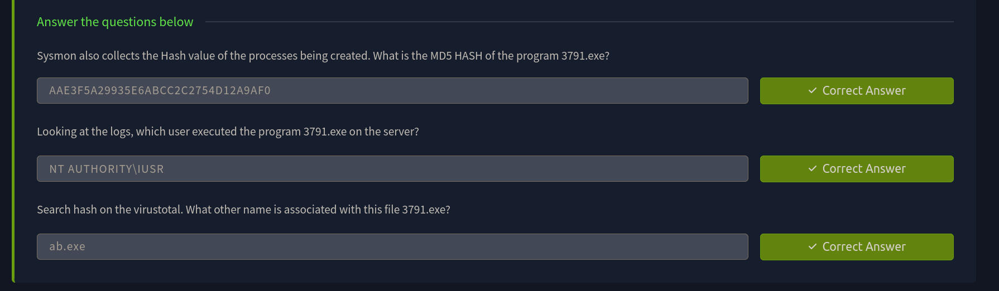

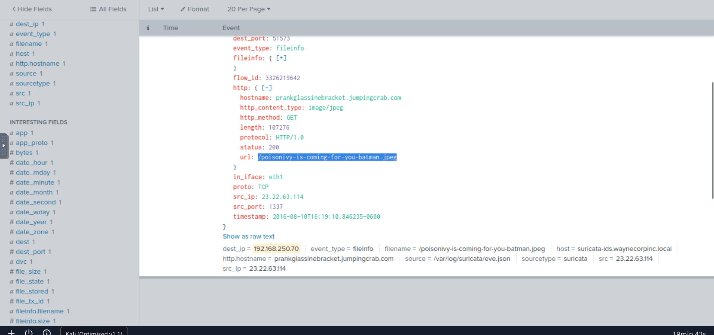

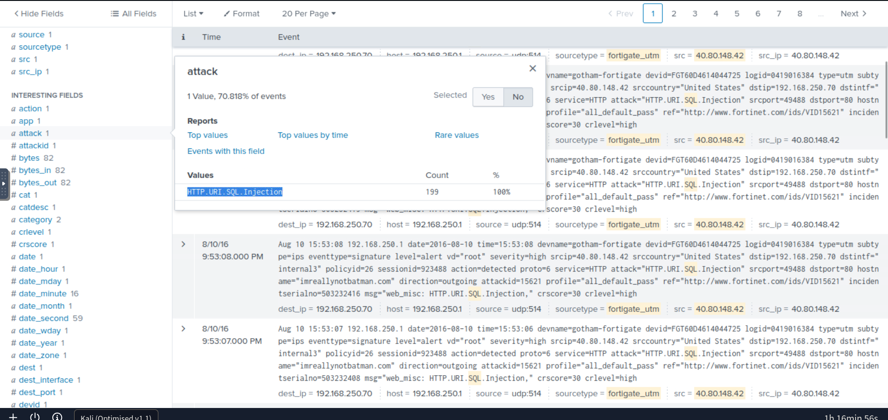

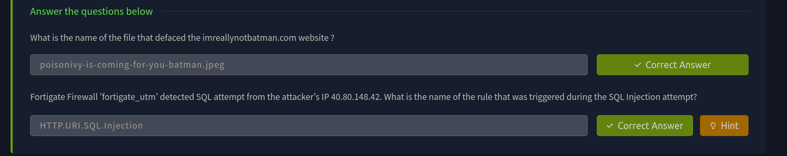

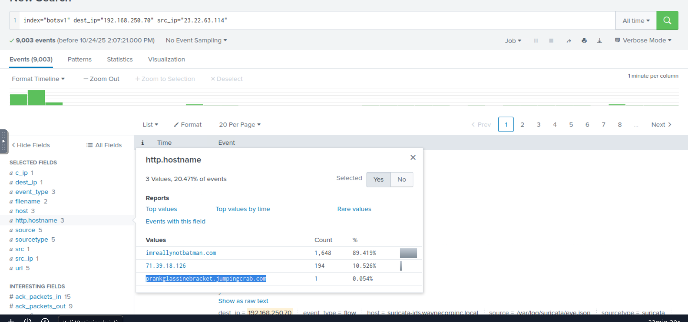

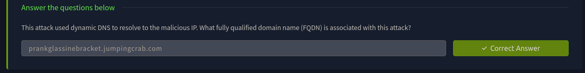

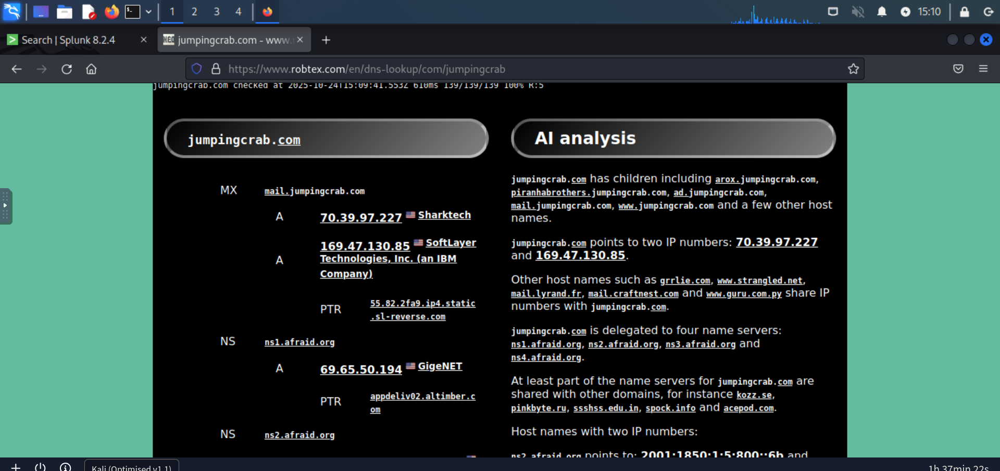

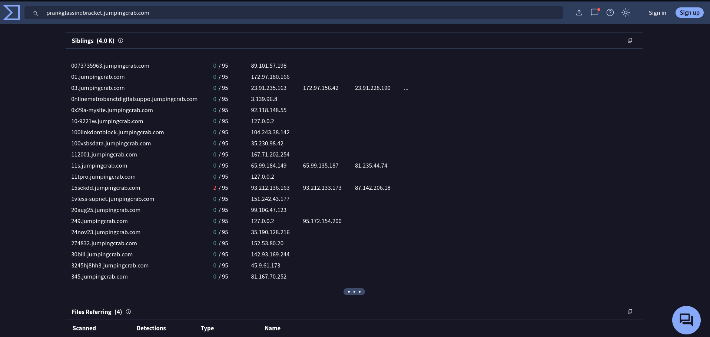

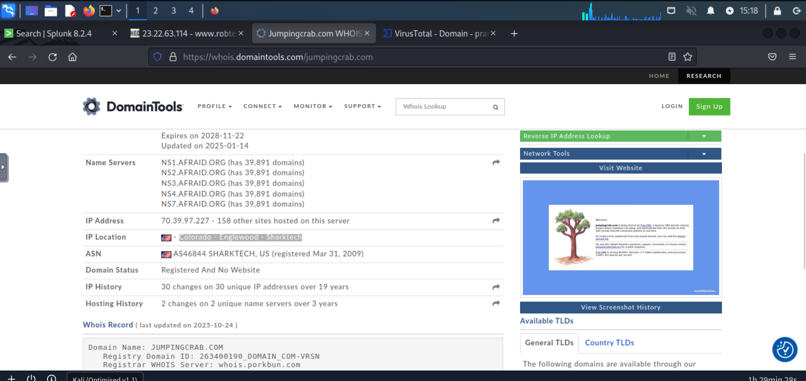

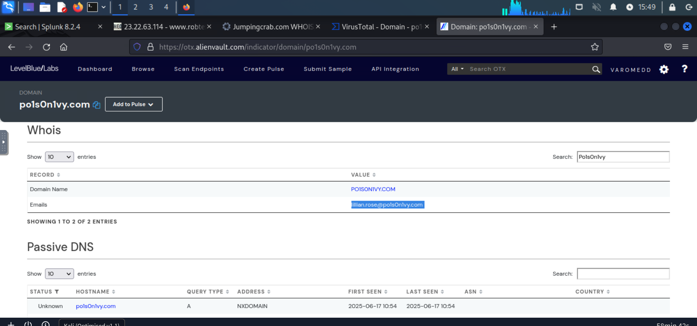

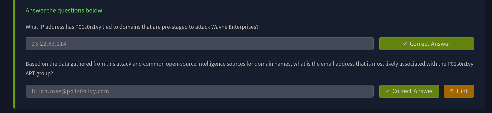

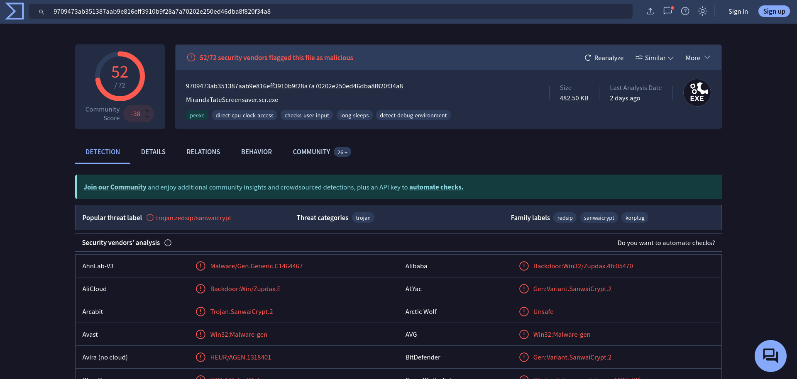

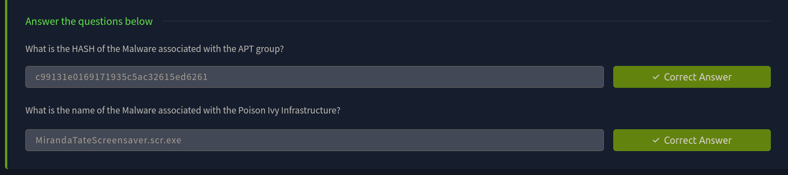