> /SOCTraining/SIEM/Multi-host

# Multi-Host Intrusion Analysis

## Objectives

- Understand the role of SIEM in centralising, normalising, and correlating logs across host, network, and web sources.

- Investigate suspicious network connections and process execution using Sysmon and Windows Event Logs in Splunk.

- Detect brute-force attacks, privilege escalation, and persistence mechanisms via Linux authentication and system logs.

- Identify web-based attacks including brute-force, web shell activity, and DDoS patterns from web access logs.

- Execute end-to-end SOC L1 triage workflows across Windows and Linux environments within Splunk.

## Tools & Resources

- **Splunk:** Primary SIEM platform for log ingestion, correlation, and investigation across all data sources.

- **Sysmon Logs:** For process creation, network connection events, and file activity on Windows hosts.

- **Windows Event Logs:** Security and System log channels for authentication events, account creation, and service activity.

- **auth.log / syslog:** Linux authentication and system logs for login attempts, privilege escalation, and cron-based persistence.

- **Web Access Logs:** Apache/Nginx access logs for detecting brute-force, web shell, and DDoS activity.

## Steps Performed

Investigated and correlated suspicious activity across Windows and Linux hosts and web logs, covering:
  - Suspicious network connection on a Windows host, identifying the destination IP, initiating process, and its MD5 hash.
  - Scheduled task creation on the same host flagged as a persistence mechanism.
  - Brute-force activity against a Linux user account, confirming the successful login and tracing privilege escalation to root.
  - Cron-based persistence via a suspicious script executing on a timed interval, with an associated reverse shell connection attempt.
  - Backdoor user account creation, tracing the attacker's source IP, failed login count, and persistence port.
  - Web access log spike, identifying the targeted URI path, source IP, attack classification, and tool used by the threat actor.

## Key Learnings

SIEM transforms isolated log events into a coherent attack narrative through centralisation and correlation. Windows investigations benefit from pairing Sysmon telemetry with Security and System event logs, where each source fills gaps the other leaves open. Linux investigations follow the same layered principle, with auth.log covering authentication and syslog exposing persistence. Web logs complete the picture by surfacing attack patterns that host logs alone would miss. Time normalisation and log format consistency are foundational, without them correlation breaks down before it begins.

## Screenshots

Please refer to the attached screenshots in this directory.

#### Suspicious connection
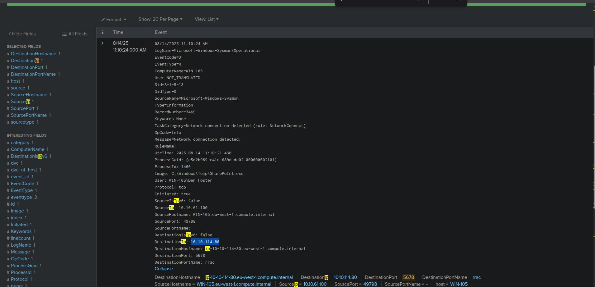

#### Malware executed
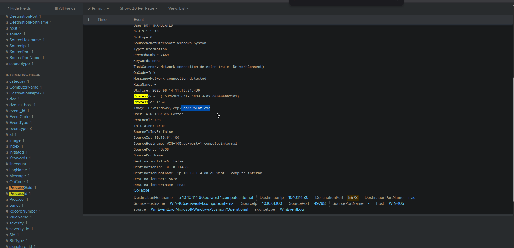

#### Malware hash
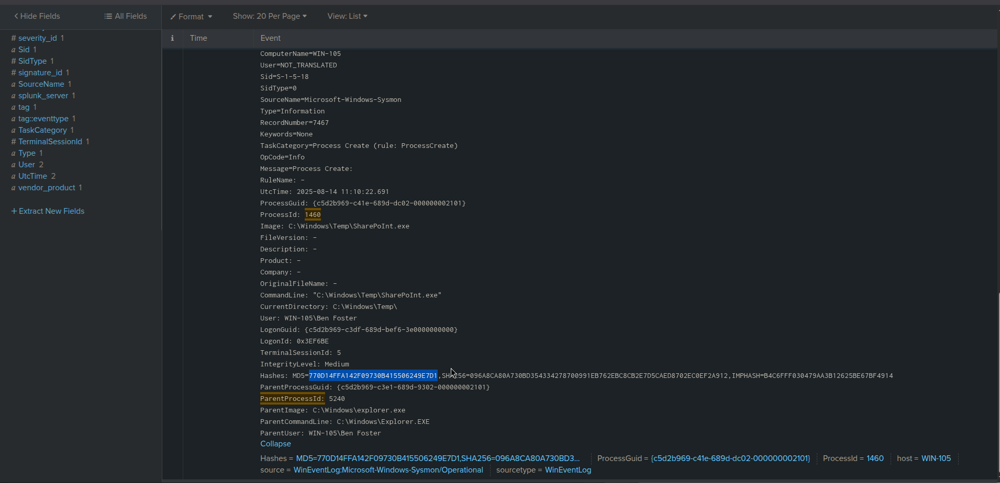

#### Scheduled task for persistence
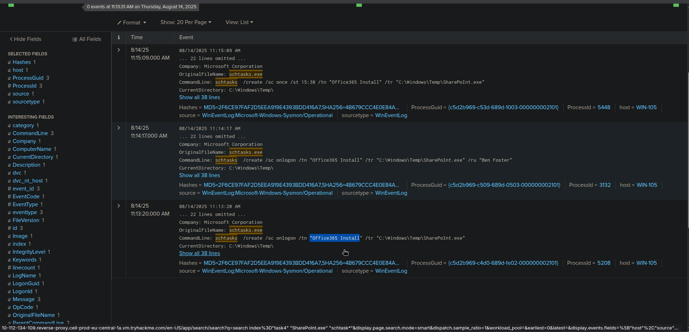

#### Remote-ssh connection
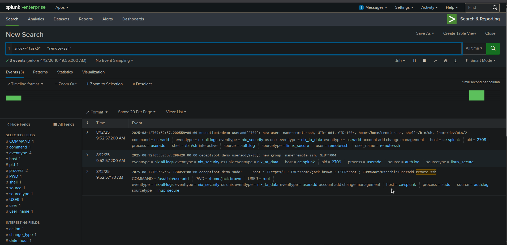

#### Privilege escalation
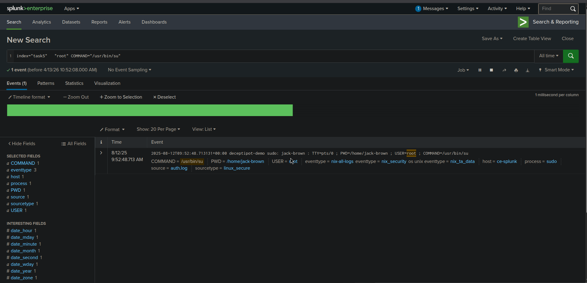

#### Successful user login
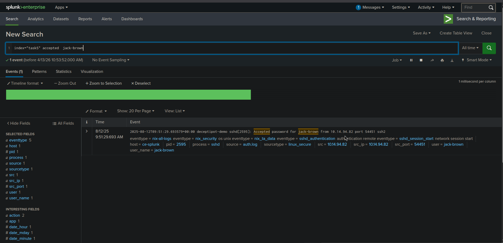

#### Failed brute-force attempts
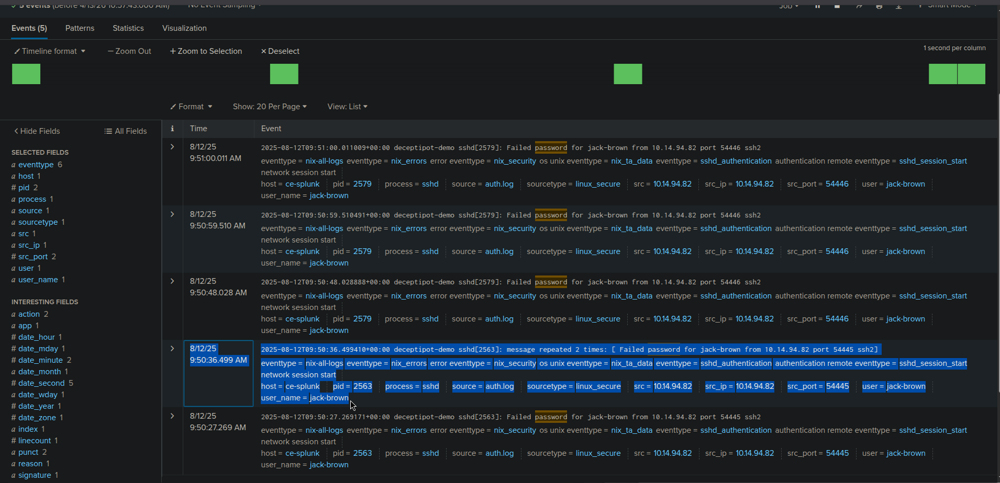

#### Configured port for persistence
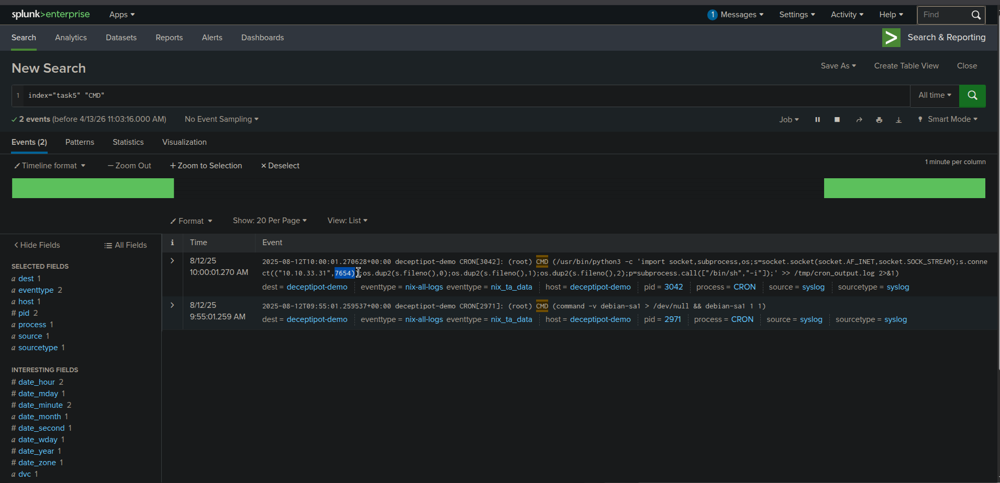

#### Web page target URI
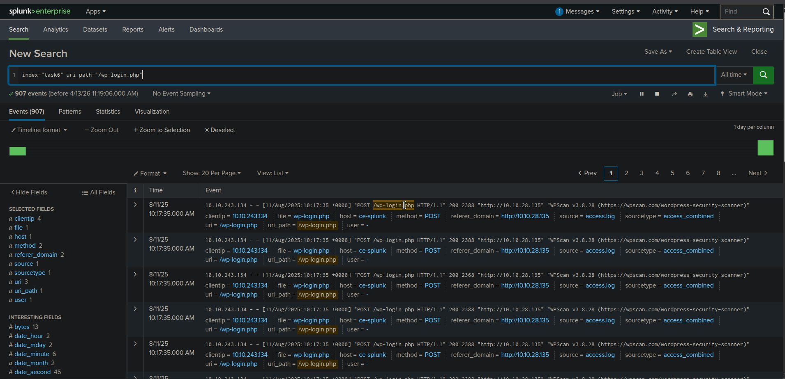

#### Results and Findings
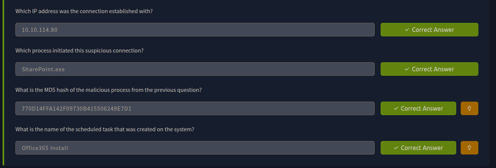

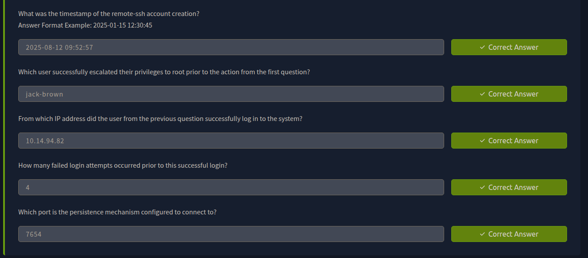

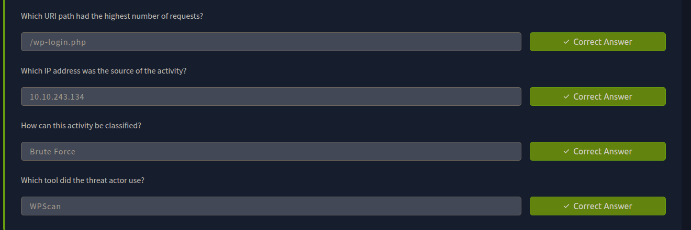

---
> QXV0aG9yOiBodHRwczovL2dpdGh1Yi5jb20vaGFzaC01NDU=