> /SOCTraining/Splunk/SPL
# Splunk: Search Processing language

## Objectives
- Understand the fundamentals of Splunk Search Processing Language (SPL)  
- Apply filters to narrow down results efficiently  
- Utilize transformational and statistical commands for analysis  
- Practice sorting, structuring, and visualizing log data  

## Tools Used
- Splunk Enterprise / Splunk Cloud (Search & Reporting App)  
- SPL commands and functions for searching, filtering, and reporting  
- Sample log datasets (`windowslogs` index)  

## Steps Performed
- Explored the **Search Head** to run SPL queries and inspect data.  
- Applied **time filters** to narrow down event logs (All time, last 60 minutes).  
- Used the **Search History** and **Data Summary** tabs to review past queries and summarize hosts/sources.  
- Utilized **Field Sidebar** to explore selected and interesting fields; identified numeric vs. alphanumeric values.  
- Applied **field operators**: comparison (=, !=, <, >), Boolean (AND, OR, NOT), and wildcards (*) to filter results.  
- Used filtering commands: `fields`, `search`, `dedup`, and `rename` to display relevant fields and remove duplicates.  
- Structured results with **ordering commands**: `table`, `head`, `tail`, `sort`, `reverse`.  
- Applied **transformational commands**: `top`, `rare`, `highlight` to extract patterns and highlight critical data.  
- Leveraged **stats commands**: `avg`, `max`, `min`, `sum`, `count` to perform statistical calculations on logs.  
- Generated **charts and visualizations** using `chart` and `timechart` commands for trend analysis.  

## Key Learnings
- SPL enables precise searching and filtering of massive log datasets.  
- Transformational commands simplify extracting patterns and insights.  
- Statistical commands and visualizations aid in identifying anomalies and trends.  
- Structuring and sorting results improves readability and investigative efficiency.  
- Field exploration is essential for identifying relevant data points in complex logs.  

## Screenshots
Please refer to the attached screenshots in this directory.  

 

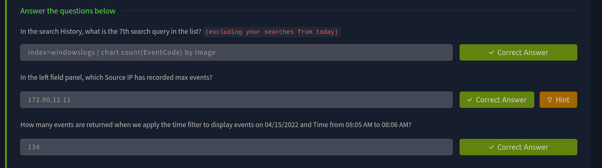

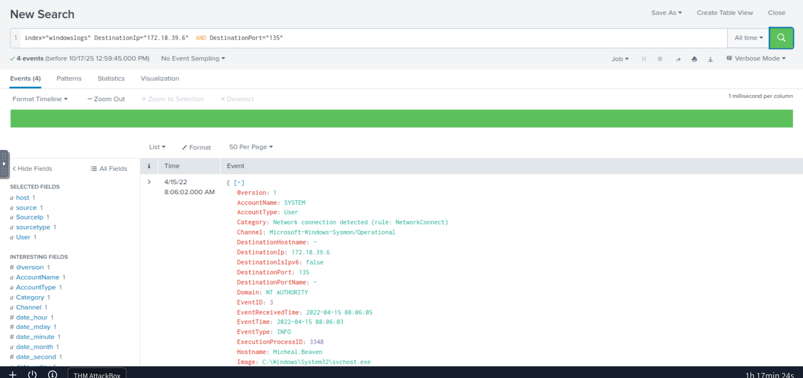

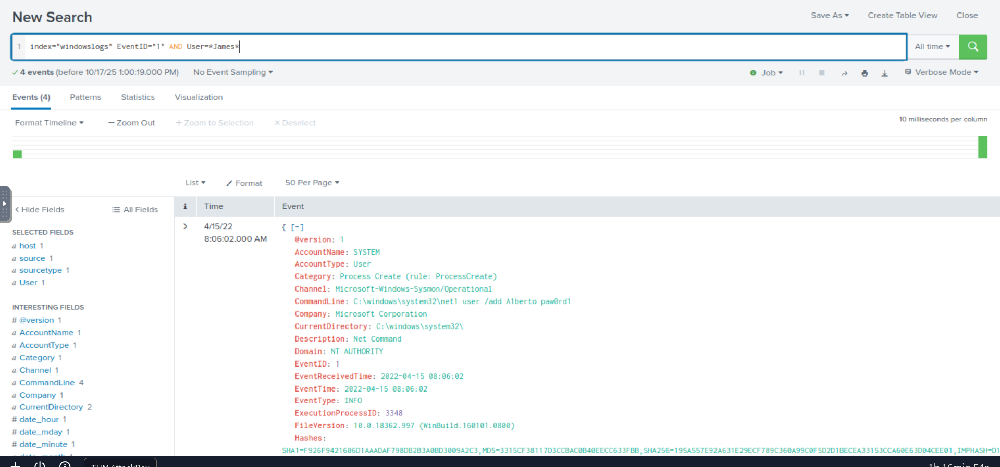

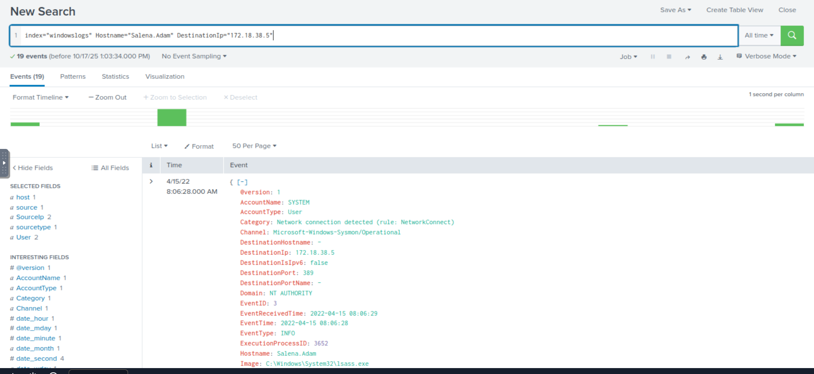

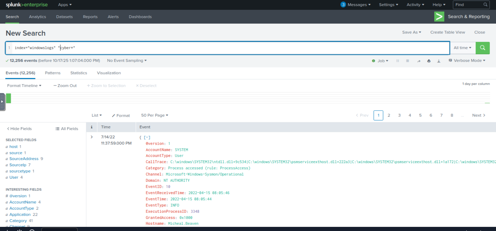

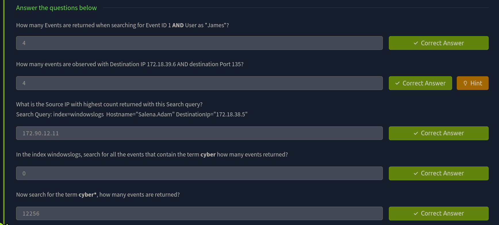

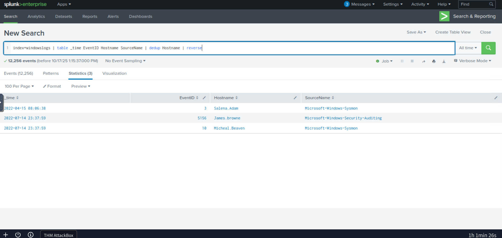

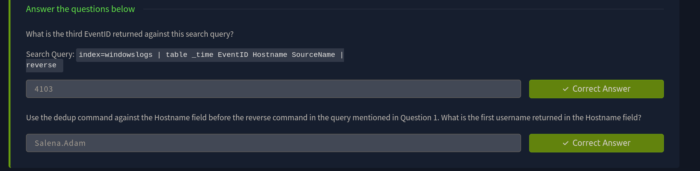

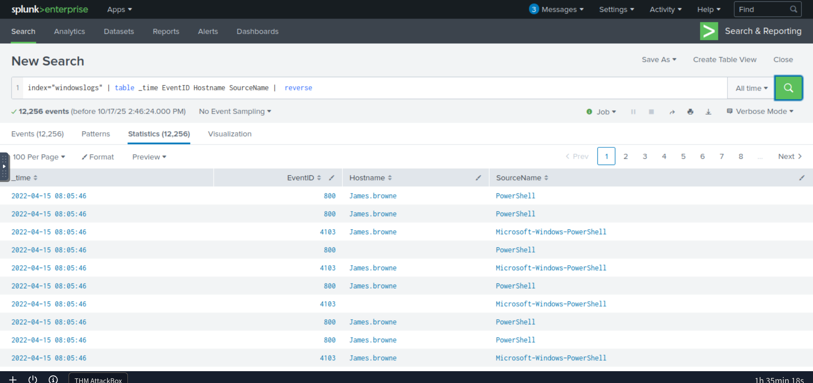

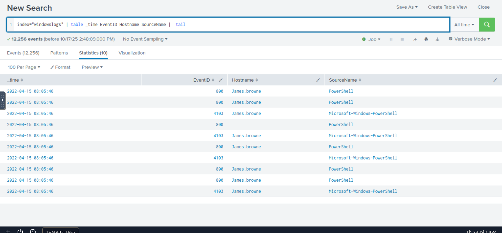

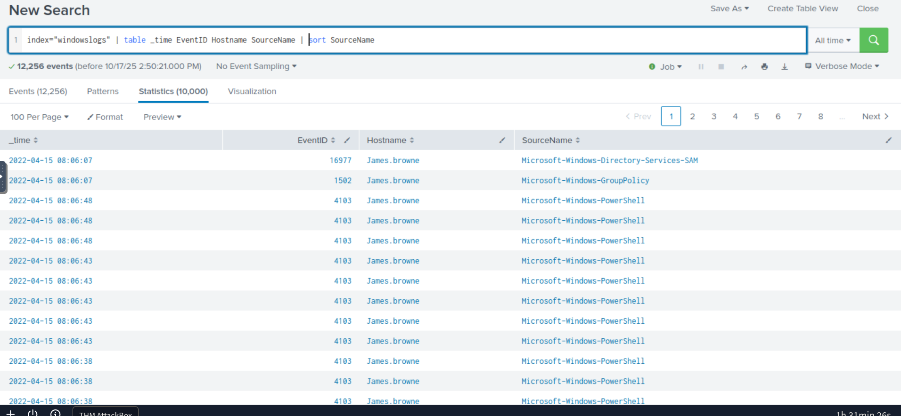

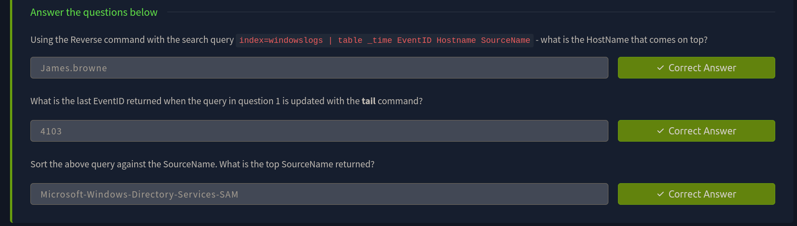

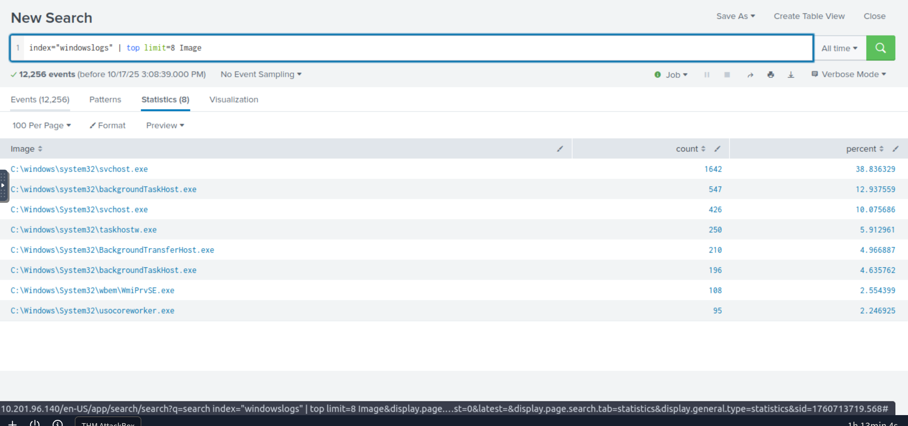

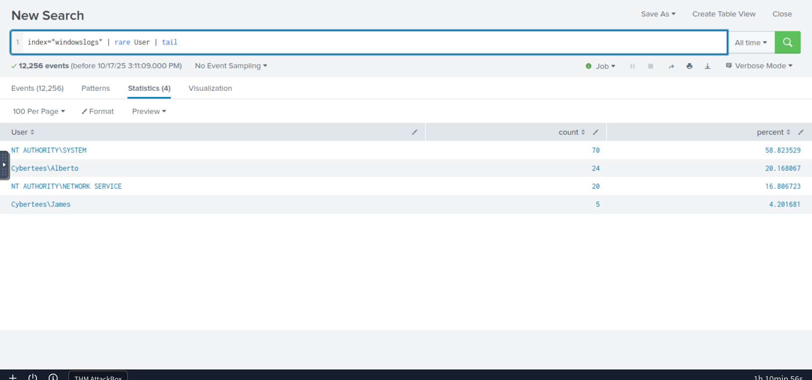

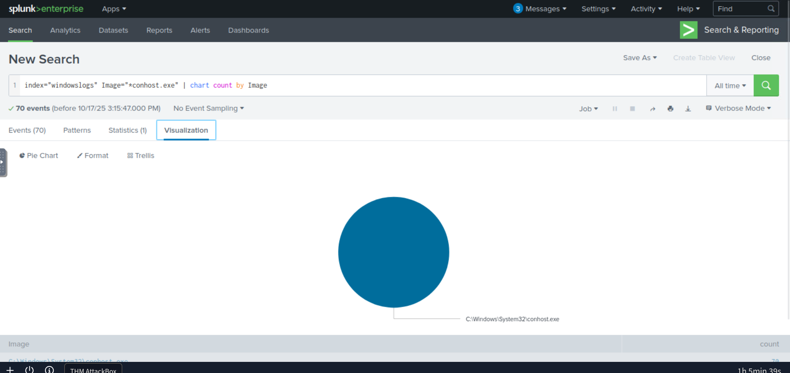

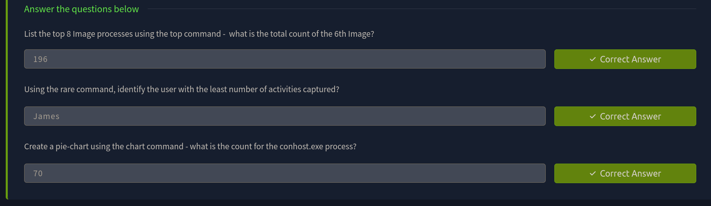
