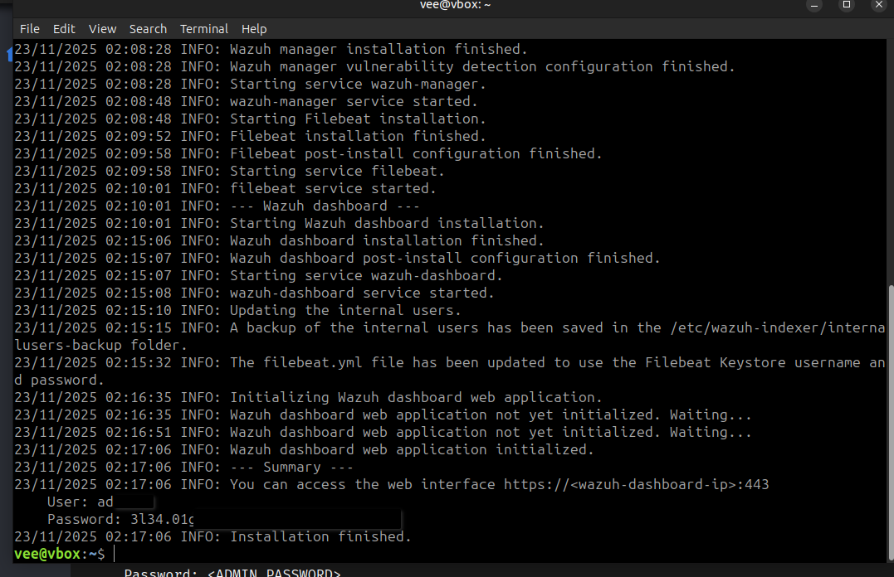
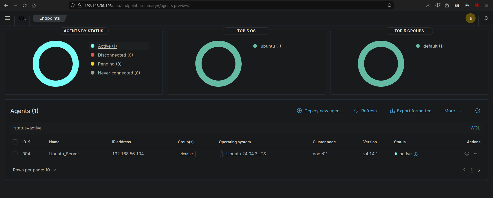
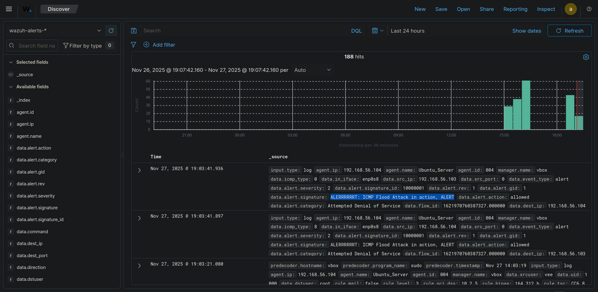

> /SOCTraining/Suricata/Wazuh Integration

# Suricata - IDS and Wazuh Integration

## Objectives
- Establish stable, non-blocking IDS mode for network monitoring.
- Successfully install and enroll the Wazuh Agent with the Manager.
- Integrate the Suricata event log `eve.json` with the Wazuh Agent for centralized analysis.
- Deploy and validate a custom ICMP flood attack detection rule.
- Achieve full, stable alert visibility on the Wazuh Manager Dashboard.

## Tools Used
- **Suricata IDS:** Configured for passive network traffic monitoring.
- **Wazuh Agent:** Installed and configured for local log forwarding.
- **IPtables:** Used to ensure clean network traffic flow for passive monitoring.
- **AF-Packet:** The high-performance packet capture mechanism used by Suricata in IDS mode to efficiently read copies of network traffic from the kernel.
- **IPtables / NFQUEUE:** The Netfilter queuing mechanism that was leveraged during IPS mode for packet interception & flow.

## Steps Performed
1. **Wazuh Agent Installation and Enrollment:**
   - The Wazuh Agent package was installed on the Ubuntu Server VM.
   - The Agent was configured to connect to the Manager IP (`192.168.56.103`).
   - The Agent service was started, completing the automatic enrollment process and achieving an 'Active' status on the Wazuh Dashboard.

2. **Firewall Cleanup for IDS Mode:**
   * All residual `iptables` rules, including any set up for `NFQUEUE` redirection, were **flushed** to ensure network traffic flows freely for passive monitoring.

3. **Suricata Service Configuration for IDS Mode:**
   - The Suricata service file (`/lib/systemd/system/suricata.service`) was modified.
   - The IPS-related startup flag (`-q 0`) was **removed** from the `ExecStart` line to ensure Suricata runs in passive IDS (Detection Only) mode.
   - The Suricata service was restarted to apply the changes.

4. **Wazuh Log Integration:**
   - The Wazuh Agent configuration (`/var/ossec/etc/ossec.conf`) was updated to monitor the Suricata JSON output file:\
      `<localfile>`\
      `<log_format>json</log_format>`\
      `<location>/var/log/suricata/eve.json</location>`\
      `</localfile>`

5.  **Custom ICMP Flood Rule Deployment and Correction:**
    - A custom rule was added to `/etc/suricata/rules/local.rules` using the required `track by_src` parameter to ensure accurate rate-limiting based on the attacking source IP:
 
6.  **Validation:**
    - Simulated an ICMP flood attack to verify the alert trigger.
    - The Wazuh Agent ingested the event alert from `eve.json` and the alert was confirmed visible on the Wazuh Dashboard.

## Key Learnings

- **Persistence of IPtables:** Understood that `iptables` rules are volatile and require persistence configuration if active filtering is required across reboots.
- **Threshold Rule Logic:** Confirmed that the `track by_src` parameter is necessary within Suricata threshold rules to accurately detect floods originating from a single source.
- **IDS Integration:** Achieved stable integration by monitoring Suricata's JSON output using the `localfile` configuration in the Wazuh Agent.

## Screenshots
Please refer to the attached screenshots in this directory.

