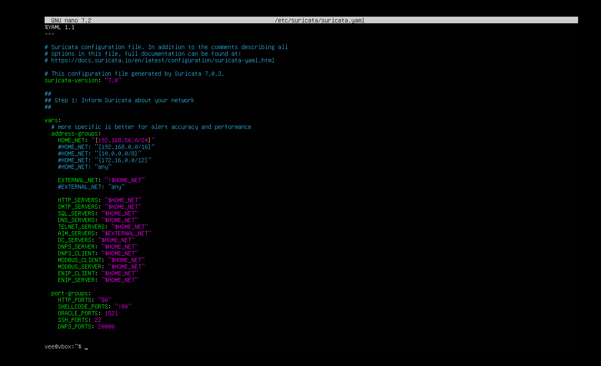
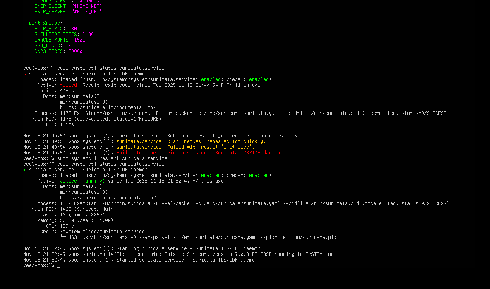
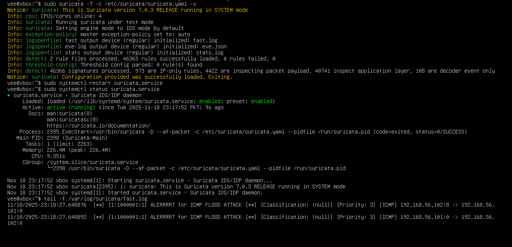

> /SOCTraining/Suricata/IDS Mode

# Suricata - Network-Based IDS Deployment

## Objectives
- Deploy and configure Suricata IDS on Ubuntu Server  
- Monitor and analyze real-time alerts using fast.log  
- Simulate ICMP flood attack using hping3  
- Create and validate custom Suricata rules  
- Understand AF-PACKET and its role in packet capture  

## Tools Used
- Suricata IDS  
- hping3
- Ubuntu Server  
- Custom rule sets  

## Steps Performed
- Installed Suricata and verified configuration using `suricata -T`  
- Started Suricata in IDS mode on the active interface  
- Updated and enabled Suricata default rule sets  
- Monitored fast.log in real time for alerts  
- Executed ICMP flood using `hping3 -1 -i u2500 -c 100 <Target_IP>`  
- Created a custom ICMP threshold detection rule  
- Restarted Suricata and confirmed alert generation  
- Tested functionality using ICMP alert rule  
- Reviewed AF-PACKET for high-performance packet capture

## Key Learnings
- Suricata rule creation and threshold-based detection
- Understanding packet inspection workflow in IDS mode  
- Validating alerts through controlled attack simulation  
- Importance of AF-PACKET for high-performance monitoring  

## Screenshots

