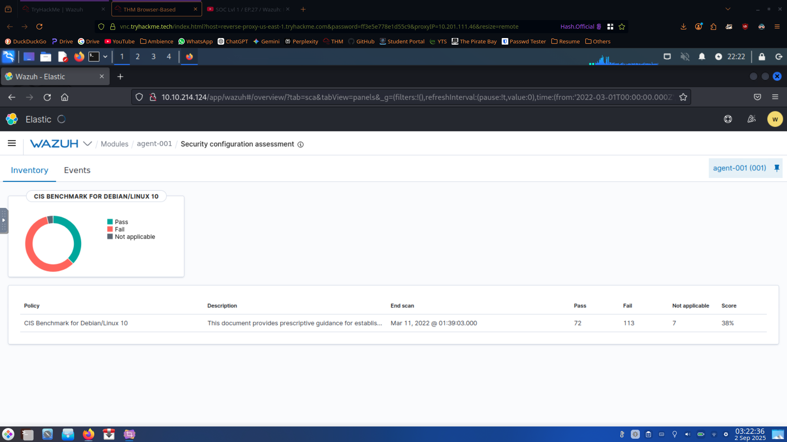
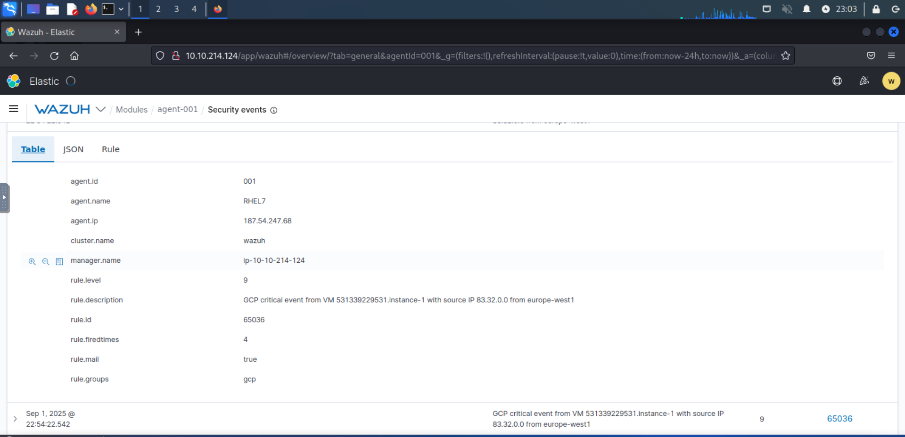
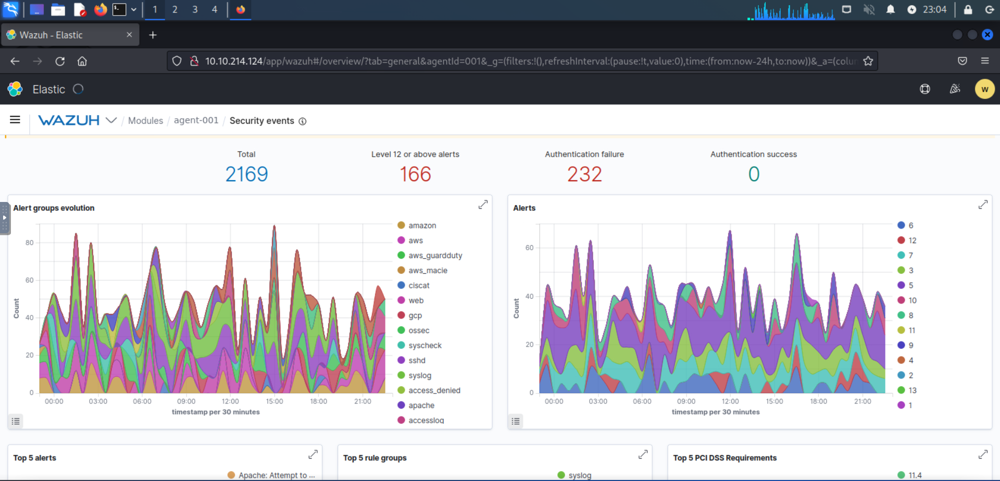
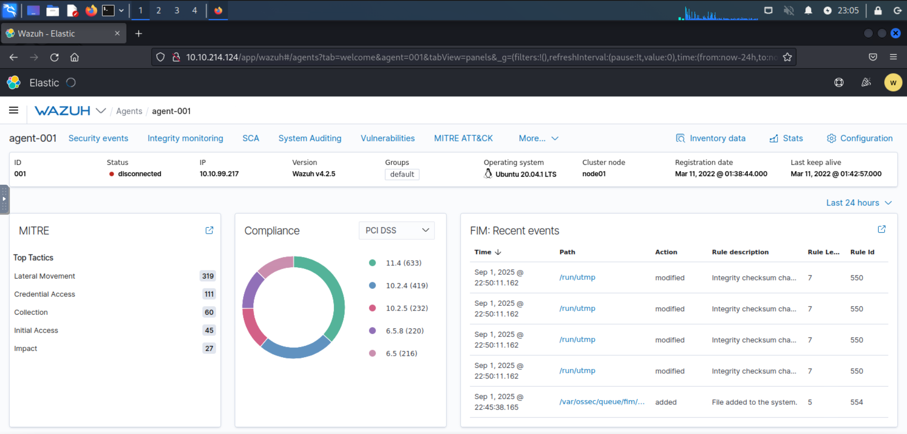
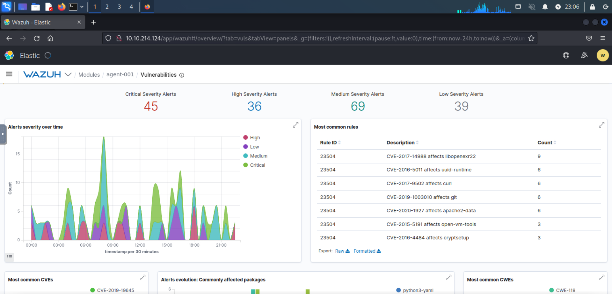

> /SOCTraining/Wazuh
# Wazuh EDR

## Objectives
The objective of this lab was to practice **endpoint detection and response (EDR)** using **Wazuh**. By working with a Wazuh management server and agents, we explored rule-based detection, log analysis, vulnerability scanning, compliance monitoring, and reporting features to understand how analysts monitor endpoints and respond to threats.  

## Tools Used
- **Wazuh Management Server** – central dashboard for monitoring and reporting  
- **Wazuh Agents** – deployed on Windows and Linux endpoints for event collection  
- **TryHackMe Network** – virtual environment for performing the lab  
- **Linux CLI utilities** (`grep`, `nano`, `less`) for log inspection  

## Steps Performed
1. **Accessing Wazuh**
   - Connected to the TryHackMe VPN and deployed the Wazuh management server.  
   - Logged into the web interface with provided credentials and selected **Global Tenant**.  
   - Explored the navigation menus: Dashboard, Rules & Alerts, and Modules.  

2. **Understanding EDR and Wazuh**
   - Reviewed the concept of EDR: auditing devices, detecting suspicious activity, and visualizing events.  
   - Understood Wazuh’s **manager-agent architecture**, where the manager centralizes data from endpoint agents.  

3. **Vulnerability Assessment**
   - Enabled Wazuh’s **Vulnerability Scanner** module.  
   - Observed scanning of installed applications against CVE databases (e.g., vulnerable version of Vim flagged with CVE-2019-12735).  
   - Configured periodic scans via `/var/ossec/etc/ossec.conf`.  

4. **Event & Alert Analysis**
   - Monitored **successful and failed logins**, including SSH brute-force attempts mapped to **MITRE ATT&CK (T1110)**.
   - Reviewed **alerts.log** using CLI tools to validate recorded events.
   - Explored how Wazuh applies severity levels and rulesets to daily system events.

5. **Compliance and Benchmarking**
   - Analyzed compliance scoring of endpoints against frameworks such as **MITRE, NIST, and GDPR**.  
   - Reviewed benchmark results for both Linux and Windows agents.  

6. **Reporting and Visualization**
   - Generated reports of **security events within the last 24 hours**.  
   - Explored visualizations to break down large sets of logs.  
   - Imported **sample data** into Wazuh to simulate a larger environment and practiced querying with different time ranges.  

## Key Learnings
- Wazuh is a **comprehensive open-source EDR solution** capable of real-time monitoring, vulnerability assessment, and compliance auditing.  
- Its **ruleset sensitivity** can generate false positives, highlighting the need for tuning.  
- **Visualization and reporting modules** simplify large-scale event analysis and incident response.  
- Mapping alerts to **MITRE ATT&CK techniques** strengthens threat classification.  
- Compliance integration with **NIST, MITRE, GDPR** frameworks provides useful auditing insights for security teams.  

## Screenshots
Please refer to the attached screenshots in this directory

