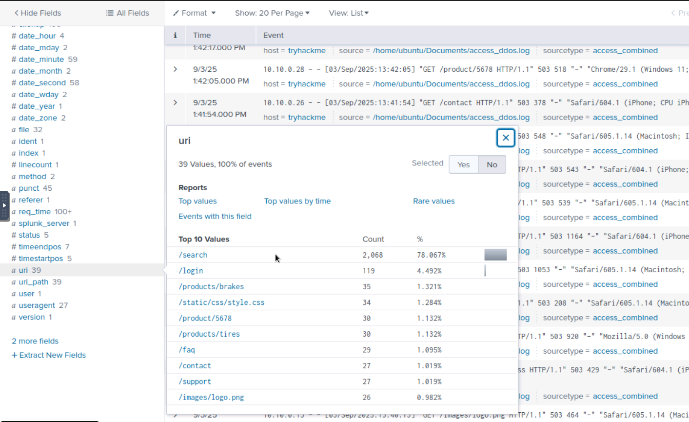
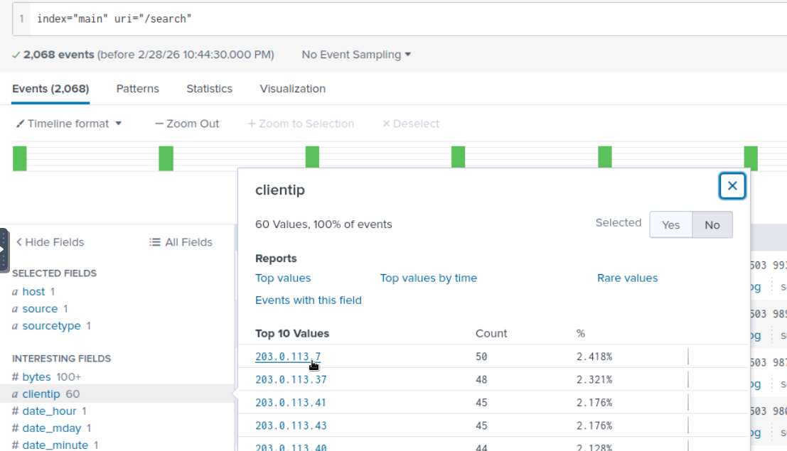
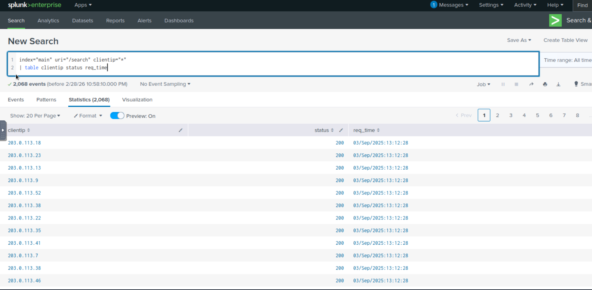
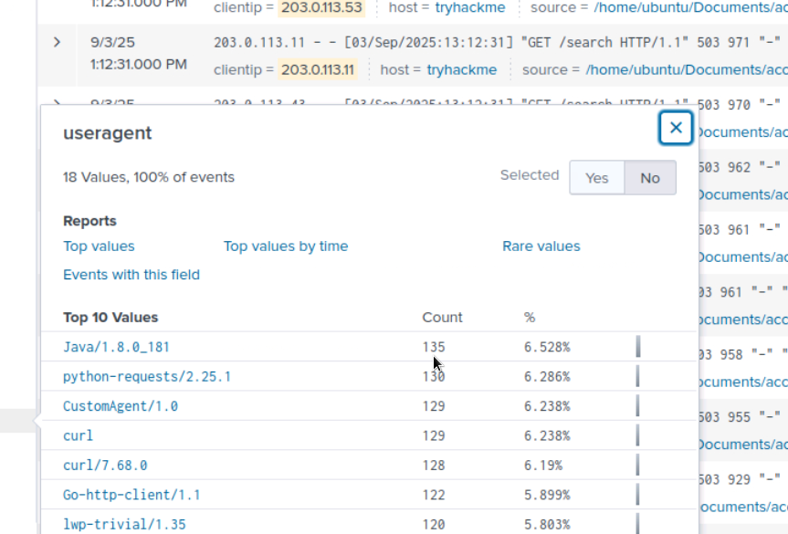
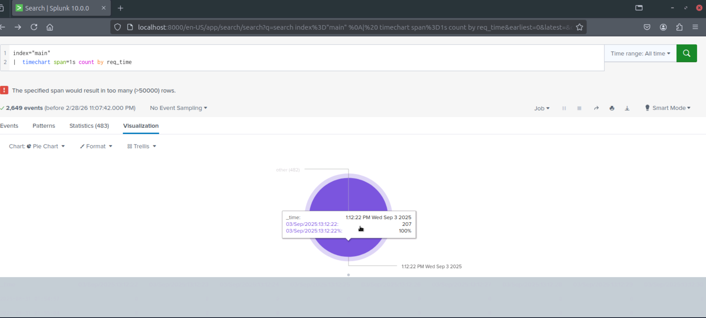
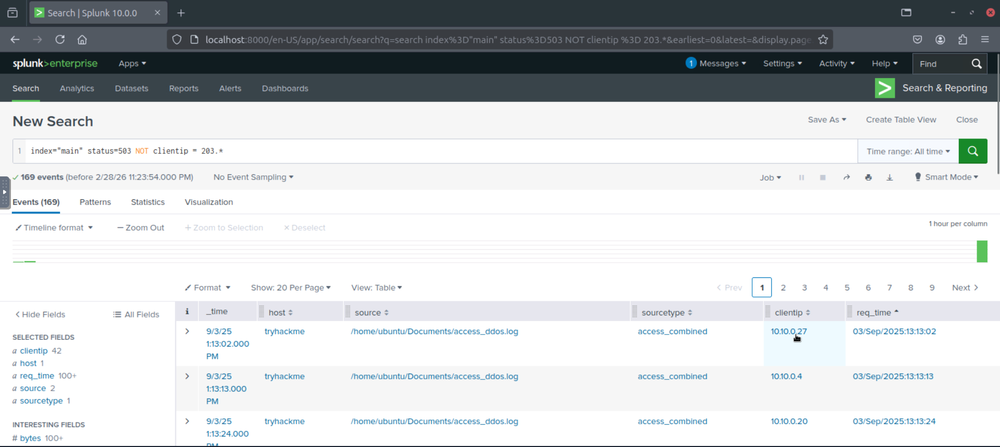
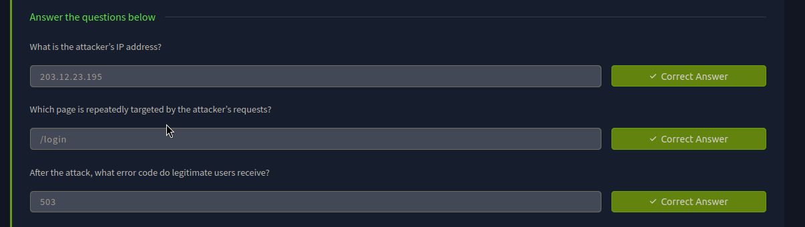
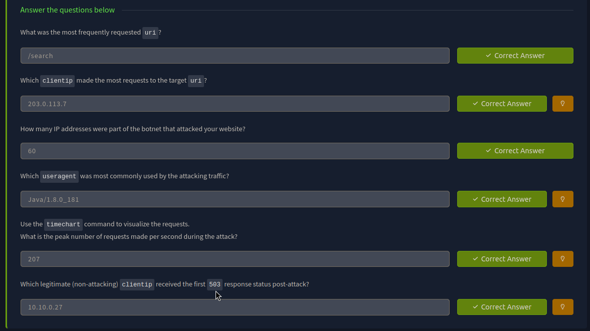

> /SOC Training/WebDDoS Investigation
# Web DDoS Investigation

## Objectives
- Learn how Denial-of-Service (DoS) and Distributed Denial-of-Service (DDoS) attacks function at the application layer (Layer 7).
- Understand attacker motives behind service disruption campaigns.
- Identify common indicators of DoS/DDoS activity in web server logs.
- Perform log-analysis & track down the IPs.
- Explore detection, mitigation, and defensive strategies against availability attacks.

## Tools & Resources
- **Splunk:** Log aggregation, filtering, timechart visualization, and field-based investigation.
- **Apache Access Logs:** Manual review of HTTP request patterns.

## Steps Performed
- Reviewed DoS vs DDoS and application-layer attack mechanics.
- Studied common attack types including HTTP Flood, Slowloris, Cache Bypass, Oversized Queries, and Login/Form Abuse.
- Analyzed attacker motives such as financial loss, extortion, hacktivism, reputational damage, and denial of wallet.
- Examined a condensed `access.log` file & identified:
  - High request rates from a malicious IP.
  - Repeated targeting of `/login.php`.
  - Burst traffic patterns within the same timestamp window.
  - Spike in `503 Service Unavailable` responses.
- Confirmed repeated targeting of a resource-intensive endpoint (`/login.php`).
- Observed legitimate users receiving `503` errors post-resource exhaustion.
- Investigated suspected DDoS activity using Splunk:
  - Identified most requested URI.
  - Determined top `clientip` generating malicious traffic.
  - Counted distinct IPs involved in botnet activity.
  - Identified automated traffic indicators.
  - Generated `timechart` visualization to determine peak requests per second.
- Differentiated legitimate vs malicious traffic based on request volume, user-agent anomalies, and timestamp bursts.

## Detection & Mitigation Techniques
- Input validation and secure development practices.
- CAPTCHA and JavaScript challenges to block automation.
- CDN caching and traffic absorption.
- Load balancing to distribute traffic across infrastructure.
- Web Application Firewall (WAF) rate-limiting rules.
- Monitoring 5xx error spikes as early indicators of resource exhaustion.

## Key Learnings
This activity highlighted that DoS and DDoS attacks aim to overwhelm web services, targeting resource-intensive endpoints like `/login` or `/search`. Key detection indicators include high request rates, unusual User-Agents, and spikes in server errors. Log analysis and SIEM help identify attack patterns efficiently, while layered defenses such as CDNs, WAFs, and input validation are essential to maintain service availability.

## Screenshots
Please refer to the attached screenshots in this directory.

### **Compromised URI**

### **Top culprit in attack**

### **Botnet & time of attack**

### **User-agent in attack**

### **Peak traffic per second during attack**

### **Legitimate clients facing 503**

**Evaluation Results**

