> /SOCTraining/WindowsThreatDetection/Sysmon&SecurityLogsAnalysis
# Windows Sysmon & Security Analysis

## Objectives
- Understand how to locate and interpret key Windows Event Logs.
- Analyze Security logs for authentication-based attacks such as brute force and RDP abuse.
- Investigate user account manipulation using Windows event IDs.
- Leverage Sysmon logs for process, network, and persistence analysis.
- Examine PowerShell history to uncover attacker activity not visible in standard logs.

## Tools & Resources
- **Event Viewer:** Analysis of Security and Sysmon EVTX logs.
- **Sysmon:** Process creation, network, file, and registry monitoring.
- **Windows Security Logs:** Authentication and user management investigation.
- **PowerShell:** Command tracking for post-compromise activity.
- **Manual Log Correlation:** Logon ID and Process ID cross-referencing with other malicious activity.

## Steps Performed
- Reviewed `evtx` logs in Event Viewer.
- Filtered Security logs for:
  - **Failed Logon** to detect brute-force attempts.
  - **Successful Logon** to identify malicious RDP access (Logon Type 10).
- Identified attacker IP responsible for brute force activity.
- Determined compromised user account.
- Correlated Logon ID from 4624 event for session tracking.
- Reviewed user management events:
  - User creation
  - Added to privileged group
- Identified backdoor account creation and group privilege escalation.
- Verified Logon ID consistency across login and account modification events.
- `Sysmon.evtx` to analyze:
  - **Process Creation** for browser usage and malware execution.
  - **Network** connections and DNS resolution.
  - **File creation** and **registry** persistence mechanisms.
- Identified:
  - Web browser used by compromised user.
  - Malicious file downloaded.
  - Download URL.
  - Persistence file dropped on the host.
  - Command & Control (C2) server IP and port.
  - Corresponding malicious domain.
- Reviewed PowerShell history file:
  - Identified first executed command.
  - Retrieved execution date.
  - Located hidden flag in user PowerShell history.

## Key Learnings
This activity demonstrated how critical Windows logging is for SOC operations and incident response. Authentication logs (4624/4625) are essential for detecting brute-force and RDP-based compromises, while user management events reveal persistence and privilege escalation attempts. Sysmon significantly enhances visibility into process execution, malware behavior, persistence, and C2 communication. Finally, PowerShell history provides valuable insight into attacker commands that are not visible in traditional process logs.

## Screenshots
Please refer to the attached screenshots in this directory.

#### **IP attempting brute-force**
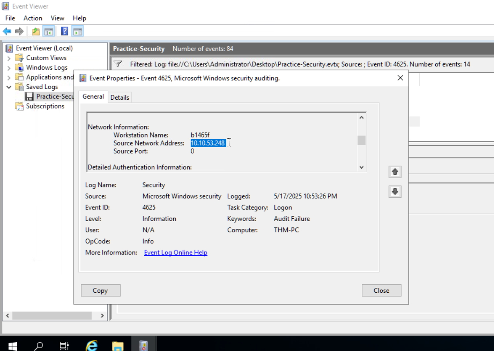

#### **Compromised User**
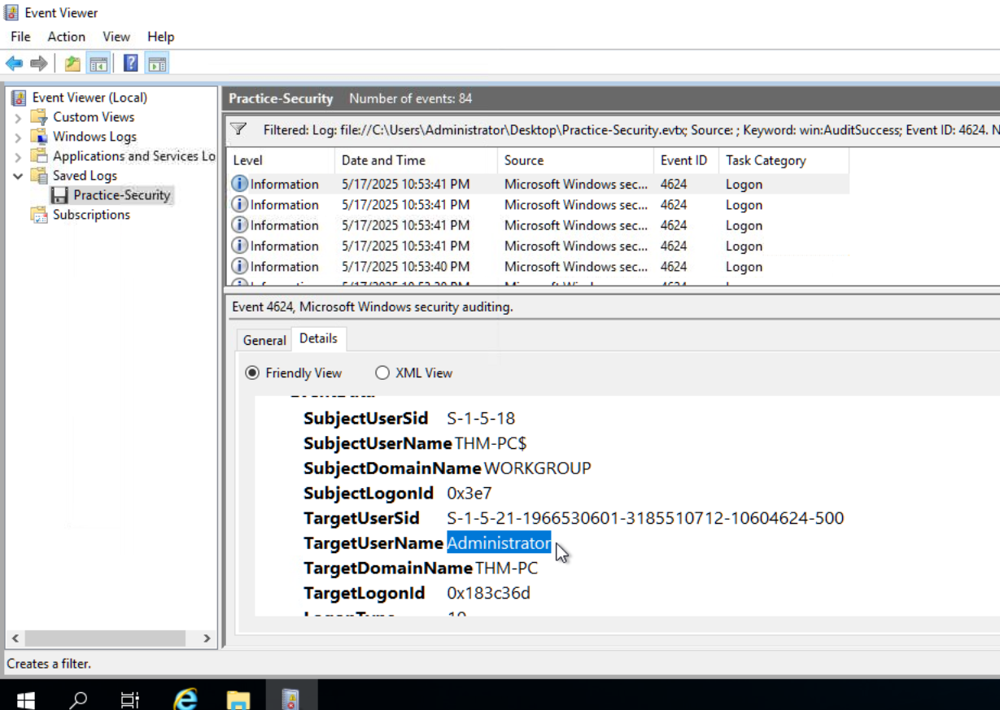

#### **Malicious user creation & session logon ID**
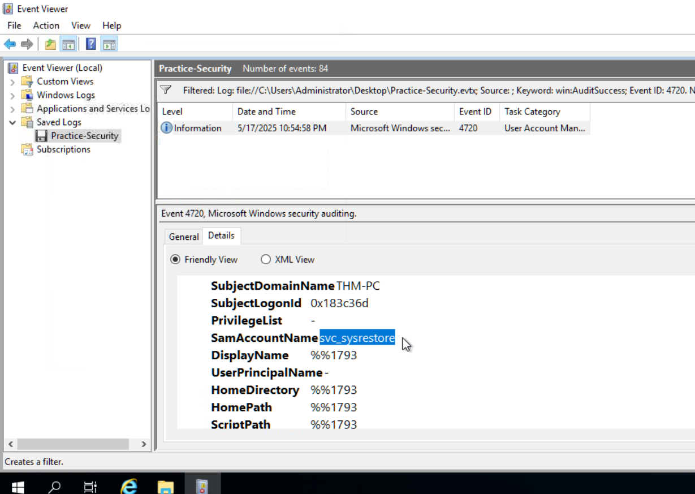

#### **Backdoor group**
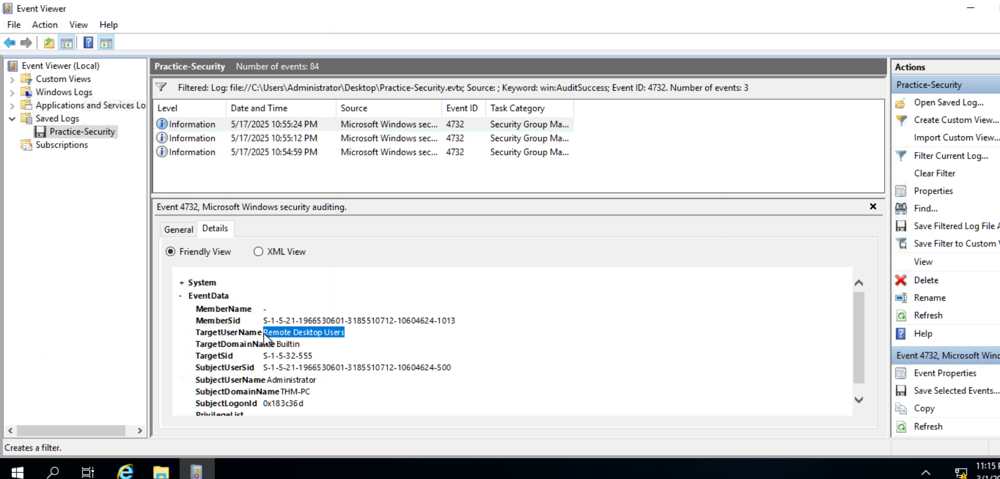

#### **Web browser used to download malicious file**
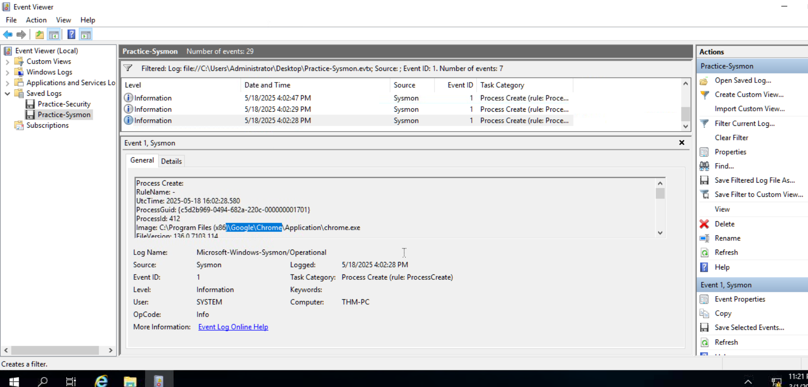

#### **Malicious file**
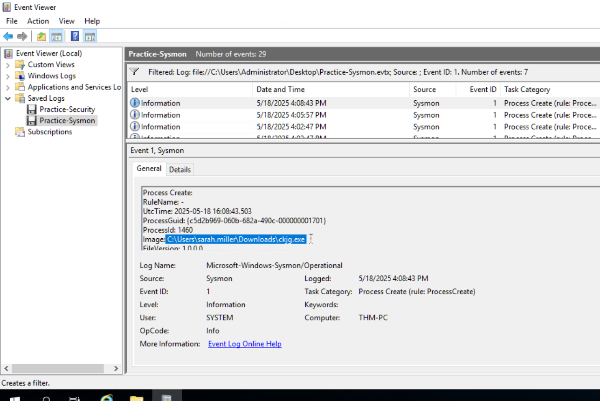

#### **Malware URL**
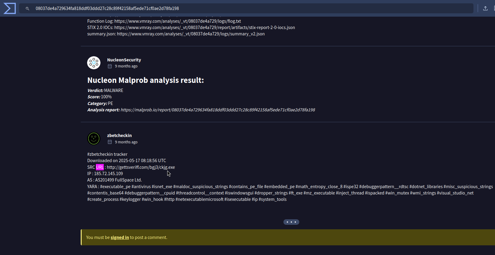

#### **File created for persistence**
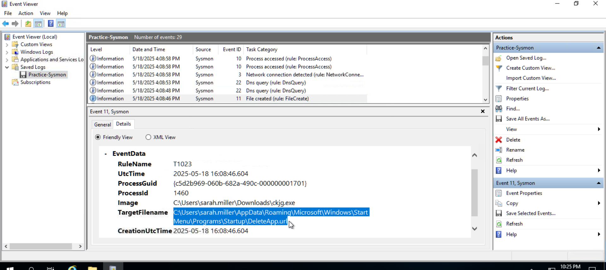

#### **C2 server pinged by malware**
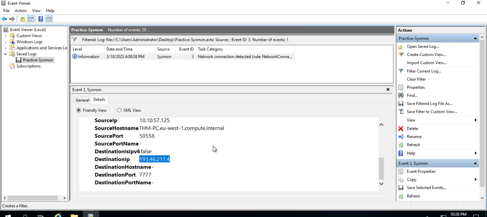

#### **Malicious domain involved**
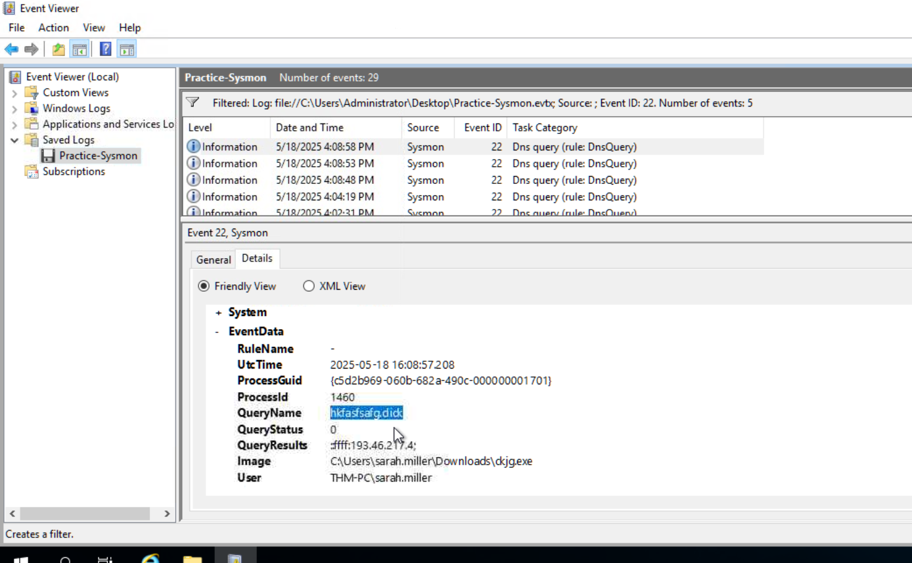

#### **PS commands executed by attacker**
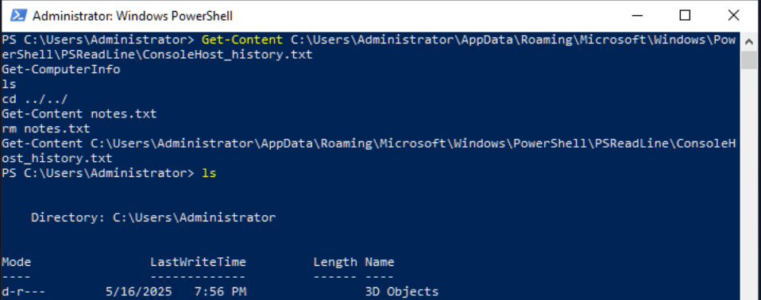

#### **Date of execution**
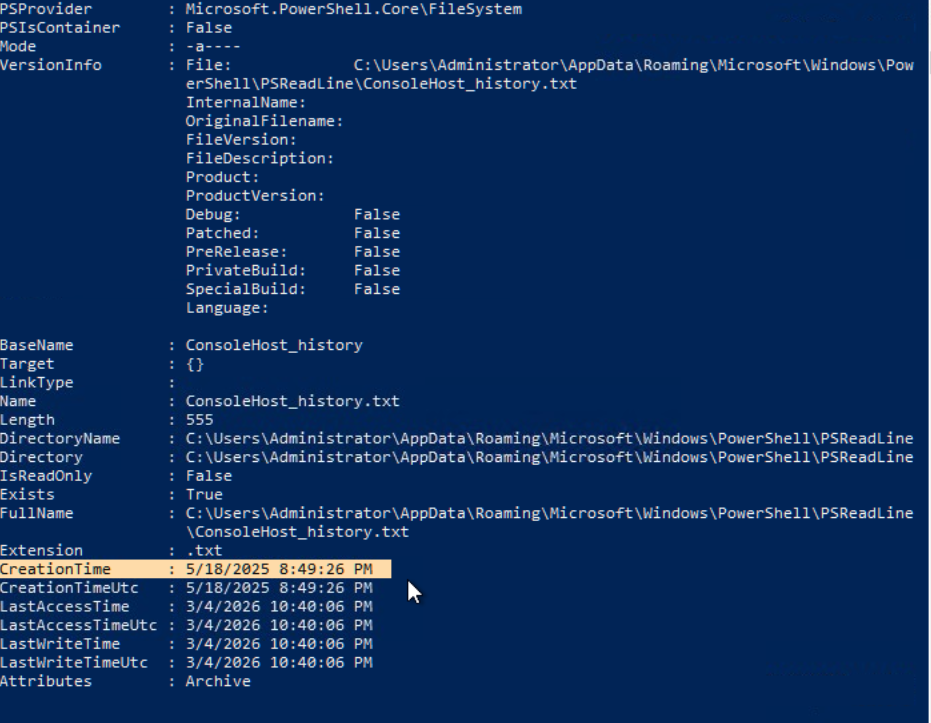

#### **Hidden flag in history**
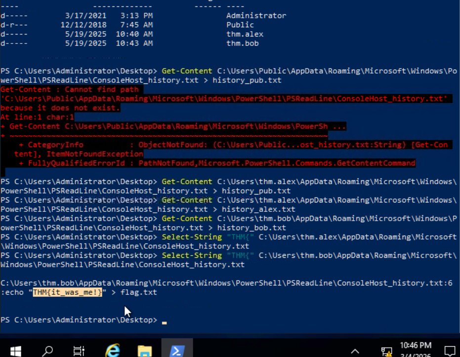

#### **Results**
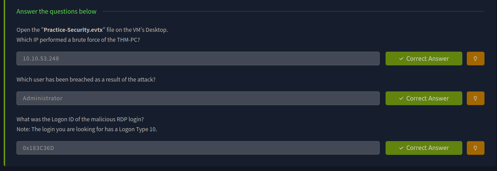

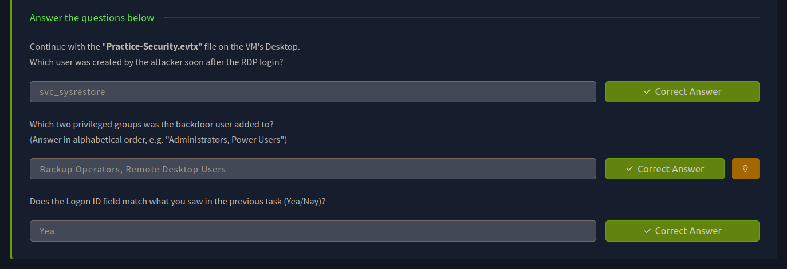

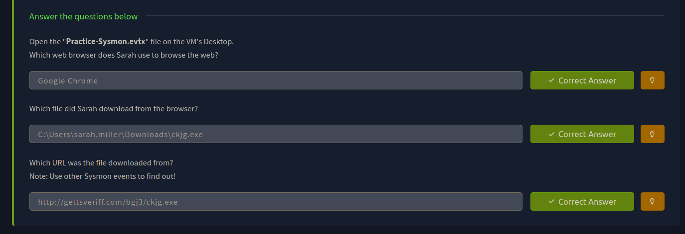

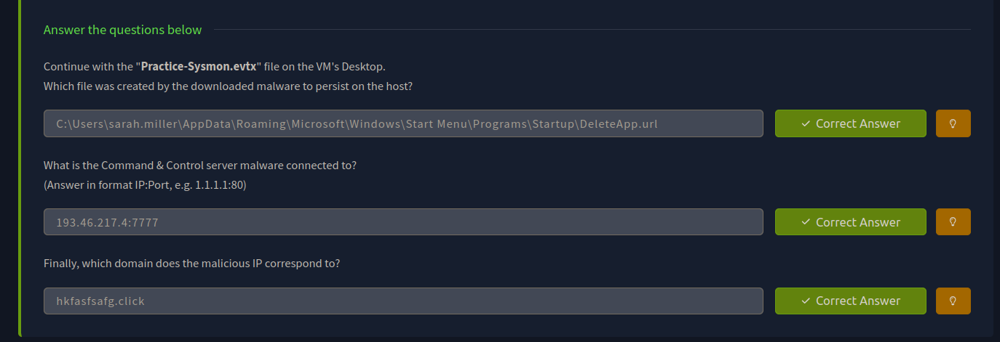

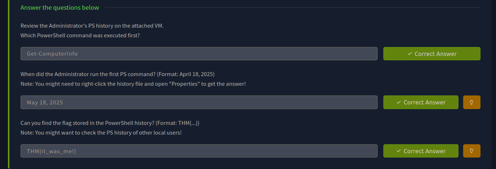

---

> QXV0aG9yOiBodHRwczovL2dpdGh1Yi5jb20vaGFzaC01NDU=