> /SOCTraining/WinThreatDetection/WindowsPhishingAnalysis

# Windows Phishing & Worm Analysis

## Objectives

- Investigate how threat actors gain Initial Access to Windows machines using exposed services and user-driven methods.
- Detect RDP brute-force attempts and successful breaches using Windows Security event logs.
- Identify attacker IP, compromised account, and post-access activity through log correlation.
- Analyze phishing attack vectors including malicious binaries, double-extension files, and LNK attachments.
- Trace malicious download and execution chains using Sysmon event logs.
- Detect USB-based malware delivery, dropped payloads, and lateral propagation via removable media.

## Tools & Resources

- **Event Viewer:** Primary tool for analyzing Windows Security logs `.evtx` across all investigation scenarios.
- **Sysmon:** Provided deep telemetry on process creation, file creation, and network connections for phishing and USB cases.
- **MITRE ATT&CK Framework:** Used to map observed attacker behavior to techniques — T1133, T1190, T1566, and T1091.
- **Windows Security Logs:** Analyzed Event IDs to detect authentication anomalies and brute-force patterns.

## Steps Performed

- Analyzed `Security.evtx` in Event Viewer and filtered for **failed logon** to identify brute-force attempts.

- Applied **Logon Type** filters to isolate remote authentication failures originating from external IPs.
  
- Identified the most frequently targeted account and the attacker's source IP from the failed logon events.

- Switched filter to **successful logon** to confirm the breached account and logon type used for Initial Access.

- Extracted the **Logon ID** from the successful RDP logon event and cross-referenced it in Sysmon logs to enumerate post-access processes.

- Examined the attacker's workstation name field to retrieve the real hostname of the threat actor's machine.

- Investigated Phishing Case by executing a `.com` binary to observe how threat actors disguise executables as harmless file types.

- Analyzed LNK file properties in Phishing Case to extract the malicious **PowerShell download URL** embedded in the shortcut target.

- Reviewed entire Phishing Case folder to identify a **double-extension** file abusing Windows' hidden extension behavior for deception.

- Investigated `Phishing-Sysmon.evtx` and traced the full execution chain: 
  > browser download  → archive extraction → malware execution.

- Identified the **Process ID** of the launched phishing malware and the malicious domain it connected to via Sysmon network events.

- Analyzed and identified the USB-originated file executed by the user based on the non-standard drive letter in the process image path.

- Located the file dropped to disk by the malware and identified the secondary USB drive to which the worm propagated.

## Key Learnings

Initial Access is rarely a single event, it's a chain, & every link leaves a trace. Whether it's hundreds of failed RDP logins, a PowerShell command hiding inside an LNK shortcut, or malware launching from an E: drive, Windows event logs and Sysmon capture it all. The key is knowing which Event IDs to look for, how to correlate them across log sources, and recognizing that attackers rely heavily on user trust and default OS behaviors to slip through unnoticed.

## Screenshots
Please refer to the attached screenshots in this directory.

#### **Attacked user**
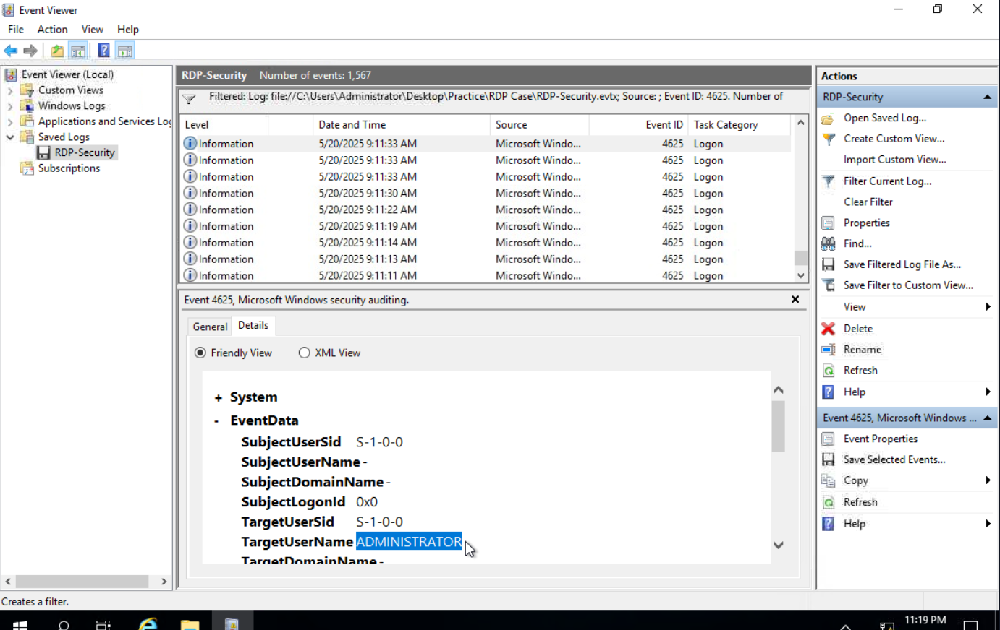

#### **Attacker's IP Address**
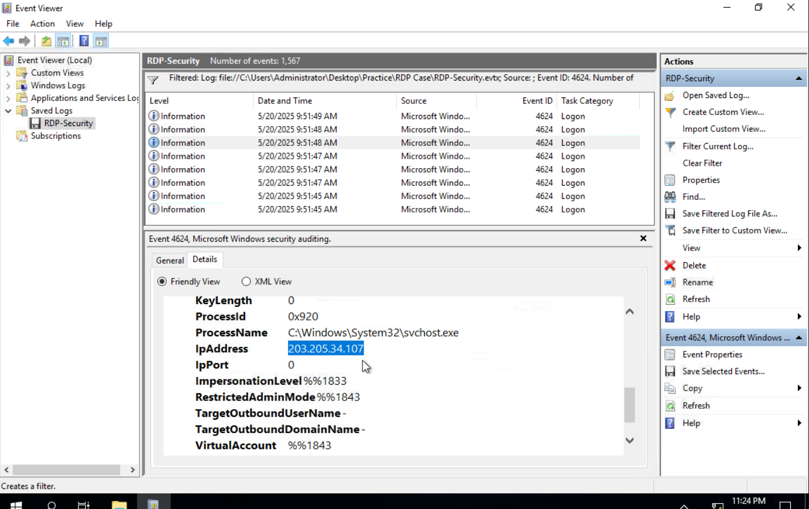

#### **Compromised workstation**
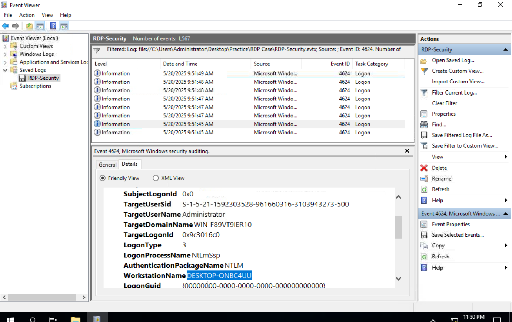

#### **Phishing malware behaviour**
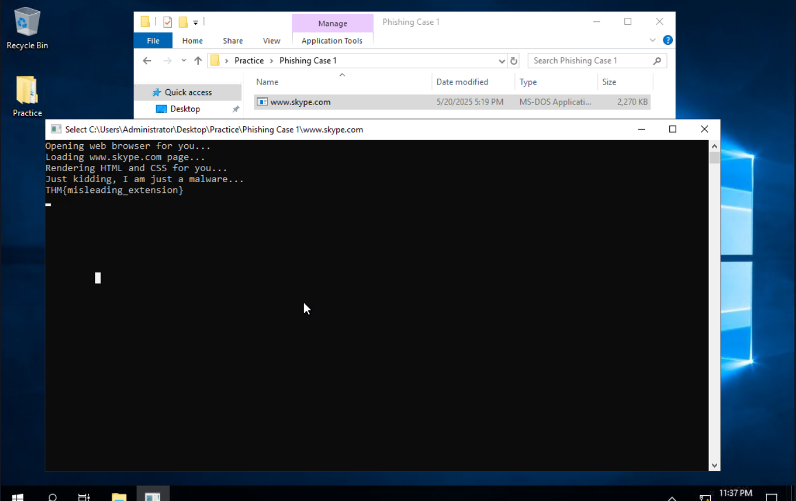

#### **Target URL for malware downloading**
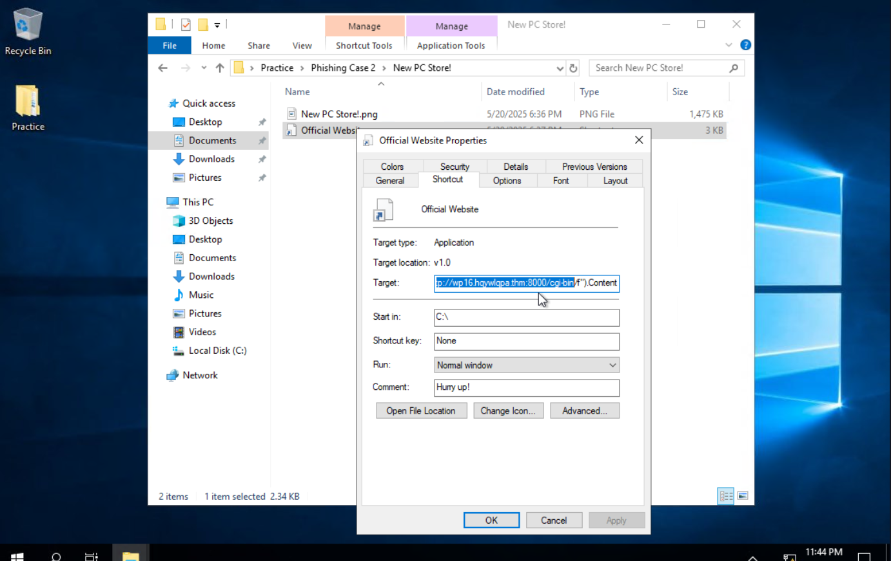

#### **Double extension indicating malware**
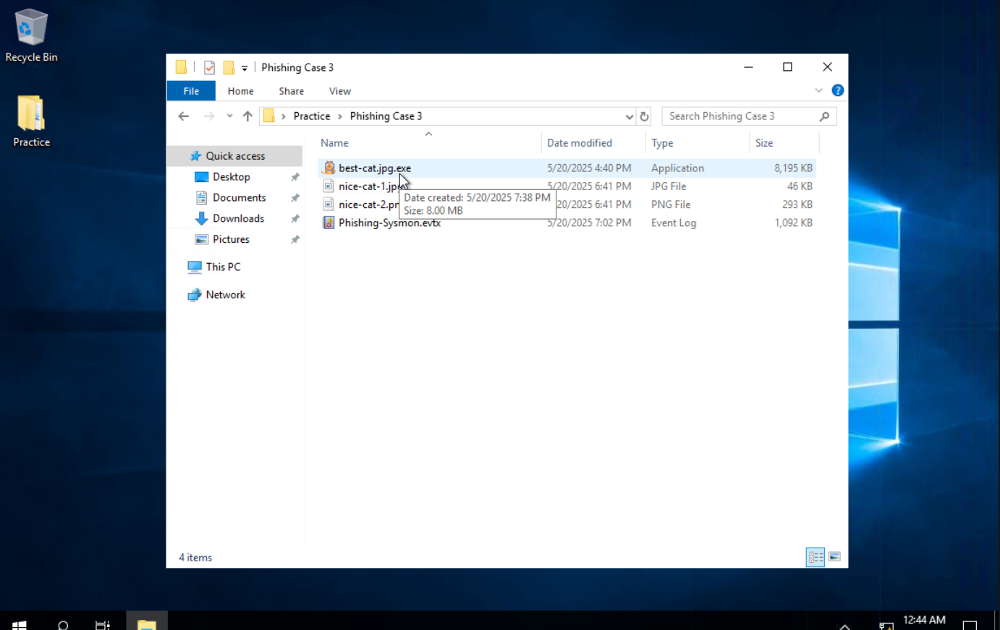

#### **Downloaded zip containing malicious file**
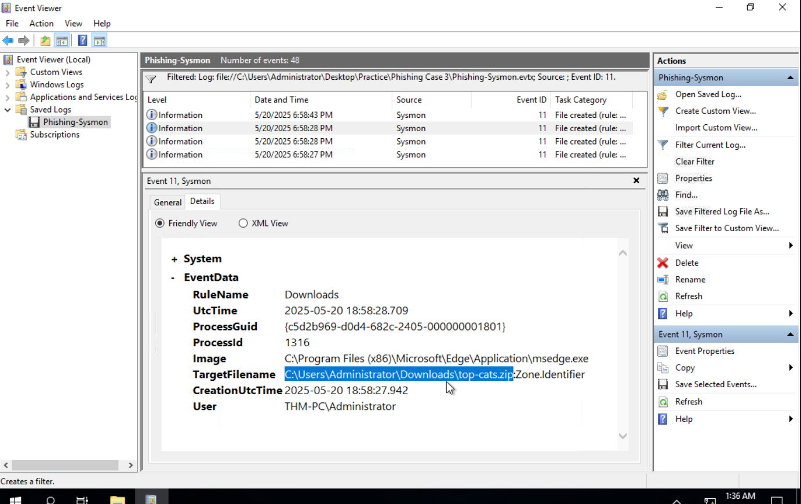

#### **Execution time & PID**
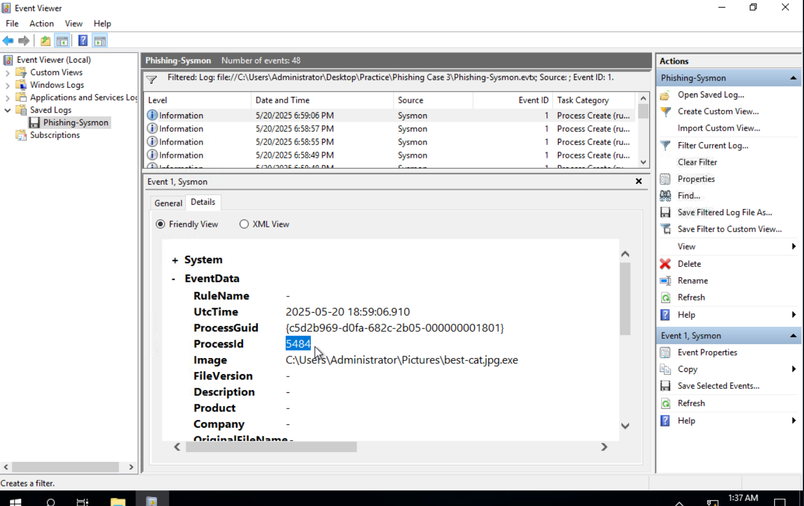

#### **Malicious DNS query**
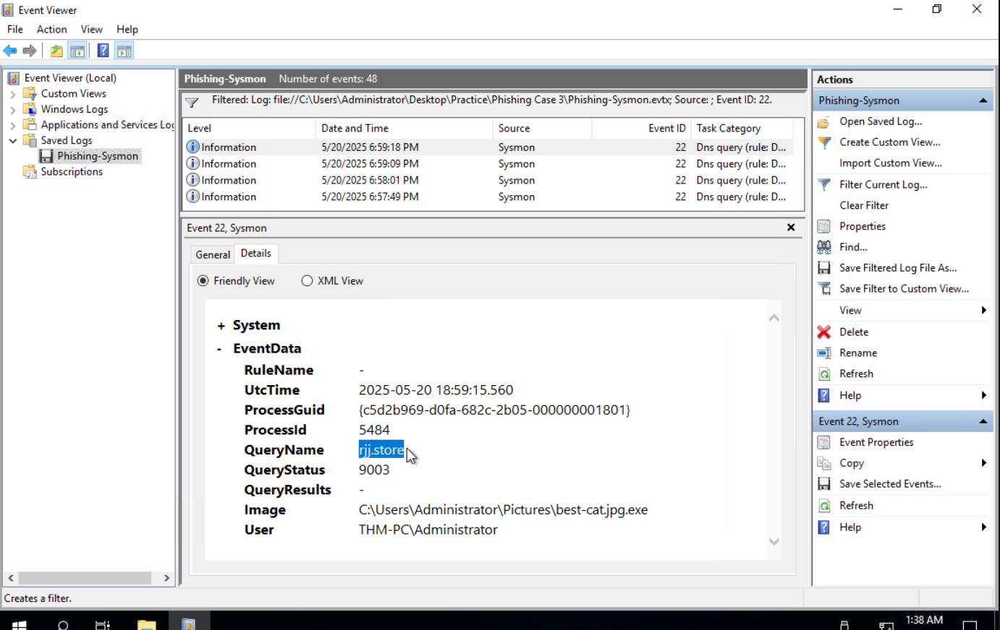

#### **USB baiting successful**
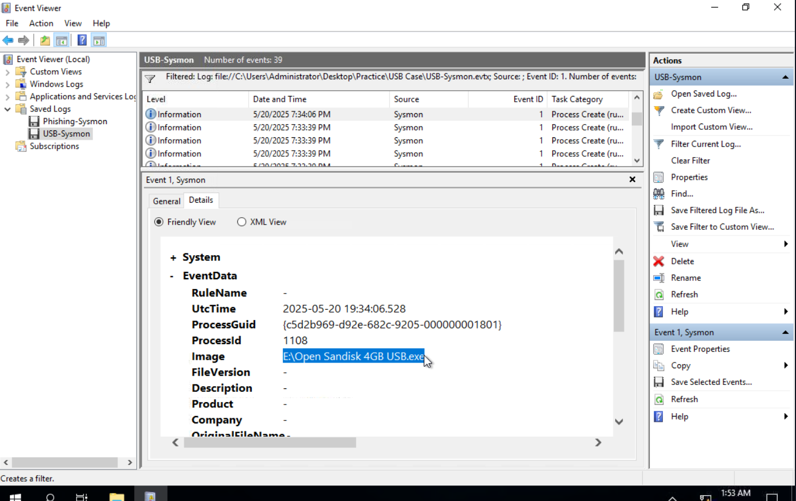

#### **USB containing malware**
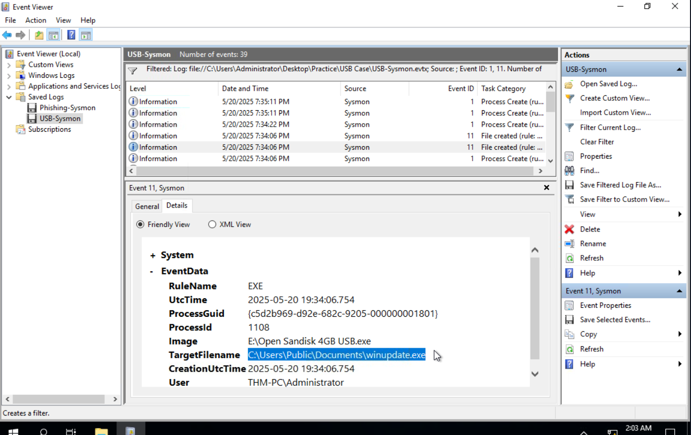

#### **Propagation to next USB**
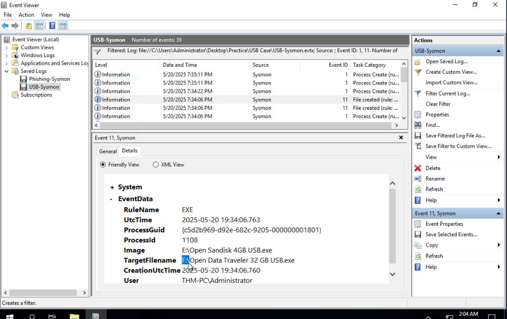

#### **Results & Findings**
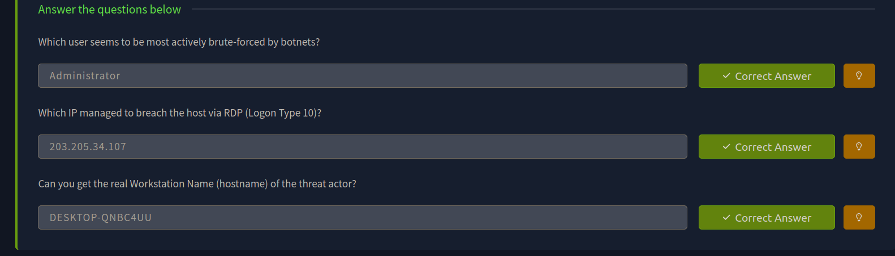

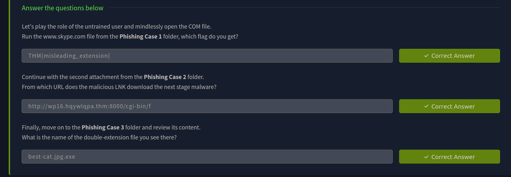

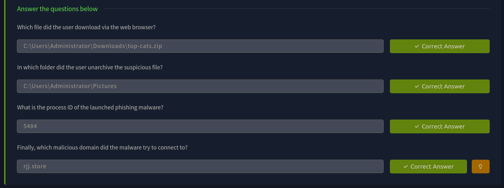

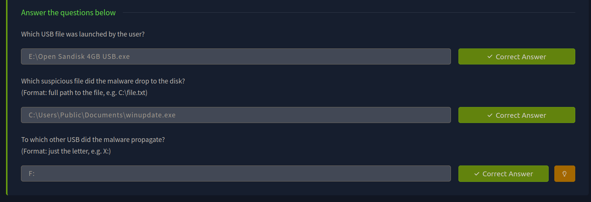

---

> QXV0aG9yOiBodHRwczovL2dpdGh1Yi5jb20vaGFzaC01NDU=