> /SOCTraining/WinThreatDetection/post_breach

# Windows Post-Breach Behavioral Analysis

## Objectives

- Investigate post-access attacker behavior mapped to MITRE Discovery, Collection, and Exfiltration tactics.
- Detect Discovery commands executed via CMD and PowerShell following initial compromise.
- Build process trees using Sysmon logs by correlating `ProcessId` and `ParentProcessId` fields.
- Identify Collection targets including saved credentials, SSH keys, and sensitive documents.
- Analyze data stealer malware behavior and trace exfiltration to attacker-controlled infrastructure.

## Tools & Resources

- **Event Viewer:** Primary tool for analyzing Sysmon `.evtx` logs across Discovery and Collection scenarios.

- **Sysmon:** Provided process creation telemetry to reconstruct attacker command execution and malware behavior.

- **MITRE ATT&CK Framework:** Used to map observed attacker activity to tactics — T1082, T1033, T1016, T1005, T1041.

## Steps Performed

- Discovery commands detection via CMD (`net user`) and their appearance in Sysmon logs as process creation events.

- Identified the privileged group membership of the Administrator account and confirmed the `Image` field of the executed `net` command in Sysmon.

- Executed `invoice.pdf.exe` phishing sample and analyzed Sysmon logs to identify the first Discovery command spawned by the malware.

- Traced the full process tree of `invoice.pdf.exe`, from `explorer.exe` parent through `cmd.exe` and `powershell.exe` child processes.

- Identified the PowerShell command used by the malware to check for MS Defender EDR presence.

- Located the C2 domain to which `invoice.pdf.exe` transmitted discovered host data.

- Investigated GUI-based Discovery artifacts, identifying non-CMD processes.

- Examined Chrome Password Manager to retrieve saved credentials accessible to an attacker with interactive session access.

- Located stored SSH keys under `C:\Users\Administrator\` and identified a secret PDF document across Desktop, Downloads, and Documents directories.

- Executed `stealer.exe` sample and monitored Sysmon logs to identify the staging directory created by the malware.

- Identified the three file extensions (`.docx, .pdf, .xlsx`) targeted by the stealer and the PowerShell cmdlet `Get-ClipBoard` used to harvest clipboard content.

- Traced the exfiltration domain used by the stealer to upload collected data.

## Key Learnings

Post-access attacker behavior follows a predictable pattern; Discovery first, Collection second, Exfiltration last; and each phase leaves distinct artifacts in Sysmon logs. Process trees built from `ProcessId` and `ParentProcessId` correlations are one of the most reliable methods for distinguishing malicious command execution from legitimate admin activity. 

Data stealers present a harder detection challenge since they bypass CMD/PowerShell entirely, making file access monitoring and network telemetry the primary detection surface.

## Screenshots

Please refer to the attached screenshots in this directory.

#### Administrator user compromise
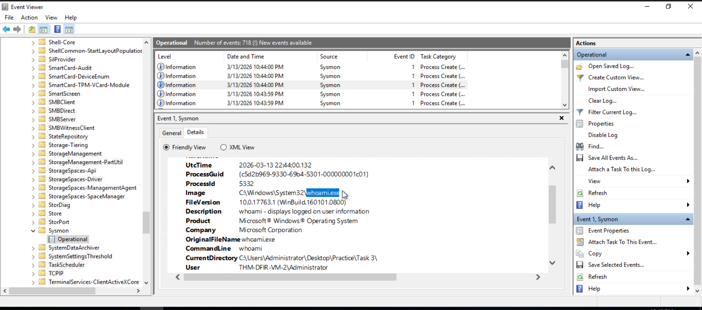

#### Defender EDR defense evasion
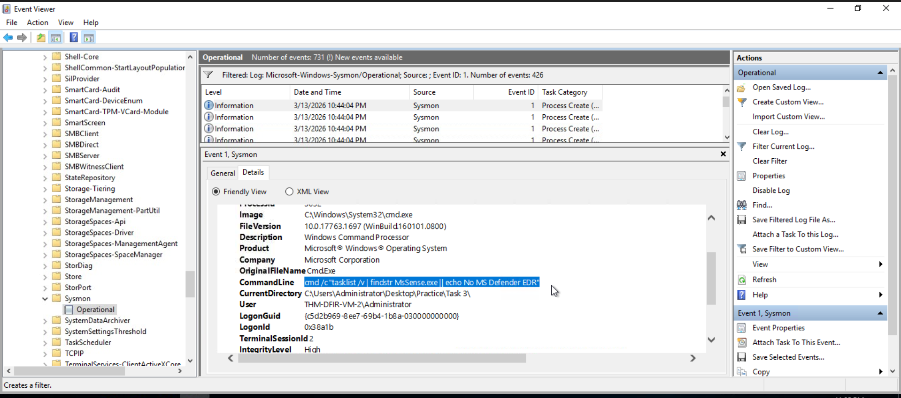

#### Plain-text password compromised

#### Domain used for data exfil
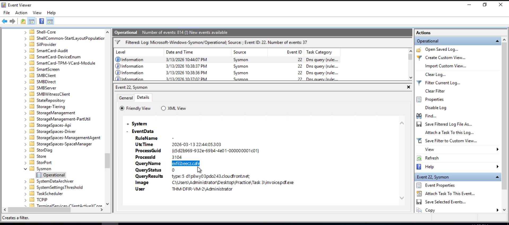

#### ssh key compromise
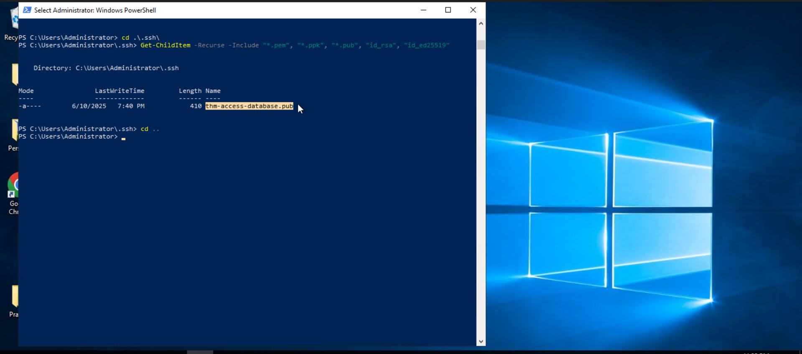

#### Network overview stolen
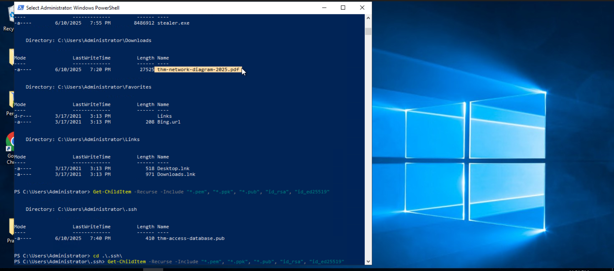

#### Directory created by attacker
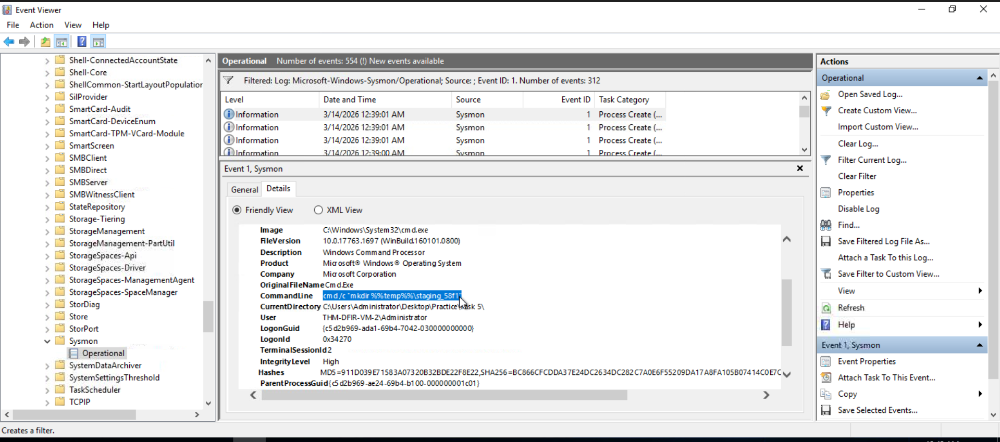

#### Targeted documents harvesting
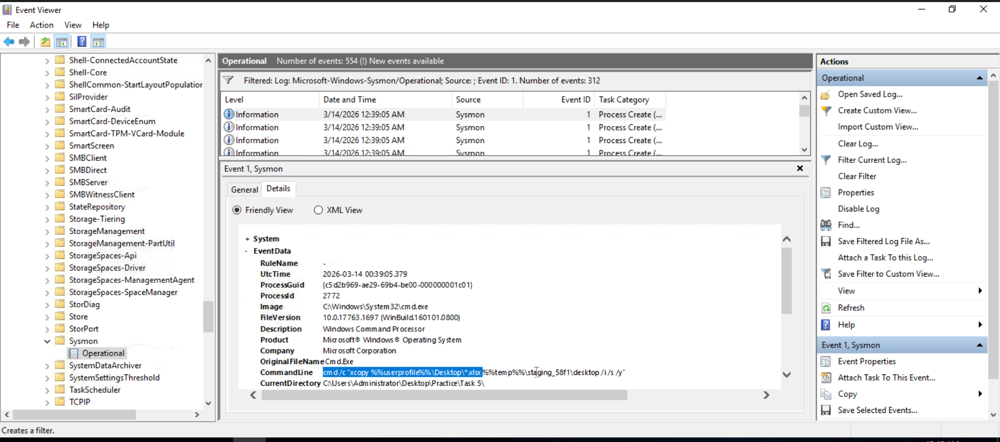

#### Clipboard content fetched
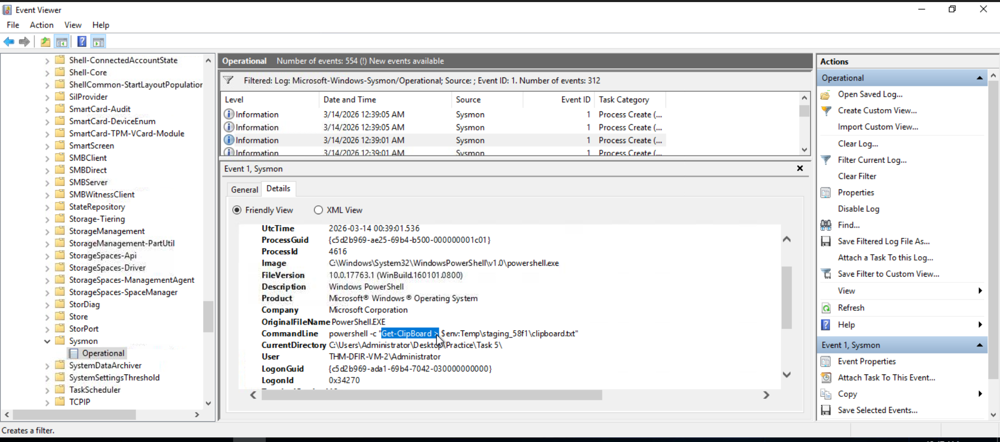

#### Domain used for data-exfil
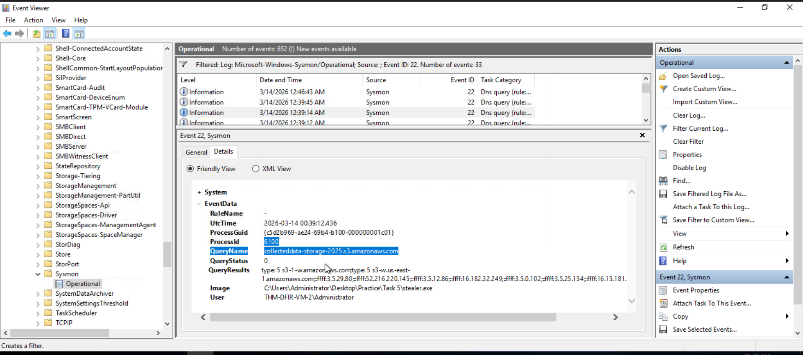

#### Results & FIndings
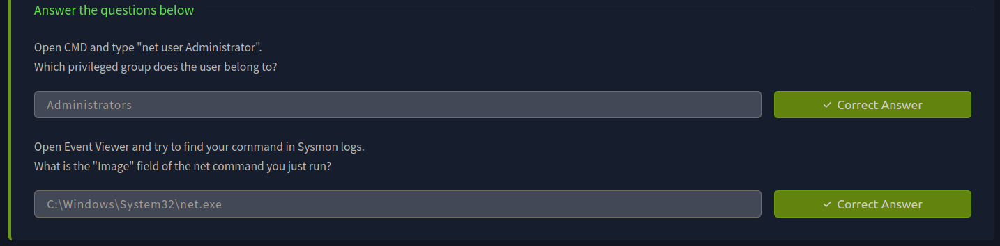

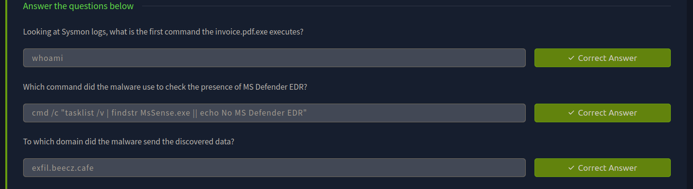

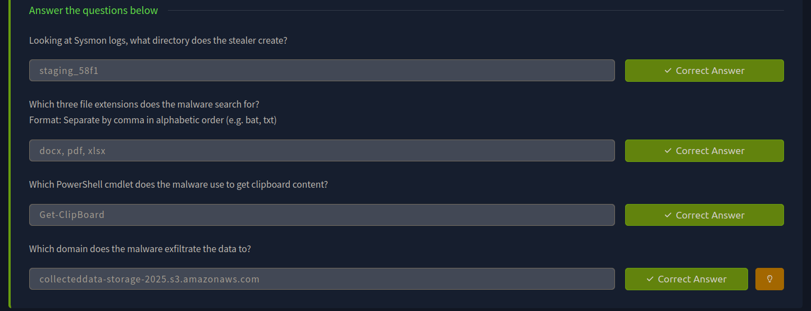

---

> QXV0aG9yOiBodHRwczovL2dpdGh1Yi5jb20vaGFzaC01NDU=