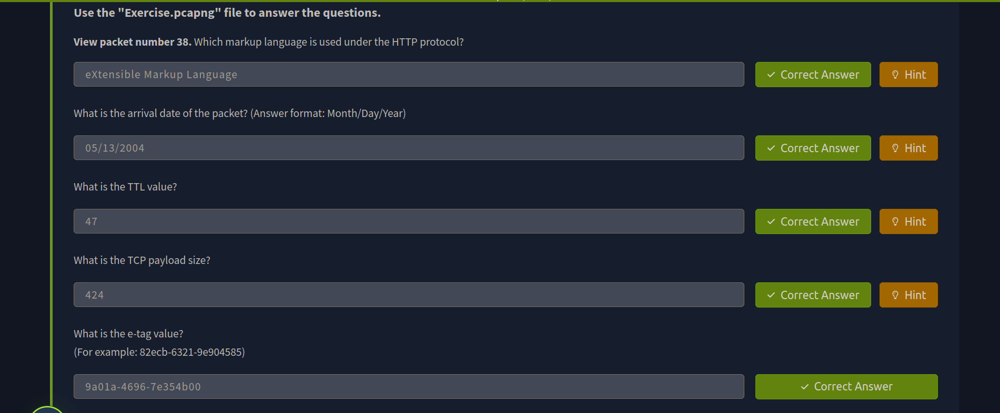

> /BlueTeaming/Wireshark
# Wireshark

## Objective
The objective of this lab was to practice **network packet analysis** using **Wireshark**. By working with provided packet capture (PCAP) files, we explored packet dissection, filtering, stream following, and traffic investigation techniques to understand how analysts detect anomalies and extract insights from raw network data.  

## Tools Used
- **Wireshark** – open-source packet analyzer for inspecting live traffic and PCAP files  

## Steps Performed
1. **Understanding the GUI**
   - Familiarized with key interface sections: Toolbar, Display Filter Bar, Packet Panes, and Status Bar.  
   - Observed how Wireshark organizes packets into **list, details, and bytes** views.  

2. **Packet Dissection**
   - Broke down packets across OSI model layers: Frame, MAC (L2), IP (L3), TCP/UDP (L4), and Application protocols (L5+).  
   - Examined **HTTP packets** and application data fields for deeper insights.  

3. **Packet Management**
   - Used **packet numbers** for navigation.  
   - Learned **marking and commenting** to tag suspicious packets.  
   - Viewed **file properties** (hash, capture time, interface details) to contextualize evidence.  

4. **Filtering & Highlighting**
   - Applied **display filters** (protocol, IPs, ports) to narrow traffic.  
   - Used **conversation filters** to focus on sessions between hosts.  
   - Explored **colourisation rules** for highlighting protocol traffic and anomalies.  

5. **Traffic Analysis Features**
   - Followed **TCP/HTTP streams** to reconstruct conversations.  
   - Learned how to **export packets** and **objects (files)** from PCAPs.  
   - Investigated Wireshark’s **Expert Info** panel for protocol warnings, errors, and anomalies.  

6. **Advanced Usage**
   - Understood packet merging to combine PCAPs.  
   - Experimented with **time display formats** for timeline analysis.  
   - Practiced searching packets by string, hex, or regex to locate events of interest.  

## Key Learnings
- Wireshark is a **powerful forensic tool** for investigating captured traffic, but it requires analyst expertise to interpret anomalies.  
- **Packet dissection** across OSI layers is critical for understanding network events.  
- **Filtering and stream following** allow focusing on suspicious or relevant traffic quickly.  
- Exporting packets and objects enables further malware or file analysis outside Wireshark.  
- **Preprocessing PCAPs** with marking, commenting, and expert info makes collaborative investigations faster.  

## Screenshots
Please refer to the attached screenshots in this directory

