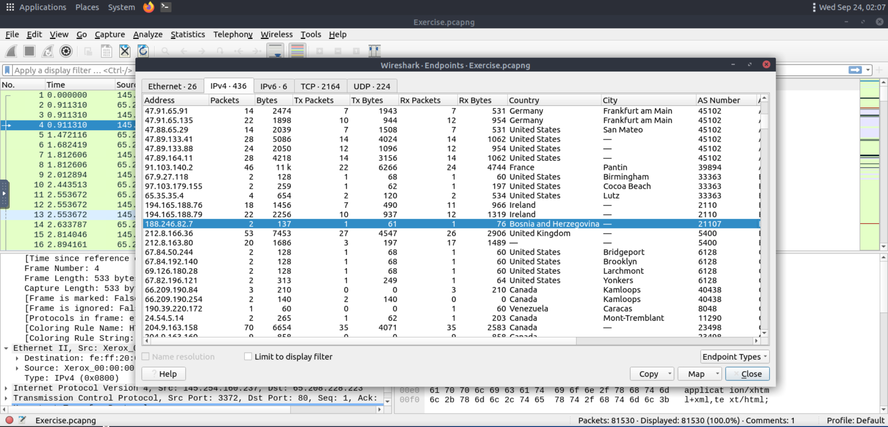

> /SOCTraining/Wireshark/Packet Operations
# Wireshark: Packet Operations

## Objectives of the Lab  
- Explore advanced features of Wireshark for packet-level analysis  
- Investigate network traffic using statistics, filters, operators, and functions  
- Apply filtering techniques to identify events of interest in a capture file  
- Practice efficient workflows for endpoint, protocol, and conversation analysis  

## Tools Used  
- Wireshark (advanced features: statistics, filters, operators, expressions)  

## Steps Performed  
- Opened and analyzed the provided `pcapng` file in Wireshark.  
- Used the **Statistics menu** to review protocol hierarchies, endpoints, conversations, DNS, and HTTP usage.  
- Applied **resolved addresses** to identify accessed resources via DNS names.  
- Explored **protocol hierarchy view** to understand traffic breakdown and usage percentages.  
- Investigated **conversations and endpoints** to map traffic between specific hosts.  
- Enabled **name resolution** (MAC, IP, port) for more readable insights.  
- Applied **IPv4/IPv6-specific statistics** to narrow analysis.  
- Created **display filters** and **capture filters** to isolate events of interest.  
- Practiced with **operators and functions**
- Built **bookmarks and filtering buttons** for quick reuse of queries.  
- Configured and saved **Wireshark profiles** to streamline repeated analysis tasks.  

## Key Learnings  
- Learned how to leverage Wireshark statistics to form investigative hypotheses  
- Practiced detailed filtering with logical and comparison operators  
- Understood how advanced functions enhance packet-level searches  
- Gained experience with profiles and custom workflows for efficient investigations  
- Strengthened practical skills in identifying events of interest through packet forensics  

## Screenshots
Please refer to the attached screenshots in this directory.
