# NIDS & NIPS Deployment - Suricata


## Introduction
This report documents the end-to-end deployment of Suricata, initially configured as a Network Intrusion Detection System (NIDS) and subsequently reconfigured as a Network Intrusion Prevention System (NIPS). The core objective was to establish full visibility by integrating the NIDS alert logs with the Wazuh Security Information & Event Management (SIEM) platform, providing centralized analysis and incident response capability.


## Objectives
- Configure Suricata to operate successfully in both **NIDS** (passive detection) and **NIPS** (active prevention) modes.
- Implement kernel-level packet interception using **IPtables** and **NFQUEUE** for NIPS functionality.
- Deploy and validate a custom Suricata signature rule to detect an ICMP flood attack and ensure reliable deployment.
- Successfully integrate the Suricata event logs (`eve.json`) with the **Wazuh Agent**.
- Achieve real-time alert forwarding and centralized visibility on the Wazuh Manager dashboard.


## Tools
- **Suricata NIDS/NIPS:** The primary network security engine.
- **Wazuh Agent & Manager:** The centralized Security Information and Event Management (SIEM) platform.
- **IPtables / NFQUEUE:** The Linux kernel facility used for redirecting packets to user-space applications (Suricata) for active blocking.
- **AF-Packet:** The high-performance packet acquisition method used by Suricata in NIDS mode.
- **hping3:** Used for simulating malicious network traffic (ICMP flood attack).
- **VirtualBox:** The virtualization environment used to host and network the Server and Manager/Attacker virtual machines.
- **Ubuntu Server:** The protected host running Suricata and the Wazuh Agent.
- **Ubuntu Mate:** Used for the SIEM dashboard and logs vizualization.
- **Parrot OS:** Used as the external attacking machine for simulating malicious traffic and attacks.


## About Suricata


Suricata is a leading open-source Network Intrusion Detection System (NIDS), Network Intrusion Prevention System (NIPS), and Security Monitoring Engine. Developed by the Open Information Security Foundation (OISF), it is designed for high performance and scalability, leveraging multi-threading to handle large volumes of network traffic efficiently. Suricata uses a powerful ruleset syntax (compatible with Snort rules) to identify malicious traffic, policy violations, and advanced threats. Key to its operation is its versatile output, primarily generating detailed event logs in structured JSON format (`eve.json`), making it ideal for integration with centralized log management systems like Wazuh.


## About Wazuh


Wazuh is an open-source security platform that combines Host Intrusion Detection System (HIDS), Security Information and Event Management (SIEM), and Extended Detection and Response (XDR) capabilities. The architecture consists of a centralized **Wazuh Manager** (the server) and decentralized **Wazuh Agents** deployed on protected endpoints. The Agent is responsible for real-time log collection, active response, file integrity monitoring, and configuration assessment. By ingesting alerts from network devices (like Suricata's `eve.json`), Wazuh provides a unified security view, correlates events across the environment, and allows security teams to monitor, detect, and respond to threats efficiently. 


## Network Topology
The project uses a simple three-VM configuration on a private network segment.
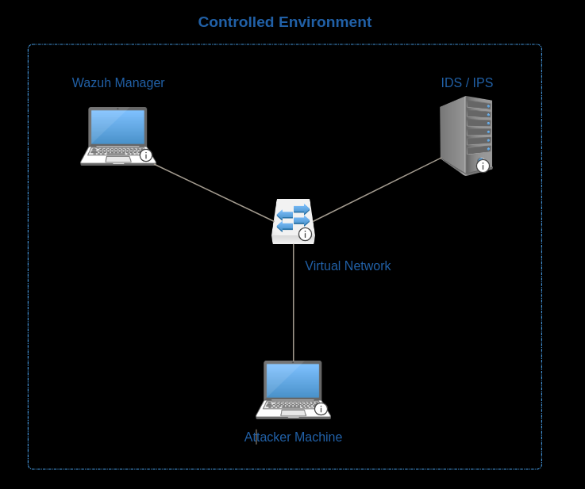


## Setup
The deployment utilized two virtual machines connected via a Host-Only adapter network segment (`192.168.56.0/24`):
- **Attacker:** Running Parrot OS
- **Suricata Server:** Installed on Ubuntu Server

**Suricata Initial Installation on Ubuntu Server:**
1. **Repository Setup:** The required PPA was added to the Ubuntu Server, and package lists were updated to ensure access to the latest Suricata stable package.
2. **Package Installation:** The core Suricata package was installed using the `apt` command.
3. **Service Initialization:** The installation automatically configured and initiated the Suricata service under `systemd`, allowing management via `systemctl`. The service configuration file (`/lib/systemd/system/suricata.service`) was verified and later modified for mode switching.
4. **Configuration Baseline:** The main configuration file (`/etc/suricata/suricata.yaml`) was checked for correct network interface settings (AF-Packet) and logging paths.

## IDS Mode
The project began by validating Suricata as a passive Network Intrusion Detection System (NIDS).

### Procedure
1.  **Deployment as IDS:** Suricata was confirmed to be running in the default passive IDS mode, listening on the network interface via AF-Packet.

Configure Network


Ensure proper service init


Test suricata.yaml file for errors
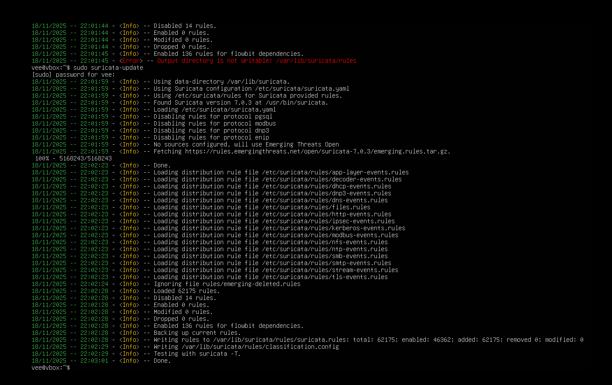

2.  **Custom Rule Creation:** A signature rule for the ICMP flood attack was written and added to `/etc/suricata/rules/custom.rules`, using `alert` as the action and `track by_src` for accurate counting.

3.  **Attack Simulation:** An ICMP flood attack was launched from the attacker's machine (Parrot OS).

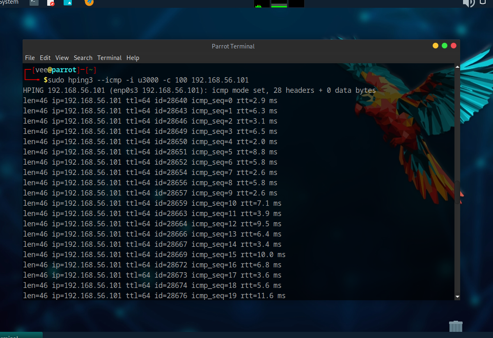

4.  **Log Review:** The attack successfully triggered the custom rule, and the resulting alerts were viewed in the `/var/log/suricata/fast.log` and `/var/log/suricata/eve.json` files, confirming NIDS functionality.

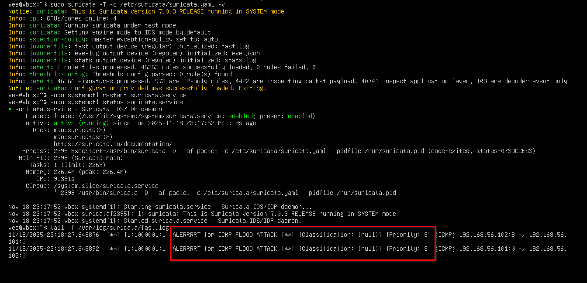

Following image summarizes the procedure:\
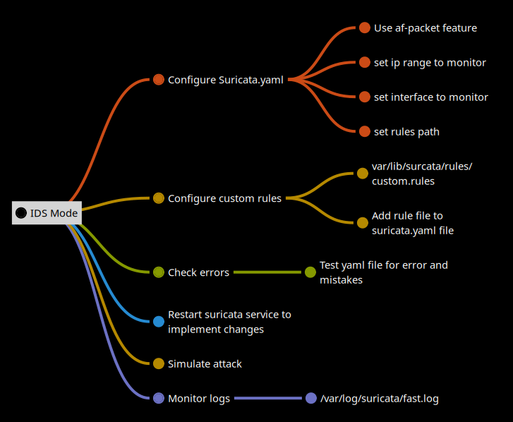

### Topology
In IDS mode, the network topology is passive. The host's traffic is processed normally by the kernel, and Suricata reads a copy of the packets from the network interface via AF-Packet.

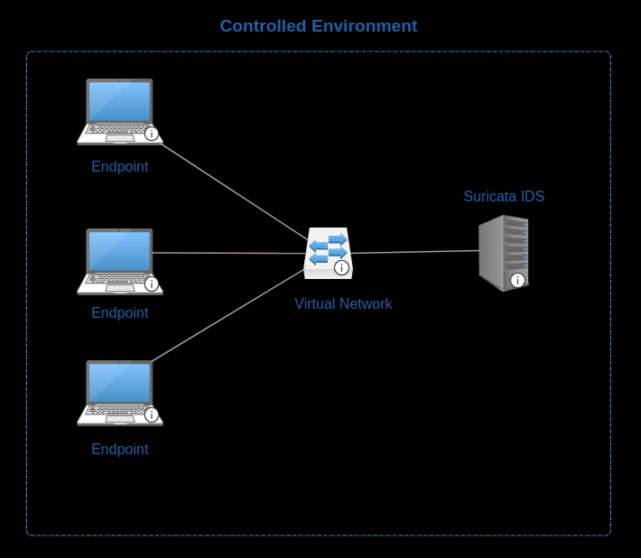

## IPS Mode
Following successful detection, Suricata was switched to active Network Intrusion Prevention System (NIPS) mode to test its blocking capabilities.

### Procedure
1.  **Mode Switch:** The Suricata service file was modified to include the `NFQUEUE` flag (`-q 0`), instructing Suricata to pull packets from kernel queue 0.


2.  **IPtables NFQUEUE Rule:** An `iptables` rule was added to redirect inbound traffic into the Suricata queue: `sudo iptables -I INPUT -j NFQUEUE --queue-num 0`.

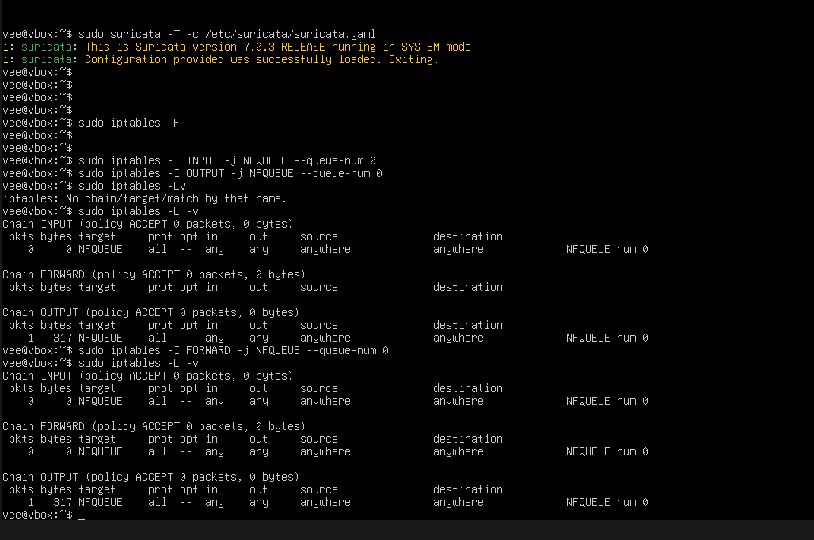

Ensure suricata.service is switched to IPS mode.
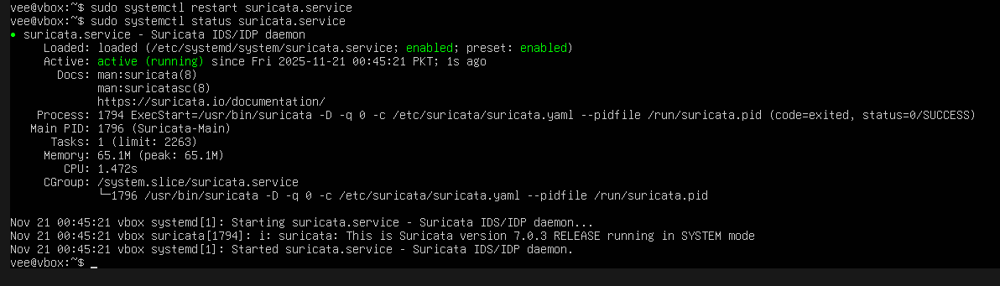

3.  **Custom Rule Modification:** The ICMP rule's action was changed from `alert` to `drop` in the rule file.

4.  **Validation:** An ICMP flood was simulated. The attacker machine received no response of successful pings, 97% loss in transmission, confirming active packet drops. The drop event was logged in `eve.json`.

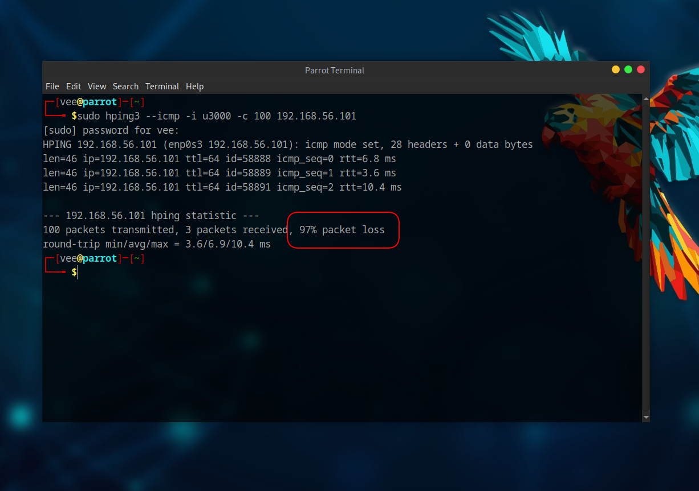

Logs
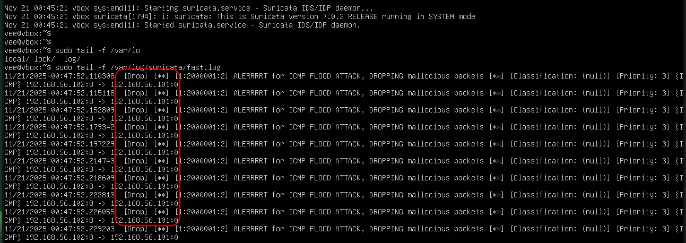

Following image summarizes the procedure:\
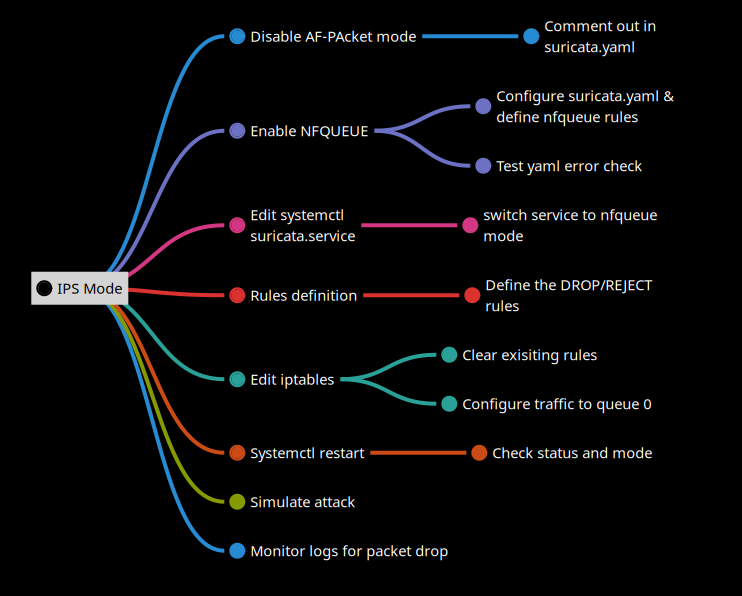

### Topology
In NIPS mode, the network topology is inline. All matching traffic is intercepted and redirected by IPtables into the Suricata process before being allowed to proceed to the destination application. Since the project was deployed on LAN, inline placement is shown on logical bases.

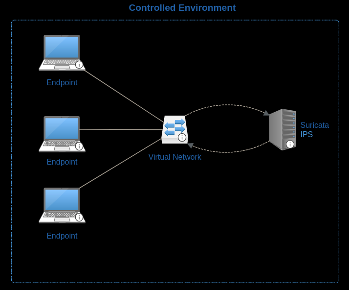


## IDS x SIEM Integration
The final phase involved reverting to the stable NIDS mode and integrating alert logging with the centralized Wazuh SIEM platform.

### Procedure
1.  **Mode Reversion:** Suricata was switched back to NIDS mode by removing the `NFQUEUE` flag from the service file and flushing all `iptables` rules.

2.  **Wazuh Agent Installation:** The Wazuh Agent package was installed on the Ubuntu Server (`192.168.56.104`).

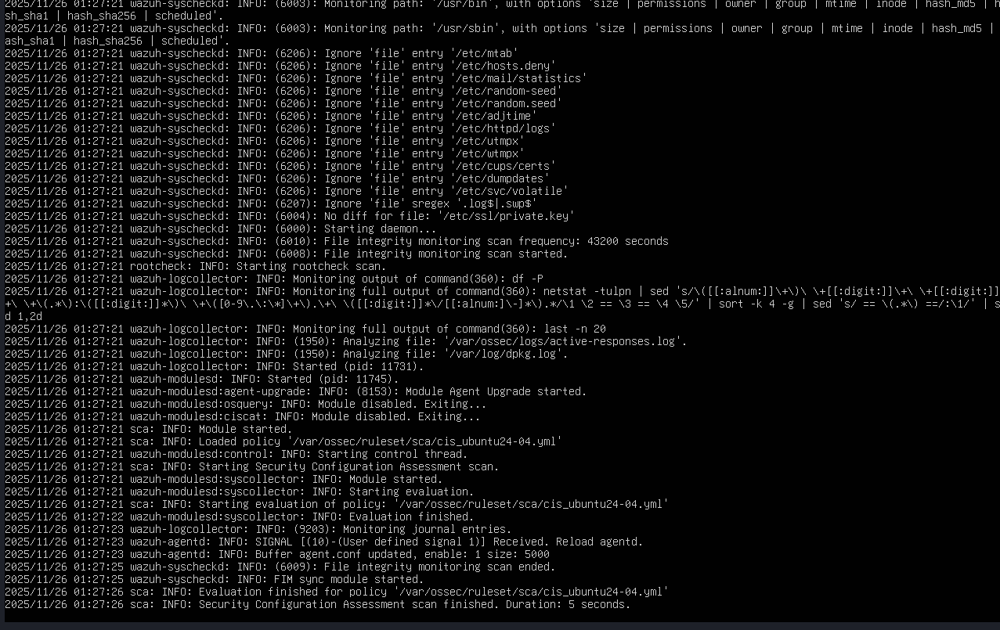

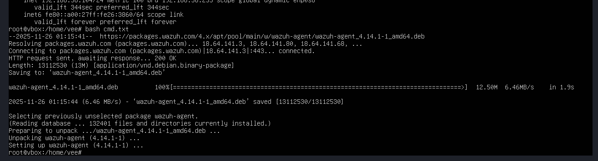


3.  **Integration Configuration:** The Agent's main configuration file (`/var/ossec/etc/ossec.conf`) was edited to add a `localfile` block to monitor Suricata's JSON output:

    ```
    <localfile>
      <log_format>json</log_format>
      <location>/var/log/suricata/eve.json</location>
    </localfile>
    ```


4.  **Wazuh Manager Setup:** The Wauh management server (Ubuntu Mate, `192.168.56.103`) was used to receive and visualize alerts from the Agent deployed on Ubuntu Server.


5.  **Final Validation:** An ICMP flood was simulated. The Wazuh Agent ingested the Suricata event and successfully transmitted it to the Manager, where the alert was displayed immediately on the dashboard.


Following image summarizes the procedure:\
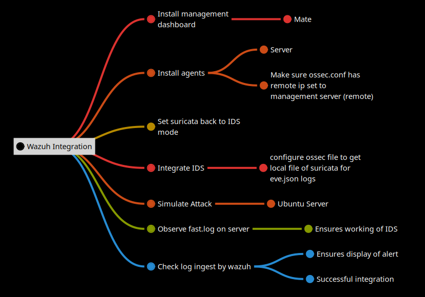

### Topology

The final network topology for validation involved three logical roles connected on the `192.168.56.0/24` segment, demonstrating the complete security monitoring cycle:

- **Attacker:** The Parrot OS machine (on `192.168.56.102`) launching the ICMP flood attack.

- **Protected Server (Sensor/Agent):** The Ubuntu Server host (on `192.168.56.104`) where both detection components reside.
    * **Suricata IDS Placement:** Deployed on the protected host acting as the NIDS sensor, passively listening to network traffic directed at `192.168.56.0/24` Network via AF-Packet.
    * **Wazuh Agent Placement:** Installed alongside Suricata on the server (`192.168.56.104`), responsible for reading Suricata's `eve.json` log file and forwarding the data securely.

- **Wazuh Management Server Placement:** Deployed on the Ubuntu Mate (`192.168.56.103`), serving as the central SIEM component to receive, analyze, and display alerts sent by the Wazuh Agent.

This architecture showcases the transition from network detection (Suricata) to host-based log forwarding (Wazuh Agent) to centralized reporting (Wazuh Manager).


## Key Takeaways

- **Mode Versatility:** The project successfully demonstrated Suricata's ability to switch between a passive detection engine (NIDS) for generating alerts and an active prevention engine (NIPS) for enforcing security policy.
- **Packet Interception:** Achieving Prevention (NIPS) relied entirely on kernel-level manipulation using `iptables` and the `NFQUEUE` mechanism. This technique forces network traffic into the Suricata process, making it an inline choke point on the protected machine.
- **Security Visibility Consolidation:** The integration validated the principle of centralized security monitoring. Network-derived alerts (from Suricata) were reliably collected by the Wazuh Agent's log monitoring capabilities and forwarded to the Manager, unifying detection events.
- **Log Management Standard:** Suricata's use of the structured `eve.json` format was critical, allowing the Wazuh Agent to easily ingest and parse network events without requiring custom log parsing rules.
- **Endpoint Protection Scope:** The NIPS deployment was scoped as an Endpoint Protection mechanism. By applying the NFQUEUE rule to the local machine's `INPUT` chain, Suricata ensured that only traffic directed specifically *to* the server was inspected and potentially dropped.
- **Traffic Flow Model:** The Endpoint NIPS model used in the project only inspects traffic destined for the local host's IP, with traffic stopping there for inspection. Conversely, a Gateway NIPS must be positioned as a network router, forcing all cross-network traffic to pass *through* it for inspection and forwarding to protect an entire downstream segment.

---